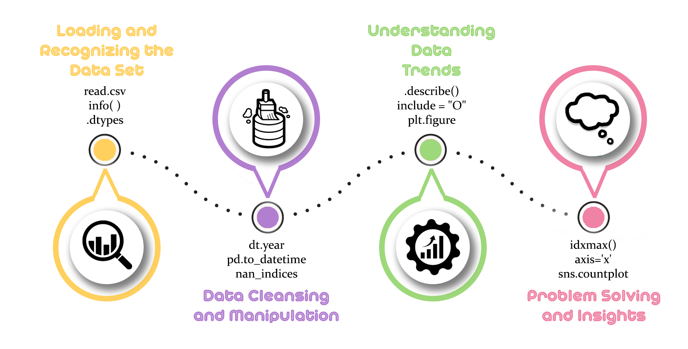

**Python Blok Projesi**<p></p>

<p>Nobel Ödülü belki de dünyanın en tanınmış bilimsel ödülüdür. Her yıl kimya, edebiyat, fizik, tıp, ekonomi ve barış alanlarında bilim insanlarına ve akademisyenlere verilmektedir. Bu projede, Nobel Ödülü kazananları inceleyeceğiz. </p>

## Proje Soruları

1. Nobel Ödüllerini en çok kazanan ilk on ülkeyi bulunuz.
2. Nobel Ödüllerini kazanan ilk kadınları listeleyiniz.
3. Nobel Ödüllerini kazanan ilk erkekleri listeleyiniz.
4. Nobel ödülünü en çok kazanan ülkenin hangi yıldan itibaren hakimiyet sağladığını görselleştirip bu hakimiyette rol oynayan şeyler nelerdir? İçgörülerinizi paylaşır mısınız?
5. Nobel Ödülü kazananların cinsiyetlerini, yaşlarını, ödül kategorisi ve yılları kullanarak görselleştiriniz.(Her bir ödül kategorisi için ayrı grafik gösteriniz) Çıkan sonuçlara göre görseli yorumlayınız.
6. 1938-1945 yılı arasında Nobel Ödülü kazananların kategorilerini ve ülkelerini görselleştirip yorumlayınız.
7. 1947-1991 yılları arasında Nobel Ödülü kazananların kategorilerini ve ülkelerini görselleştirip yorumlayınız.(Her kategori için ayrı bir grafik olması istenmektedir)
8. Kimya, Edebiyat, Barış, Fizik ve Tıp kategorilerindeki 2000 sonrasındaki kişilerin ülkelerini, yaşlarını görselleştirin.(Her bir Kategori için ayrı görselleştirme yapılması istenmektedir) Veriyi yorumlayınız.


# Yol Haritası



# Load and Explore the Data Set🤹‍♀️


```python
import pandas as pd
import numpy as np
import matplotlib.pyplot as plt
import seaborn as sns
import plotly.express as px
import datetime
```


```python
nobel_prize = pd.read_csv("nobel.csv")
```


```python
nobel_prize
```


<div>
<style scoped>
    .dataframe tbody tr th:only-of-type {
        vertical-align: middle;
    }

    .dataframe tbody tr th {
        vertical-align: top;
    }

    .dataframe thead th {
        text-align: right;
    }
</style>
<table border="1" class="dataframe">
  <thead>
    <tr style="text-align: right;">
      <th></th>
      <th>year</th>
      <th>category</th>
      <th>prize</th>
      <th>motivation</th>
      <th>prize_share</th>
      <th>laureate_id</th>
      <th>laureate_type</th>
      <th>full_name</th>
      <th>birth_date</th>
      <th>birth_city</th>
      <th>birth_country</th>
      <th>sex</th>
      <th>organization_name</th>
      <th>organization_city</th>
      <th>organization_country</th>
      <th>death_date</th>
      <th>death_city</th>
      <th>death_country</th>
    </tr>
  </thead>
  <tbody>
    <tr>
      <th>0</th>
      <td>1901</td>
      <td>Chemistry</td>
      <td>The Nobel Prize in Chemistry 1901</td>
      <td>"in recognition of the extraordinary services ...</td>
      <td>1/1</td>
      <td>160</td>
      <td>Individual</td>
      <td>Jacobus Henricus van 't Hoff</td>
      <td>1852-08-30</td>
      <td>Rotterdam</td>
      <td>Netherlands</td>
      <td>Male</td>
      <td>Berlin University</td>
      <td>Berlin</td>
      <td>Germany</td>
      <td>1911-03-01</td>
      <td>Berlin</td>
      <td>Germany</td>
    </tr>
    <tr>
      <th>1</th>
      <td>1901</td>
      <td>Literature</td>
      <td>The Nobel Prize in Literature 1901</td>
      <td>"in special recognition of his poetic composit...</td>
      <td>1/1</td>
      <td>569</td>
      <td>Individual</td>
      <td>Sully Prudhomme</td>
      <td>1839-03-16</td>
      <td>Paris</td>
      <td>France</td>
      <td>Male</td>
      <td>NaN</td>
      <td>NaN</td>
      <td>NaN</td>
      <td>1907-09-07</td>
      <td>Châtenay</td>
      <td>France</td>
    </tr>
    <tr>
      <th>2</th>
      <td>1901</td>
      <td>Medicine</td>
      <td>The Nobel Prize in Physiology or Medicine 1901</td>
      <td>"for his work on serum therapy, especially its...</td>
      <td>1/1</td>
      <td>293</td>
      <td>Individual</td>
      <td>Emil Adolf von Behring</td>
      <td>1854-03-15</td>
      <td>Hansdorf (Lawice)</td>
      <td>Prussia (Poland)</td>
      <td>Male</td>
      <td>Marburg University</td>
      <td>Marburg</td>
      <td>Germany</td>
      <td>1917-03-31</td>
      <td>Marburg</td>
      <td>Germany</td>
    </tr>
    <tr>
      <th>3</th>
      <td>1901</td>
      <td>Peace</td>
      <td>The Nobel Peace Prize 1901</td>
      <td>NaN</td>
      <td>1/2</td>
      <td>462</td>
      <td>Individual</td>
      <td>Jean Henry Dunant</td>
      <td>1828-05-08</td>
      <td>Geneva</td>
      <td>Switzerland</td>
      <td>Male</td>
      <td>NaN</td>
      <td>NaN</td>
      <td>NaN</td>
      <td>1910-10-30</td>
      <td>Heiden</td>
      <td>Switzerland</td>
    </tr>
    <tr>
      <th>4</th>
      <td>1901</td>
      <td>Peace</td>
      <td>The Nobel Peace Prize 1901</td>
      <td>NaN</td>
      <td>1/2</td>
      <td>463</td>
      <td>Individual</td>
      <td>Frédéric Passy</td>
      <td>1822-05-20</td>
      <td>Paris</td>
      <td>France</td>
      <td>Male</td>
      <td>NaN</td>
      <td>NaN</td>
      <td>NaN</td>
      <td>1912-06-12</td>
      <td>Paris</td>
      <td>France</td>
    </tr>
    <tr>
      <th>...</th>
      <td>...</td>
      <td>...</td>
      <td>...</td>
      <td>...</td>
      <td>...</td>
      <td>...</td>
      <td>...</td>
      <td>...</td>
      <td>...</td>
      <td>...</td>
      <td>...</td>
      <td>...</td>
      <td>...</td>
      <td>...</td>
      <td>...</td>
      <td>...</td>
      <td>...</td>
      <td>...</td>
    </tr>
    <tr>
      <th>906</th>
      <td>2016</td>
      <td>Medicine</td>
      <td>The Nobel Prize in Physiology or Medicine 2016</td>
      <td>"for his discoveries of mechanisms for autophagy"</td>
      <td>1/1</td>
      <td>927</td>
      <td>Individual</td>
      <td>Yoshinori Ohsumi</td>
      <td>1945-02-09</td>
      <td>Fukuoka</td>
      <td>Japan</td>
      <td>Male</td>
      <td>Tokyo Institute of Technology</td>
      <td>Tokyo</td>
      <td>Japan</td>
      <td>NaN</td>
      <td>NaN</td>
      <td>NaN</td>
    </tr>
    <tr>
      <th>907</th>
      <td>2016</td>
      <td>Peace</td>
      <td>The Nobel Peace Prize 2016</td>
      <td>"for his resolute efforts to bring the country...</td>
      <td>1/1</td>
      <td>934</td>
      <td>Individual</td>
      <td>Juan Manuel Santos</td>
      <td>1951-08-10</td>
      <td>Bogotá</td>
      <td>Colombia</td>
      <td>Male</td>
      <td>NaN</td>
      <td>NaN</td>
      <td>NaN</td>
      <td>NaN</td>
      <td>NaN</td>
      <td>NaN</td>
    </tr>
    <tr>
      <th>908</th>
      <td>2016</td>
      <td>Physics</td>
      <td>The Nobel Prize in Physics 2016</td>
      <td>"for theoretical discoveries of topological ph...</td>
      <td>1/2</td>
      <td>928</td>
      <td>Individual</td>
      <td>David J. Thouless</td>
      <td>1934-09-21</td>
      <td>Bearsden</td>
      <td>United Kingdom</td>
      <td>Male</td>
      <td>University of Washington</td>
      <td>Seattle, WA</td>
      <td>United States of America</td>
      <td>NaN</td>
      <td>NaN</td>
      <td>NaN</td>
    </tr>
    <tr>
      <th>909</th>
      <td>2016</td>
      <td>Physics</td>
      <td>The Nobel Prize in Physics 2016</td>
      <td>"for theoretical discoveries of topological ph...</td>
      <td>1/4</td>
      <td>929</td>
      <td>Individual</td>
      <td>F. Duncan M. Haldane</td>
      <td>1951-09-14</td>
      <td>London</td>
      <td>United Kingdom</td>
      <td>Male</td>
      <td>Princeton University</td>
      <td>Princeton, NJ</td>
      <td>United States of America</td>
      <td>NaN</td>
      <td>NaN</td>
      <td>NaN</td>
    </tr>
    <tr>
      <th>910</th>
      <td>2016</td>
      <td>Physics</td>
      <td>The Nobel Prize in Physics 2016</td>
      <td>"for theoretical discoveries of topological ph...</td>
      <td>1/4</td>
      <td>930</td>
      <td>Individual</td>
      <td>J. Michael Kosterlitz</td>
      <td>1943-06-22</td>
      <td>Aberdeen</td>
      <td>United Kingdom</td>
      <td>Male</td>
      <td>Brown University</td>
      <td>Providence, RI</td>
      <td>United States of America</td>
      <td>NaN</td>
      <td>NaN</td>
      <td>NaN</td>
    </tr>
  </tbody>
</table>
<p>911 rows × 18 columns</p>
</div>


# Columns

-year: The year the Nobel prize was awarded.

-category: Prize category (e.g. Physics, Chemistry, Peace, Economics, etc.).

-prize: Prize name.

-motivation: The reason for awarding the prize.

-prize_share: The share of the prize.

-laureate_id: ID of the winner.

-laureate_type: Type of winner (e.g. individual or organization).

-full_name: The full name of the winner.

-birth_date: Winner's date of birth.

-birth_city: Winner's city of birth.

-birth_country: Winner's country of birth.

-sex: Winner's gender.

-organization_name: Winner's organization name (if applicable).

-organization_city: The city where the winner's organization is located.

-organization_country: Country where the winner's organization is located.

-death_date: The date of the winner's death.	

-death_city: The city where the winner died.	

-death_country: The country where the winner died.


```python
nobel_prize.info()
```

    <class 'pandas.core.frame.DataFrame'>
    RangeIndex: 911 entries, 0 to 910
    Data columns (total 18 columns):
     #   Column                Non-Null Count  Dtype 
    ---  ------                --------------  ----- 
     0   year                  911 non-null    int64 
     1   category              911 non-null    object
     2   prize                 911 non-null    object
     3   motivation            823 non-null    object
     4   prize_share           911 non-null    object
     5   laureate_id           911 non-null    int64 
     6   laureate_type         911 non-null    object
     7   full_name             911 non-null    object
     8   birth_date            883 non-null    object
     9   birth_city            883 non-null    object
     10  birth_country         885 non-null    object
     11  sex                   885 non-null    object
     12  organization_name     665 non-null    object
     13  organization_city     667 non-null    object
     14  organization_country  667 non-null    object
     15  death_date            593 non-null    object
     16  death_city            576 non-null    object
     17  death_country         582 non-null    object
    dtypes: int64(2), object(16)
    memory usage: 128.2+ KB


```python
nobel_prize.dtypes
```


    year                     int64
    category                object
    prize                   object
    motivation              object
    prize_share             object
    laureate_id              int64
    laureate_type           object
    full_name               object
    birth_date              object
    birth_city              object
    birth_country           object
    sex                     object
    organization_name       object
    organization_city       object
    organization_country    object
    death_date              object
    death_city              object
    death_country           object
    dtype: object


#                                           Inspecting Null Values🪁


```python
missing_values = nobel_prize.isnull().sum()
missing_values
```


    year                      0
    category                  0
    prize                     0
    motivation               88
    prize_share               0
    laureate_id               0
    laureate_type             0
    full_name                 0
    birth_date               28
    birth_city               28
    birth_country            26
    sex                      26
    organization_name       246
    organization_city       244
    organization_country    244
    death_date              318
    death_city              335
    death_country           329
    dtype: int64


```python
data = {
    "kolonlar": ["year", "category", "prize", "motivation", "prize_share", "laureate_id", "laureate_type", "full_name", "birth_date", "birth_city", "birth_country", "sex", "organization_name", "organization_city", "organization_country", "death_date", "death_city", "death_country"],
    "null_value_count": [0, 0, 0, 88, 0, 0, 0, 0, 28, 28, 26, 26, 246, 244, 244, 318, 335, 329]
}

df = pd.DataFrame(data)
plt.figure(figsize=(12, 6))
bars = plt.barh(df["kolonlar"], df["null_value_count"], color="thistle")
plt.xlabel("Null Değer Sayısı")
plt.title("Null Değerler")
plt.grid(axis="x")
for bar in bars:
    plt.text(bar.get_width(), bar.get_y() + bar.get_height() / 2, f"{int(bar.get_width())}", va="center", ha="left")
plt.show()
```


    

    


# Data Cleansing and Manipulation 🧩


```python
#Let's update the birth and death date data type to date time.
nobel_prize["birth_date"] = pd.to_datetime(nobel_prize["birth_date"], errors = "coerce")
nobel_prize["death_date"] = pd.to_datetime(nobel_prize["death_date"], errors = "coerce")
```


```python
# Calculate the column Age (age at receipt of award) (subtracting the year of birth from the year of award)
nobel_prize["Age"] = nobel_prize["year"] - nobel_prize["birth_date"].dt.year

print(nobel_prize.head())
```

       year    category                                           prize  \
    0  1901   Chemistry               The Nobel Prize in Chemistry 1901   
    1  1901  Literature              The Nobel Prize in Literature 1901   
    2  1901    Medicine  The Nobel Prize in Physiology or Medicine 1901   
    3  1901       Peace                      The Nobel Peace Prize 1901   
    4  1901       Peace                      The Nobel Peace Prize 1901   
    
                                              motivation prize_share  laureate_id  \
    0  "in recognition of the extraordinary services ...         1/1          160   
    1  "in special recognition of his poetic composit...         1/1          569   
    2  "for his work on serum therapy, especially its...         1/1          293   
    3                                                NaN         1/2          462   
    4                                                NaN         1/2          463   
    
      laureate_type                     full_name birth_date         birth_city  \
    0    Individual  Jacobus Henricus van 't Hoff 1852-08-30          Rotterdam   
    1    Individual               Sully Prudhomme 1839-03-16              Paris   
    2    Individual        Emil Adolf von Behring 1854-03-15  Hansdorf (Lawice)   
    3    Individual             Jean Henry Dunant 1828-05-08             Geneva   
    4    Individual                Frédéric Passy 1822-05-20              Paris   
    
          birth_country   sex   organization_name organization_city  \
    0       Netherlands  Male   Berlin University            Berlin   
    1            France  Male                 NaN               NaN   
    2  Prussia (Poland)  Male  Marburg University           Marburg   
    3       Switzerland  Male                 NaN               NaN   
    4            France  Male                 NaN               NaN   
    
      organization_country death_date death_city death_country   Age  
    0              Germany 1911-03-01     Berlin       Germany  49.0  
    1                  NaN 1907-09-07   Châtenay        France  62.0  
    2              Germany 1917-03-31    Marburg       Germany  47.0  
    3                  NaN 1910-10-30     Heiden   Switzerland  73.0  
    4                  NaN 1912-06-12      Paris        France  79.0  


```python
nobel_prize.info()
```

    <class 'pandas.core.frame.DataFrame'>
    RangeIndex: 911 entries, 0 to 910
    Data columns (total 19 columns):
     #   Column                Non-Null Count  Dtype         
    ---  ------                --------------  -----         
     0   year                  911 non-null    int64         
     1   category              911 non-null    object        
     2   prize                 911 non-null    object        
     3   motivation            823 non-null    object        
     4   prize_share           911 non-null    object        
     5   laureate_id           911 non-null    int64         
     6   laureate_type         911 non-null    object        
     7   full_name             911 non-null    object        
     8   birth_date            883 non-null    datetime64[ns]
     9   birth_city            883 non-null    object        
     10  birth_country         885 non-null    object        
     11  sex                   885 non-null    object        
     12  organization_name     665 non-null    object        
     13  organization_city     667 non-null    object        
     14  organization_country  667 non-null    object        
     15  death_date            593 non-null    datetime64[ns]
     16  death_city            576 non-null    object        
     17  death_country         582 non-null    object        
     18  Age                   883 non-null    float64       
    dtypes: datetime64[ns](2), float64(1), int64(2), object(14)
    memory usage: 135.4+ KB


```python
# For rows with NaN values, fill the sex column with “unknown”.

nan_indices = nobel_prize[nobel_prize["sex"].isnull()].index

nobel_prize.loc[nan_indices, "sex"] = "unknown"

print(nobel_prize["sex"].value_counts())
```

    sex
    Male       836
    Female      49
    unknown     26
    Name: count, dtype: int64


```python
print(nobel_prize["sex"].unique())
```

    ['Male' 'Female' 'unknown']


```python
nobel_prize.isnull().sum()
```


    year                      0
    category                  0
    prize                     0
    motivation               88
    prize_share               0
    laureate_id               0
    laureate_type             0
    full_name                 0
    birth_date               28
    birth_city               28
    birth_country            26
    sex                       0
    organization_name       246
    organization_city       244
    organization_country    244
    death_date              318
    death_city              335
    death_country           329
    Age                      28
    dtype: int64


```python
nobel_prize.keys()
```


    Index(['year', 'category', 'prize', 'motivation', 'prize_share', 'laureate_id',
           'laureate_type', 'full_name', 'birth_date', 'birth_city',
           'birth_country', 'sex', 'organization_name', 'organization_city',
           'organization_country', 'death_date', 'death_city', 'death_country',
           'Age'],
          dtype='object')


```python
nobel_prize
```


<div>
<style scoped>
    .dataframe tbody tr th:only-of-type {
        vertical-align: middle;
    }

    .dataframe tbody tr th {
        vertical-align: top;
    }

    .dataframe thead th {
        text-align: right;
    }
</style>
<table border="1" class="dataframe">
  <thead>
    <tr style="text-align: right;">
      <th></th>
      <th>year</th>
      <th>category</th>
      <th>prize</th>
      <th>motivation</th>
      <th>prize_share</th>
      <th>laureate_id</th>
      <th>laureate_type</th>
      <th>full_name</th>
      <th>birth_date</th>
      <th>birth_city</th>
      <th>birth_country</th>
      <th>sex</th>
      <th>organization_name</th>
      <th>organization_city</th>
      <th>organization_country</th>
      <th>death_date</th>
      <th>death_city</th>
      <th>death_country</th>
      <th>Age</th>
    </tr>
  </thead>
  <tbody>
    <tr>
      <th>0</th>
      <td>1901</td>
      <td>Chemistry</td>
      <td>The Nobel Prize in Chemistry 1901</td>
      <td>"in recognition of the extraordinary services ...</td>
      <td>1/1</td>
      <td>160</td>
      <td>Individual</td>
      <td>Jacobus Henricus van 't Hoff</td>
      <td>1852-08-30</td>
      <td>Rotterdam</td>
      <td>Netherlands</td>
      <td>Male</td>
      <td>Berlin University</td>
      <td>Berlin</td>
      <td>Germany</td>
      <td>1911-03-01</td>
      <td>Berlin</td>
      <td>Germany</td>
      <td>49.0</td>
    </tr>
    <tr>
      <th>1</th>
      <td>1901</td>
      <td>Literature</td>
      <td>The Nobel Prize in Literature 1901</td>
      <td>"in special recognition of his poetic composit...</td>
      <td>1/1</td>
      <td>569</td>
      <td>Individual</td>
      <td>Sully Prudhomme</td>
      <td>1839-03-16</td>
      <td>Paris</td>
      <td>France</td>
      <td>Male</td>
      <td>NaN</td>
      <td>NaN</td>
      <td>NaN</td>
      <td>1907-09-07</td>
      <td>Châtenay</td>
      <td>France</td>
      <td>62.0</td>
    </tr>
    <tr>
      <th>2</th>
      <td>1901</td>
      <td>Medicine</td>
      <td>The Nobel Prize in Physiology or Medicine 1901</td>
      <td>"for his work on serum therapy, especially its...</td>
      <td>1/1</td>
      <td>293</td>
      <td>Individual</td>
      <td>Emil Adolf von Behring</td>
      <td>1854-03-15</td>
      <td>Hansdorf (Lawice)</td>
      <td>Prussia (Poland)</td>
      <td>Male</td>
      <td>Marburg University</td>
      <td>Marburg</td>
      <td>Germany</td>
      <td>1917-03-31</td>
      <td>Marburg</td>
      <td>Germany</td>
      <td>47.0</td>
    </tr>
    <tr>
      <th>3</th>
      <td>1901</td>
      <td>Peace</td>
      <td>The Nobel Peace Prize 1901</td>
      <td>NaN</td>
      <td>1/2</td>
      <td>462</td>
      <td>Individual</td>
      <td>Jean Henry Dunant</td>
      <td>1828-05-08</td>
      <td>Geneva</td>
      <td>Switzerland</td>
      <td>Male</td>
      <td>NaN</td>
      <td>NaN</td>
      <td>NaN</td>
      <td>1910-10-30</td>
      <td>Heiden</td>
      <td>Switzerland</td>
      <td>73.0</td>
    </tr>
    <tr>
      <th>4</th>
      <td>1901</td>
      <td>Peace</td>
      <td>The Nobel Peace Prize 1901</td>
      <td>NaN</td>
      <td>1/2</td>
      <td>463</td>
      <td>Individual</td>
      <td>Frédéric Passy</td>
      <td>1822-05-20</td>
      <td>Paris</td>
      <td>France</td>
      <td>Male</td>
      <td>NaN</td>
      <td>NaN</td>
      <td>NaN</td>
      <td>1912-06-12</td>
      <td>Paris</td>
      <td>France</td>
      <td>79.0</td>
    </tr>
    <tr>
      <th>...</th>
      <td>...</td>
      <td>...</td>
      <td>...</td>
      <td>...</td>
      <td>...</td>
      <td>...</td>
      <td>...</td>
      <td>...</td>
      <td>...</td>
      <td>...</td>
      <td>...</td>
      <td>...</td>
      <td>...</td>
      <td>...</td>
      <td>...</td>
      <td>...</td>
      <td>...</td>
      <td>...</td>
      <td>...</td>
    </tr>
    <tr>
      <th>906</th>
      <td>2016</td>
      <td>Medicine</td>
      <td>The Nobel Prize in Physiology or Medicine 2016</td>
      <td>"for his discoveries of mechanisms for autophagy"</td>
      <td>1/1</td>
      <td>927</td>
      <td>Individual</td>
      <td>Yoshinori Ohsumi</td>
      <td>1945-02-09</td>
      <td>Fukuoka</td>
      <td>Japan</td>
      <td>Male</td>
      <td>Tokyo Institute of Technology</td>
      <td>Tokyo</td>
      <td>Japan</td>
      <td>NaT</td>
      <td>NaN</td>
      <td>NaN</td>
      <td>71.0</td>
    </tr>
    <tr>
      <th>907</th>
      <td>2016</td>
      <td>Peace</td>
      <td>The Nobel Peace Prize 2016</td>
      <td>"for his resolute efforts to bring the country...</td>
      <td>1/1</td>
      <td>934</td>
      <td>Individual</td>
      <td>Juan Manuel Santos</td>
      <td>1951-08-10</td>
      <td>Bogotá</td>
      <td>Colombia</td>
      <td>Male</td>
      <td>NaN</td>
      <td>NaN</td>
      <td>NaN</td>
      <td>NaT</td>
      <td>NaN</td>
      <td>NaN</td>
      <td>65.0</td>
    </tr>
    <tr>
      <th>908</th>
      <td>2016</td>
      <td>Physics</td>
      <td>The Nobel Prize in Physics 2016</td>
      <td>"for theoretical discoveries of topological ph...</td>
      <td>1/2</td>
      <td>928</td>
      <td>Individual</td>
      <td>David J. Thouless</td>
      <td>1934-09-21</td>
      <td>Bearsden</td>
      <td>United Kingdom</td>
      <td>Male</td>
      <td>University of Washington</td>
      <td>Seattle, WA</td>
      <td>United States of America</td>
      <td>NaT</td>
      <td>NaN</td>
      <td>NaN</td>
      <td>82.0</td>
    </tr>
    <tr>
      <th>909</th>
      <td>2016</td>
      <td>Physics</td>
      <td>The Nobel Prize in Physics 2016</td>
      <td>"for theoretical discoveries of topological ph...</td>
      <td>1/4</td>
      <td>929</td>
      <td>Individual</td>
      <td>F. Duncan M. Haldane</td>
      <td>1951-09-14</td>
      <td>London</td>
      <td>United Kingdom</td>
      <td>Male</td>
      <td>Princeton University</td>
      <td>Princeton, NJ</td>
      <td>United States of America</td>
      <td>NaT</td>
      <td>NaN</td>
      <td>NaN</td>
      <td>65.0</td>
    </tr>
    <tr>
      <th>910</th>
      <td>2016</td>
      <td>Physics</td>
      <td>The Nobel Prize in Physics 2016</td>
      <td>"for theoretical discoveries of topological ph...</td>
      <td>1/4</td>
      <td>930</td>
      <td>Individual</td>
      <td>J. Michael Kosterlitz</td>
      <td>1943-06-22</td>
      <td>Aberdeen</td>
      <td>United Kingdom</td>
      <td>Male</td>
      <td>Brown University</td>
      <td>Providence, RI</td>
      <td>United States of America</td>
      <td>NaT</td>
      <td>NaN</td>
      <td>NaN</td>
      <td>73.0</td>
    </tr>
  </tbody>
</table>
<p>911 rows × 19 columns</p>
</div>


# Understanding Data Trends 📊


```python
nobel_prize.describe()
```


<div>
<style scoped>
    .dataframe tbody tr th:only-of-type {
        vertical-align: middle;
    }

    .dataframe tbody tr th {
        vertical-align: top;
    }

    .dataframe thead th {
        text-align: right;
    }
</style>
<table border="1" class="dataframe">
  <thead>
    <tr style="text-align: right;">
      <th></th>
      <th>year</th>
      <th>laureate_id</th>
      <th>birth_date</th>
      <th>death_date</th>
      <th>Age</th>
    </tr>
  </thead>
  <tbody>
    <tr>
      <th>count</th>
      <td>911.000000</td>
      <td>911.000000</td>
      <td>883</td>
      <td>593</td>
      <td>883.000000</td>
    </tr>
    <tr>
      <th>mean</th>
      <td>1969.201976</td>
      <td>462.515917</td>
      <td>1910-01-19 20:13:19.093997824</td>
      <td>1974-11-18 17:36:19.426644192</td>
      <td>59.453001</td>
    </tr>
    <tr>
      <th>min</th>
      <td>1901.000000</td>
      <td>1.000000</td>
      <td>1817-11-30 00:00:00</td>
      <td>1903-11-01 00:00:00</td>
      <td>17.000000</td>
    </tr>
    <tr>
      <th>25%</th>
      <td>1946.000000</td>
      <td>228.500000</td>
      <td>1889-11-15 12:00:00</td>
      <td>1953-12-19 00:00:00</td>
      <td>50.000000</td>
    </tr>
    <tr>
      <th>50%</th>
      <td>1975.000000</td>
      <td>457.000000</td>
      <td>1915-07-28 00:00:00</td>
      <td>1979-08-12 00:00:00</td>
      <td>60.000000</td>
    </tr>
    <tr>
      <th>75%</th>
      <td>1997.000000</td>
      <td>698.500000</td>
      <td>1933-11-03 12:00:00</td>
      <td>1999-04-28 00:00:00</td>
      <td>69.000000</td>
    </tr>
    <tr>
      <th>max</th>
      <td>2016.000000</td>
      <td>937.000000</td>
      <td>1997-07-12 00:00:00</td>
      <td>2017-02-08 00:00:00</td>
      <td>90.000000</td>
    </tr>
    <tr>
      <th>std</th>
      <td>32.837978</td>
      <td>270.236159</td>
      <td>NaN</td>
      <td>NaN</td>
      <td>12.399290</td>
    </tr>
  </tbody>
</table>
</div>


```python
nobel_prize.describe(include = "O")
```


<div>
<style scoped>
    .dataframe tbody tr th:only-of-type {
        vertical-align: middle;
    }

    .dataframe tbody tr th {
        vertical-align: top;
    }

    .dataframe thead th {
        text-align: right;
    }
</style>
<table border="1" class="dataframe">
  <thead>
    <tr style="text-align: right;">
      <th></th>
      <th>category</th>
      <th>prize</th>
      <th>motivation</th>
      <th>prize_share</th>
      <th>laureate_type</th>
      <th>full_name</th>
      <th>birth_city</th>
      <th>birth_country</th>
      <th>sex</th>
      <th>organization_name</th>
      <th>organization_city</th>
      <th>organization_country</th>
      <th>death_city</th>
      <th>death_country</th>
    </tr>
  </thead>
  <tbody>
    <tr>
      <th>count</th>
      <td>911</td>
      <td>911</td>
      <td>823</td>
      <td>911</td>
      <td>911</td>
      <td>911</td>
      <td>883</td>
      <td>885</td>
      <td>911</td>
      <td>665</td>
      <td>667</td>
      <td>667</td>
      <td>576</td>
      <td>582</td>
    </tr>
    <tr>
      <th>unique</th>
      <td>6</td>
      <td>579</td>
      <td>565</td>
      <td>4</td>
      <td>2</td>
      <td>904</td>
      <td>601</td>
      <td>121</td>
      <td>3</td>
      <td>295</td>
      <td>181</td>
      <td>29</td>
      <td>291</td>
      <td>50</td>
    </tr>
    <tr>
      <th>top</th>
      <td>Medicine</td>
      <td>The Nobel Prize in Physiology or Medicine 1968</td>
      <td>"for theoretical discoveries of topological ph...</td>
      <td>1/1</td>
      <td>Individual</td>
      <td>Comité international de la Croix Rouge (Intern...</td>
      <td>New York, NY</td>
      <td>United States of America</td>
      <td>Male</td>
      <td>University of California</td>
      <td>Cambridge, MA</td>
      <td>United States of America</td>
      <td>Paris</td>
      <td>United States of America</td>
    </tr>
    <tr>
      <th>freq</th>
      <td>211</td>
      <td>3</td>
      <td>3</td>
      <td>344</td>
      <td>881</td>
      <td>3</td>
      <td>45</td>
      <td>259</td>
      <td>836</td>
      <td>32</td>
      <td>47</td>
      <td>341</td>
      <td>27</td>
      <td>203</td>
    </tr>
  </tbody>
</table>
</div>


```python
# Let's only draw prizes that have a year.
data_with_year = nobel_prize.dropna(subset=["year"])

# Let's calculate the number of awards by year.
awards_by_year = data_with_year["year"].value_counts().sort_index()

# Let's calculate the total number of rewards at certain intervals
filtered_awards_by_year = awards_by_year[awards_by_year.index % 4 == 1]

# Graphic
plt.figure(figsize=(12, 6))
filtered_awards_by_year.plot(kind="bar", color="thistle", edgecolor='black', linewidth=0.5)
plt.title("5 Yıl Aralıklarla Alınan Toplam Nobel Ödül Sayısı")
plt.xlabel("Yıl")
plt.ylabel("Toplam Ödül Sayısı")
plt.grid(axis="y", linestyle="--", alpha=0.7)
plt.tight_layout()
plt.show()
```


    

    


```python
# Let's verify the graph.
count_1901 = nobel_prize[nobel_prize["year"] == 1901].shape[0]
print("1901 yılına ait giriş sayısı:", count_1901)
```

    1901 yılına ait giriş sayısı: 6


```python
# Awards with year only
data_with_year = nobel_prize.dropna(subset=["year"])

# Let's calculate the number of awards by year.
awards_by_year = data_with_year["year"].value_counts().sort_index()

# Graphic
plt.figure(figsize=(12, 6))
plt.bar(awards_by_year.index, awards_by_year.values, color="thistle", edgecolor="black", linewidth=0.5)
plt.title("Yıllara Göre Toplam Ödül Sayısı", fontsize=16)
plt.xlabel("Yıl", fontsize=14)
plt.ylabel("Toplam Ödül Sayısı", fontsize=14)
plt.grid(axis="y", linestyle="--", alpha=0.4)
plt.xticks(rotation=45, fontsize=12)
plt.yticks(fontsize=12)
plt.tight_layout()
plt.show()
```


    

    


No Nobel Prize during the Second World War (1939-1942)
Very few prizes were awarded during the First World War
Several Nobel prizes were awarded in 2001

# Question Solutions and Insights 🎯

# QUESTION 1: Find the top ten countries that have won the most Nobel Prizes.


```python
# Let's count how many times each country has received an award.
country_counts = nobel_prize["organization_country"].value_counts()

# Let's choose the top 10 most awarded countries.
top_10_countries = country_counts.head(10)

print("En çok ödül alan ilk on ülke:")
print(top_10_countries)
```

    En çok ödül alan ilk on ülke:
    organization_country
    United States of America               341
    United Kingdom                          89
    Germany                                 43
    France                                  36
    Federal Republic of Germany             23
    Switzerland                             21
    Sweden                                  17
    Japan                                   16
    Netherlands                             11
    Union of Soviet Socialist Republics      9
    Name: count, dtype: int64


2 people in TR received the nobel, but in the records, tr appears 1. If there was a birth date, it should have appeared 2, including aziz sancar. birth_date cannot be taken for this reason.


```python
plt.figure(figsize=(12, 6))
top_10_countries.plot(kind="bar", color="thistle")
plt.title("Nobel Ödüllerini En Çok Alan İlk 10 Ülke")
plt.xlabel("Ülke")
plt.ylabel("Ödül Sayısı")
plt.xticks(rotation=75)
plt.grid(axis="y", linestyle="--", alpha=0.7)
plt.tight_layout()
plt.show()
```


    

    


# QUESTION 2: List the first women to win Nobel Prizes.


```python

female_laureates = nobel_prize[nobel_prize["sex"] == "Female"]


female_laureates_sorted = female_laureates.sort_values(by="year")


top_10_female_laureates = female_laureates_sorted.head(10)

print("İlk 10 Nobel Ödülünü Kazanan Kadın:")
print(top_10_female_laureates[["year", "category", "full_name"]])
```

    İlk 10 Nobel Ödülünü Kazanan Kadın:
         year    category                                          full_name
    19   1903     Physics                        Marie Curie, née Sklodowska
    29   1905       Peace  Baroness Bertha Sophie Felicita von Suttner, n...
    51   1909  Literature                      Selma Ottilia Lovisa Lagerlöf
    62   1911   Chemistry                        Marie Curie, née Sklodowska
    128  1926  Literature                                     Grazia Deledda
    141  1928  Literature                                      Sigrid Undset
    160  1931       Peace                                        Jane Addams
    179  1935   Chemistry                                 Irène Joliot-Curie
    198  1938  Literature                                         Pearl Buck
    218  1945  Literature                                   Gabriela Mistral


# QUESTION 3: List the first men to win Nobel Prizes.


```python
male_laureates = nobel_prize[nobel_prize["sex"] == "Male"]

male_laureates_sorted = male_laureates.sort_values(by="year")

top_10_male_laureates = male_laureates_sorted.head(10)

print("İlk 10 Nobel Ödülünü Kazanan Erkek:")
print(top_10_male_laureates[["year", "category", "full_name"]])
```

    İlk 10 Nobel Ödülünü Kazanan Erkek:
        year    category                     full_name
    0   1901   Chemistry  Jacobus Henricus van 't Hoff
    1   1901  Literature               Sully Prudhomme
    2   1901    Medicine        Emil Adolf von Behring
    3   1901       Peace             Jean Henry Dunant
    4   1901       Peace                Frédéric Passy
    5   1901     Physics        Wilhelm Conrad Röntgen
    11  1902     Physics        Hendrik Antoon Lorentz
    10  1902       Peace          Charles Albert Gobat
    9   1902       Peace                 Élie Ducommun
    12  1902     Physics                 Pieter Zeeman


# QUESTION 4: What are the things that have played a role in the dominance of the country that has won the most Nobel prizes and from which year onwards? Can you share your insights?


```python

nobel_counts_per_year = nobel_prize.groupby(["year", "organization_country"]).size().unstack(fill_value=0)


cumulative_nobel_counts = nobel_counts_per_year.cumsum()


years_as_leader = (cumulative_nobel_counts.idxmax(axis=1))


dominant_country = cumulative_nobel_counts.iloc[-1].idxmax()


dominant_years = years_as_leader[years_as_leader == dominant_country]


fig = px.line(cumulative_nobel_counts, x=cumulative_nobel_counts.index, y=dominant_country,
              title=f"{dominant_country} 'nın Kümülatif Nobel Ödülü Sayısı ",
              labels={"year": "Yıl", "value": "Cumulative Nobel Prizes"},
              template=None)

fig.add_vline(x=dominant_years.index[0], line_dash="dash", line_color="purple",
              annotation_text="Hakimiyet Başlangıcı",
              annotation_position="top left")

fig.update_traces(line=dict(color="thistle", width=5))

fig.show()
```


<div>                            <div id="d1e9c3d3-3e37-48b5-9c85-a8795cdaebef" class="plotly-graph-div" style="height:525px; width:100%;"></div>            <script type="text/javascript">                require(["plotly"], function(Plotly) {                    window.PLOTLYENV=window.PLOTLYENV || {};                                    if (document.getElementById("d1e9c3d3-3e37-48b5-9c85-a8795cdaebef")) {                    Plotly.newPlot(                        "d1e9c3d3-3e37-48b5-9c85-a8795cdaebef",                        [{"hovertemplate":"Y\u0131l=%{x}<br>United States of America=%{y}<extra></extra>","legendgroup":"","line":{"color":"thistle","dash":"solid","width":5},"marker":{"symbol":"circle"},"mode":"lines","name":"","orientation":"v","showlegend":false,"x":[1901,1902,1903,1904,1905,1906,1907,1908,1909,1910,1911,1912,1913,1914,1915,1917,1918,1919,1920,1921,1922,1923,1924,1925,1926,1927,1928,1929,1930,1931,1932,1933,1934,1935,1936,1937,1938,1939,1943,1944,1945,1946,1947,1948,1949,1950,1951,1952,1953,1954,1955,1956,1957,1958,1959,1960,1961,1962,1963,1964,1965,1966,1967,1968,1969,1970,1971,1972,1973,1974,1975,1976,1977,1978,1979,1980,1981,1982,1983,1984,1985,1986,1987,1988,1989,1990,1991,1992,1993,1994,1995,1996,1997,1998,1999,2000,2001,2002,2003,2004,2005,2006,2007,2008,2009,2010,2011,2012,2013,2014,2015,2016],"xaxis":"x","y":[0,0,0,0,0,0,1,1,1,1,1,2,2,3,3,3,3,3,3,3,3,4,4,4,4,5,5,5,6,7,8,9,13,13,14,15,15,16,18,21,22,27,29,29,30,33,36,39,40,44,47,52,54,57,61,63,66,68,70,72,75,78,81,86,90,92,94,102,105,108,112,118,123,128,134,141,148,150,155,156,161,165,169,174,180,189,190,194,201,207,214,221,227,235,238,246,255,262,269,277,282,288,293,298,306,310,316,320,328,331,335,341],"yaxis":"y","type":"scatter"}],                        {"template":{"data":{"histogram2dcontour":[{"type":"histogram2dcontour","colorbar":{"outlinewidth":0,"ticks":""},"colorscale":[[0.0,"#0d0887"],[0.1111111111111111,"#46039f"],[0.2222222222222222,"#7201a8"],[0.3333333333333333,"#9c179e"],[0.4444444444444444,"#bd3786"],[0.5555555555555556,"#d8576b"],[0.6666666666666666,"#ed7953"],[0.7777777777777778,"#fb9f3a"],[0.8888888888888888,"#fdca26"],[1.0,"#f0f921"]]}],"choropleth":[{"type":"choropleth","colorbar":{"outlinewidth":0,"ticks":""}}],"histogram2d":[{"type":"histogram2d","colorbar":{"outlinewidth":0,"ticks":""},"colorscale":[[0.0,"#0d0887"],[0.1111111111111111,"#46039f"],[0.2222222222222222,"#7201a8"],[0.3333333333333333,"#9c179e"],[0.4444444444444444,"#bd3786"],[0.5555555555555556,"#d8576b"],[0.6666666666666666,"#ed7953"],[0.7777777777777778,"#fb9f3a"],[0.8888888888888888,"#fdca26"],[1.0,"#f0f921"]]}],"heatmap":[{"type":"heatmap","colorbar":{"outlinewidth":0,"ticks":""},"colorscale":[[0.0,"#0d0887"],[0.1111111111111111,"#46039f"],[0.2222222222222222,"#7201a8"],[0.3333333333333333,"#9c179e"],[0.4444444444444444,"#bd3786"],[0.5555555555555556,"#d8576b"],[0.6666666666666666,"#ed7953"],[0.7777777777777778,"#fb9f3a"],[0.8888888888888888,"#fdca26"],[1.0,"#f0f921"]]}],"heatmapgl":[{"type":"heatmapgl","colorbar":{"outlinewidth":0,"ticks":""},"colorscale":[[0.0,"#0d0887"],[0.1111111111111111,"#46039f"],[0.2222222222222222,"#7201a8"],[0.3333333333333333,"#9c179e"],[0.4444444444444444,"#bd3786"],[0.5555555555555556,"#d8576b"],[0.6666666666666666,"#ed7953"],[0.7777777777777778,"#fb9f3a"],[0.8888888888888888,"#fdca26"],[1.0,"#f0f921"]]}],"contourcarpet":[{"type":"contourcarpet","colorbar":{"outlinewidth":0,"ticks":""}}],"contour":[{"type":"contour","colorbar":{"outlinewidth":0,"ticks":""},"colorscale":[[0.0,"#0d0887"],[0.1111111111111111,"#46039f"],[0.2222222222222222,"#7201a8"],[0.3333333333333333,"#9c179e"],[0.4444444444444444,"#bd3786"],[0.5555555555555556,"#d8576b"],[0.6666666666666666,"#ed7953"],[0.7777777777777778,"#fb9f3a"],[0.8888888888888888,"#fdca26"],[1.0,"#f0f921"]]}],"surface":[{"type":"surface","colorbar":{"outlinewidth":0,"ticks":""},"colorscale":[[0.0,"#0d0887"],[0.1111111111111111,"#46039f"],[0.2222222222222222,"#7201a8"],[0.3333333333333333,"#9c179e"],[0.4444444444444444,"#bd3786"],[0.5555555555555556,"#d8576b"],[0.6666666666666666,"#ed7953"],[0.7777777777777778,"#fb9f3a"],[0.8888888888888888,"#fdca26"],[1.0,"#f0f921"]]}],"mesh3d":[{"type":"mesh3d","colorbar":{"outlinewidth":0,"ticks":""}}],"scatter":[{"fillpattern":{"fillmode":"overlay","size":10,"solidity":0.2},"type":"scatter"}],"parcoords":[{"type":"parcoords","line":{"colorbar":{"outlinewidth":0,"ticks":""}}}],"scatterpolargl":[{"type":"scatterpolargl","marker":{"colorbar":{"outlinewidth":0,"ticks":""}}}],"bar":[{"error_x":{"color":"#2a3f5f"},"error_y":{"color":"#2a3f5f"},"marker":{"line":{"color":"#E5ECF6","width":0.5},"pattern":{"fillmode":"overlay","size":10,"solidity":0.2}},"type":"bar"}],"scattergeo":[{"type":"scattergeo","marker":{"colorbar":{"outlinewidth":0,"ticks":""}}}],"scatterpolar":[{"type":"scatterpolar","marker":{"colorbar":{"outlinewidth":0,"ticks":""}}}],"histogram":[{"marker":{"pattern":{"fillmode":"overlay","size":10,"solidity":0.2}},"type":"histogram"}],"scattergl":[{"type":"scattergl","marker":{"colorbar":{"outlinewidth":0,"ticks":""}}}],"scatter3d":[{"type":"scatter3d","line":{"colorbar":{"outlinewidth":0,"ticks":""}},"marker":{"colorbar":{"outlinewidth":0,"ticks":""}}}],"scattermapbox":[{"type":"scattermapbox","marker":{"colorbar":{"outlinewidth":0,"ticks":""}}}],"scatterternary":[{"type":"scatterternary","marker":{"colorbar":{"outlinewidth":0,"ticks":""}}}],"scattercarpet":[{"type":"scattercarpet","marker":{"colorbar":{"outlinewidth":0,"ticks":""}}}],"carpet":[{"aaxis":{"endlinecolor":"#2a3f5f","gridcolor":"white","linecolor":"white","minorgridcolor":"white","startlinecolor":"#2a3f5f"},"baxis":{"endlinecolor":"#2a3f5f","gridcolor":"white","linecolor":"white","minorgridcolor":"white","startlinecolor":"#2a3f5f"},"type":"carpet"}],"table":[{"cells":{"fill":{"color":"#EBF0F8"},"line":{"color":"white"}},"header":{"fill":{"color":"#C8D4E3"},"line":{"color":"white"}},"type":"table"}],"barpolar":[{"marker":{"line":{"color":"#E5ECF6","width":0.5},"pattern":{"fillmode":"overlay","size":10,"solidity":0.2}},"type":"barpolar"}],"pie":[{"automargin":true,"type":"pie"}]},"layout":{"autotypenumbers":"strict","colorway":["#636efa","#EF553B","#00cc96","#ab63fa","#FFA15A","#19d3f3","#FF6692","#B6E880","#FF97FF","#FECB52"],"font":{"color":"#2a3f5f"},"hovermode":"closest","hoverlabel":{"align":"left"},"paper_bgcolor":"white","plot_bgcolor":"#E5ECF6","polar":{"bgcolor":"#E5ECF6","angularaxis":{"gridcolor":"white","linecolor":"white","ticks":""},"radialaxis":{"gridcolor":"white","linecolor":"white","ticks":""}},"ternary":{"bgcolor":"#E5ECF6","aaxis":{"gridcolor":"white","linecolor":"white","ticks":""},"baxis":{"gridcolor":"white","linecolor":"white","ticks":""},"caxis":{"gridcolor":"white","linecolor":"white","ticks":""}},"coloraxis":{"colorbar":{"outlinewidth":0,"ticks":""}},"colorscale":{"sequential":[[0.0,"#0d0887"],[0.1111111111111111,"#46039f"],[0.2222222222222222,"#7201a8"],[0.3333333333333333,"#9c179e"],[0.4444444444444444,"#bd3786"],[0.5555555555555556,"#d8576b"],[0.6666666666666666,"#ed7953"],[0.7777777777777778,"#fb9f3a"],[0.8888888888888888,"#fdca26"],[1.0,"#f0f921"]],"sequentialminus":[[0.0,"#0d0887"],[0.1111111111111111,"#46039f"],[0.2222222222222222,"#7201a8"],[0.3333333333333333,"#9c179e"],[0.4444444444444444,"#bd3786"],[0.5555555555555556,"#d8576b"],[0.6666666666666666,"#ed7953"],[0.7777777777777778,"#fb9f3a"],[0.8888888888888888,"#fdca26"],[1.0,"#f0f921"]],"diverging":[[0,"#8e0152"],[0.1,"#c51b7d"],[0.2,"#de77ae"],[0.3,"#f1b6da"],[0.4,"#fde0ef"],[0.5,"#f7f7f7"],[0.6,"#e6f5d0"],[0.7,"#b8e186"],[0.8,"#7fbc41"],[0.9,"#4d9221"],[1,"#276419"]]},"xaxis":{"gridcolor":"white","linecolor":"white","ticks":"","title":{"standoff":15},"zerolinecolor":"white","automargin":true,"zerolinewidth":2},"yaxis":{"gridcolor":"white","linecolor":"white","ticks":"","title":{"standoff":15},"zerolinecolor":"white","automargin":true,"zerolinewidth":2},"scene":{"xaxis":{"backgroundcolor":"#E5ECF6","gridcolor":"white","linecolor":"white","showbackground":true,"ticks":"","zerolinecolor":"white","gridwidth":2},"yaxis":{"backgroundcolor":"#E5ECF6","gridcolor":"white","linecolor":"white","showbackground":true,"ticks":"","zerolinecolor":"white","gridwidth":2},"zaxis":{"backgroundcolor":"#E5ECF6","gridcolor":"white","linecolor":"white","showbackground":true,"ticks":"","zerolinecolor":"white","gridwidth":2}},"shapedefaults":{"line":{"color":"#2a3f5f"}},"annotationdefaults":{"arrowcolor":"#2a3f5f","arrowhead":0,"arrowwidth":1},"geo":{"bgcolor":"white","landcolor":"#E5ECF6","subunitcolor":"white","showland":true,"showlakes":true,"lakecolor":"white"},"title":{"x":0.05},"mapbox":{"style":"light"}}},"xaxis":{"anchor":"y","domain":[0.0,1.0],"title":{"text":"Y\u0131l"}},"yaxis":{"anchor":"x","domain":[0.0,1.0],"title":{"text":"United States of America"}},"legend":{"tracegroupgap":0},"title":{"text":"United States of America 'n\u0131n K\u00fcm\u00fclatif Nobel \u00d6d\u00fcl\u00fc Say\u0131s\u0131 "},"shapes":[{"line":{"color":"purple","dash":"dash"},"type":"line","x0":1952,"x1":1952,"xref":"x","y0":0,"y1":1,"yref":"y domain"}],"annotations":[{"showarrow":false,"text":"Hakimiyet Ba\u015flang\u0131c\u0131","x":1952,"xanchor":"right","xref":"x","y":1,"yanchor":"top","yref":"y domain"}]},                        {"responsive": true}                    ).then(function(){

var gd = document.getElementById('d1e9c3d3-3e37-48b5-9c85-a8795cdaebef');
var x = new MutationObserver(function (mutations, observer) {{
        var display = window.getComputedStyle(gd).display;
        if (!display || display === 'none') {{
            console.log([gd, 'removed!']);
            Plotly.purge(gd);
            observer.disconnect();
        }}
}});

// Listen for the removal of the full notebook cells
var notebookContainer = gd.closest('#notebook-container');
if (notebookContainer) {{
    x.observe(notebookContainer, {childList: true});
}}

// Listen for the clearing of the current output cell
var outputEl = gd.closest('.output');
if (outputEl) {{
    x.observe(outputEl, {childList: true});
}}

                        })                };                });            </script>        </div>


```python

filtered_data = nobel_prize[nobel_prize["birth_country"] != nobel_prize["organization_country"]]


grouped_data = filtered_data.groupby(["birth_country", "organization_country"]).size().reset_index(name="count")

sorted_data = grouped_data.sort_values(by="count", ascending=False)

print(sorted_data)
```

             birth_country         organization_country  count
    44             Germany  Federal Republic of Germany     17
    130     United Kingdom     United States of America     16
    28              Canada     United States of America     12
    30               China     United States of America      6
    115           Scotland               United Kingdom      6
    ..                 ...                          ...    ...
    66    India (Pakistan)     United States of America      1
    65    India (Pakistan)                        Italy      1
    64               India     United States of America      1
    21   Bavaria (Germany)                      Germany      1
    0            Argentina               United Kingdom      1
    
    [139 rows x 3 columns]


```python

america_data = nobel_prize[(nobel_prize["birth_country"] != "United States of America") & (nobel_prize["organization_country"] == "United States of America")]


yearly_counts = america_data.groupby("year").size()

plt.figure(figsize=(10, 6))
yearly_counts.plot(kind="bar", color="thistle")
plt.title("Doğum ülkesi Amerika Olmayıp Organizasyon Ülkesi Amerika Olan Kişilerin Ödül Sayıları")
plt.xlabel("Yıl")
plt.ylabel("Ödül Sayısı")
plt.grid(axis="y", linestyle="--", alpha=0.7)
plt.xticks(rotation=90)
plt.tight_layout()
plt.show()
```


    

    


```python

america_data = nobel_prize[(nobel_prize["birth_country"] != "United States of America") & (nobel_prize["organization_country"] == "United States of America")]


yearly_counts = america_data.groupby("year").size().reset_index(name="count")


yearly_counts = yearly_counts[yearly_counts["count"] != 0]


fig = px.bar(yearly_counts, x="year", y="count", color="count",
             labels={"year": "Yıl", "count": "Ödül Sayısı"},
             title="Doğum ülkesi Amerika Olmayıp Organizasyon Ülkesi Amerika Olan Kişilerin Ödül Sayıları",
             color_continuous_scale=["thistle", "#9467bd"])  # Pembe ve mor tonları kullan

fig.update_layout(xaxis=dict(tickmode="linear", tick0=0, dtick=5, tickangle=45),
                  yaxis=dict(title="Ödül Sayısı"))

fig.show()
```


<div>                            <div id="a7c325e3-18ab-42af-874a-9b3fef774d3c" class="plotly-graph-div" style="height:525px; width:100%;"></div>            <script type="text/javascript">                require(["plotly"], function(Plotly) {                    window.PLOTLYENV=window.PLOTLYENV || {};                                    if (document.getElementById("a7c325e3-18ab-42af-874a-9b3fef774d3c")) {                    Plotly.newPlot(                        "a7c325e3-18ab-42af-874a-9b3fef774d3c",                        [{"alignmentgroup":"True","hovertemplate":"Y\u0131l=%{x}<br>\u00d6d\u00fcl Say\u0131s\u0131=%{marker.color}<extra></extra>","legendgroup":"","marker":{"color":[1,1,1,1,1,1,2,1,1,2,1,1,3,2,2,1,2,1,1,1,2,2,1,3,2,1,2,1,3,1,4,3,1,1,2,1,2,1,1,2,1,2,1,2,1,4,3,3,1,3,3,1,3,2,3,1,1,3,1,3,6],"coloraxis":"coloraxis","pattern":{"shape":""}},"name":"","offsetgroup":"","orientation":"v","showlegend":false,"textposition":"auto","x":[1907,1912,1930,1943,1944,1945,1947,1949,1951,1952,1953,1955,1956,1957,1959,1961,1963,1964,1966,1967,1968,1969,1971,1973,1974,1975,1977,1978,1979,1980,1981,1983,1985,1986,1987,1988,1989,1990,1991,1992,1993,1994,1995,1996,1997,1998,1999,2000,2001,2002,2003,2004,2007,2008,2009,2010,2011,2013,2014,2015,2016],"xaxis":"x","y":[1,1,1,1,1,1,2,1,1,2,1,1,3,2,2,1,2,1,1,1,2,2,1,3,2,1,2,1,3,1,4,3,1,1,2,1,2,1,1,2,1,2,1,2,1,4,3,3,1,3,3,1,3,2,3,1,1,3,1,3,6],"yaxis":"y","type":"bar"}],                        {"template":{"data":{"histogram2dcontour":[{"type":"histogram2dcontour","colorbar":{"outlinewidth":0,"ticks":""},"colorscale":[[0.0,"#0d0887"],[0.1111111111111111,"#46039f"],[0.2222222222222222,"#7201a8"],[0.3333333333333333,"#9c179e"],[0.4444444444444444,"#bd3786"],[0.5555555555555556,"#d8576b"],[0.6666666666666666,"#ed7953"],[0.7777777777777778,"#fb9f3a"],[0.8888888888888888,"#fdca26"],[1.0,"#f0f921"]]}],"choropleth":[{"type":"choropleth","colorbar":{"outlinewidth":0,"ticks":""}}],"histogram2d":[{"type":"histogram2d","colorbar":{"outlinewidth":0,"ticks":""},"colorscale":[[0.0,"#0d0887"],[0.1111111111111111,"#46039f"],[0.2222222222222222,"#7201a8"],[0.3333333333333333,"#9c179e"],[0.4444444444444444,"#bd3786"],[0.5555555555555556,"#d8576b"],[0.6666666666666666,"#ed7953"],[0.7777777777777778,"#fb9f3a"],[0.8888888888888888,"#fdca26"],[1.0,"#f0f921"]]}],"heatmap":[{"type":"heatmap","colorbar":{"outlinewidth":0,"ticks":""},"colorscale":[[0.0,"#0d0887"],[0.1111111111111111,"#46039f"],[0.2222222222222222,"#7201a8"],[0.3333333333333333,"#9c179e"],[0.4444444444444444,"#bd3786"],[0.5555555555555556,"#d8576b"],[0.6666666666666666,"#ed7953"],[0.7777777777777778,"#fb9f3a"],[0.8888888888888888,"#fdca26"],[1.0,"#f0f921"]]}],"heatmapgl":[{"type":"heatmapgl","colorbar":{"outlinewidth":0,"ticks":""},"colorscale":[[0.0,"#0d0887"],[0.1111111111111111,"#46039f"],[0.2222222222222222,"#7201a8"],[0.3333333333333333,"#9c179e"],[0.4444444444444444,"#bd3786"],[0.5555555555555556,"#d8576b"],[0.6666666666666666,"#ed7953"],[0.7777777777777778,"#fb9f3a"],[0.8888888888888888,"#fdca26"],[1.0,"#f0f921"]]}],"contourcarpet":[{"type":"contourcarpet","colorbar":{"outlinewidth":0,"ticks":""}}],"contour":[{"type":"contour","colorbar":{"outlinewidth":0,"ticks":""},"colorscale":[[0.0,"#0d0887"],[0.1111111111111111,"#46039f"],[0.2222222222222222,"#7201a8"],[0.3333333333333333,"#9c179e"],[0.4444444444444444,"#bd3786"],[0.5555555555555556,"#d8576b"],[0.6666666666666666,"#ed7953"],[0.7777777777777778,"#fb9f3a"],[0.8888888888888888,"#fdca26"],[1.0,"#f0f921"]]}],"surface":[{"type":"surface","colorbar":{"outlinewidth":0,"ticks":""},"colorscale":[[0.0,"#0d0887"],[0.1111111111111111,"#46039f"],[0.2222222222222222,"#7201a8"],[0.3333333333333333,"#9c179e"],[0.4444444444444444,"#bd3786"],[0.5555555555555556,"#d8576b"],[0.6666666666666666,"#ed7953"],[0.7777777777777778,"#fb9f3a"],[0.8888888888888888,"#fdca26"],[1.0,"#f0f921"]]}],"mesh3d":[{"type":"mesh3d","colorbar":{"outlinewidth":0,"ticks":""}}],"scatter":[{"fillpattern":{"fillmode":"overlay","size":10,"solidity":0.2},"type":"scatter"}],"parcoords":[{"type":"parcoords","line":{"colorbar":{"outlinewidth":0,"ticks":""}}}],"scatterpolargl":[{"type":"scatterpolargl","marker":{"colorbar":{"outlinewidth":0,"ticks":""}}}],"bar":[{"error_x":{"color":"#2a3f5f"},"error_y":{"color":"#2a3f5f"},"marker":{"line":{"color":"#E5ECF6","width":0.5},"pattern":{"fillmode":"overlay","size":10,"solidity":0.2}},"type":"bar"}],"scattergeo":[{"type":"scattergeo","marker":{"colorbar":{"outlinewidth":0,"ticks":""}}}],"scatterpolar":[{"type":"scatterpolar","marker":{"colorbar":{"outlinewidth":0,"ticks":""}}}],"histogram":[{"marker":{"pattern":{"fillmode":"overlay","size":10,"solidity":0.2}},"type":"histogram"}],"scattergl":[{"type":"scattergl","marker":{"colorbar":{"outlinewidth":0,"ticks":""}}}],"scatter3d":[{"type":"scatter3d","line":{"colorbar":{"outlinewidth":0,"ticks":""}},"marker":{"colorbar":{"outlinewidth":0,"ticks":""}}}],"scattermapbox":[{"type":"scattermapbox","marker":{"colorbar":{"outlinewidth":0,"ticks":""}}}],"scatterternary":[{"type":"scatterternary","marker":{"colorbar":{"outlinewidth":0,"ticks":""}}}],"scattercarpet":[{"type":"scattercarpet","marker":{"colorbar":{"outlinewidth":0,"ticks":""}}}],"carpet":[{"aaxis":{"endlinecolor":"#2a3f5f","gridcolor":"white","linecolor":"white","minorgridcolor":"white","startlinecolor":"#2a3f5f"},"baxis":{"endlinecolor":"#2a3f5f","gridcolor":"white","linecolor":"white","minorgridcolor":"white","startlinecolor":"#2a3f5f"},"type":"carpet"}],"table":[{"cells":{"fill":{"color":"#EBF0F8"},"line":{"color":"white"}},"header":{"fill":{"color":"#C8D4E3"},"line":{"color":"white"}},"type":"table"}],"barpolar":[{"marker":{"line":{"color":"#E5ECF6","width":0.5},"pattern":{"fillmode":"overlay","size":10,"solidity":0.2}},"type":"barpolar"}],"pie":[{"automargin":true,"type":"pie"}]},"layout":{"autotypenumbers":"strict","colorway":["#636efa","#EF553B","#00cc96","#ab63fa","#FFA15A","#19d3f3","#FF6692","#B6E880","#FF97FF","#FECB52"],"font":{"color":"#2a3f5f"},"hovermode":"closest","hoverlabel":{"align":"left"},"paper_bgcolor":"white","plot_bgcolor":"#E5ECF6","polar":{"bgcolor":"#E5ECF6","angularaxis":{"gridcolor":"white","linecolor":"white","ticks":""},"radialaxis":{"gridcolor":"white","linecolor":"white","ticks":""}},"ternary":{"bgcolor":"#E5ECF6","aaxis":{"gridcolor":"white","linecolor":"white","ticks":""},"baxis":{"gridcolor":"white","linecolor":"white","ticks":""},"caxis":{"gridcolor":"white","linecolor":"white","ticks":""}},"coloraxis":{"colorbar":{"outlinewidth":0,"ticks":""}},"colorscale":{"sequential":[[0.0,"#0d0887"],[0.1111111111111111,"#46039f"],[0.2222222222222222,"#7201a8"],[0.3333333333333333,"#9c179e"],[0.4444444444444444,"#bd3786"],[0.5555555555555556,"#d8576b"],[0.6666666666666666,"#ed7953"],[0.7777777777777778,"#fb9f3a"],[0.8888888888888888,"#fdca26"],[1.0,"#f0f921"]],"sequentialminus":[[0.0,"#0d0887"],[0.1111111111111111,"#46039f"],[0.2222222222222222,"#7201a8"],[0.3333333333333333,"#9c179e"],[0.4444444444444444,"#bd3786"],[0.5555555555555556,"#d8576b"],[0.6666666666666666,"#ed7953"],[0.7777777777777778,"#fb9f3a"],[0.8888888888888888,"#fdca26"],[1.0,"#f0f921"]],"diverging":[[0,"#8e0152"],[0.1,"#c51b7d"],[0.2,"#de77ae"],[0.3,"#f1b6da"],[0.4,"#fde0ef"],[0.5,"#f7f7f7"],[0.6,"#e6f5d0"],[0.7,"#b8e186"],[0.8,"#7fbc41"],[0.9,"#4d9221"],[1,"#276419"]]},"xaxis":{"gridcolor":"white","linecolor":"white","ticks":"","title":{"standoff":15},"zerolinecolor":"white","automargin":true,"zerolinewidth":2},"yaxis":{"gridcolor":"white","linecolor":"white","ticks":"","title":{"standoff":15},"zerolinecolor":"white","automargin":true,"zerolinewidth":2},"scene":{"xaxis":{"backgroundcolor":"#E5ECF6","gridcolor":"white","linecolor":"white","showbackground":true,"ticks":"","zerolinecolor":"white","gridwidth":2},"yaxis":{"backgroundcolor":"#E5ECF6","gridcolor":"white","linecolor":"white","showbackground":true,"ticks":"","zerolinecolor":"white","gridwidth":2},"zaxis":{"backgroundcolor":"#E5ECF6","gridcolor":"white","linecolor":"white","showbackground":true,"ticks":"","zerolinecolor":"white","gridwidth":2}},"shapedefaults":{"line":{"color":"#2a3f5f"}},"annotationdefaults":{"arrowcolor":"#2a3f5f","arrowhead":0,"arrowwidth":1},"geo":{"bgcolor":"white","landcolor":"#E5ECF6","subunitcolor":"white","showland":true,"showlakes":true,"lakecolor":"white"},"title":{"x":0.05},"mapbox":{"style":"light"}}},"xaxis":{"anchor":"y","domain":[0.0,1.0],"title":{"text":"Y\u0131l"},"tickmode":"linear","tick0":0,"dtick":5,"tickangle":45},"yaxis":{"anchor":"x","domain":[0.0,1.0],"title":{"text":"\u00d6d\u00fcl Say\u0131s\u0131"}},"coloraxis":{"colorbar":{"title":{"text":"\u00d6d\u00fcl Say\u0131s\u0131"}},"colorscale":[[0.0,"thistle"],[1.0,"#9467bd"]]},"legend":{"tracegroupgap":0},"title":{"text":"Do\u011fum \u00fclkesi Amerika Olmay\u0131p Organizasyon \u00dclkesi Amerika Olan Ki\u015filerin \u00d6d\u00fcl Say\u0131lar\u0131"},"barmode":"relative"},                        {"responsive": true}                    ).then(function(){

var gd = document.getElementById('a7c325e3-18ab-42af-874a-9b3fef774d3c');
var x = new MutationObserver(function (mutations, observer) {{
        var display = window.getComputedStyle(gd).display;
        if (!display || display === 'none') {{
            console.log([gd, 'removed!']);
            Plotly.purge(gd);
            observer.disconnect();
        }}
}});

// Listen for the removal of the full notebook cells
var notebookContainer = gd.closest('#notebook-container');
if (notebookContainer) {{
    x.observe(notebookContainer, {childList: true});
}}

// Listen for the clearing of the current output cell
var outputEl = gd.closest('.output');
if (outputEl) {{
    x.observe(outputEl, {childList: true});
}}

                        })                };                });            </script>        </div>


Scientific Research and Discoveries: A country's investment in scientific research and discovery can influence success in Nobel Prizes.

Education System: A quality education system can increase a country's contribution to science and technology and therefore help it achieve more success at the Nobel Prizes.

Science Policies: Policies supportive of science can contribute to stimulating research and discoveries and retaining scientists.

Research Infrastructure: A country's research infrastructure can enable scientific discoveries to be made and studies to be conducted that are candidates for Nobel Prizes.

Cultural and Social Factors: Societal and cultural attitudes towards science and technology can influence a country's effectiveness in science and success in Nobel Prizes.

# QUESTION 5: Visualize the gender, age, award category and year of the Nobel Prize winners. (Show a separate graph for each award category) Interpret the visual according to the results.


```python

data = nobel_prize[["full_name", "sex", "Age", "category", "year"]]


categories = data["category"].unique()


for category in categories:
    category_data = data[data["category"] == category]
    fig = px.scatter(category_data, x="year", y="Age", color="sex", hover_name="full_name",
                     title=f"Nobel Ödülü Kazananların Cinsiyet ve Yaş Dağılımı - {category}",
                     labels={"year": "Yıl", "Age": "Yaş", "sex": "Cinsiyet", "full_name": "Kazananın Adı"},
                     category_orders={"sex": ["Male", "Female"]},
                     color_discrete_map={"Male": "#9467bd", "Female": "pink"},  
                     width=900, height=600)  
    fig.update_traces(marker=dict(size=10))  
    fig.show()
```


<div>                            <div id="ed9bc9f8-e610-4b19-89b1-b7d71a5c9546" class="plotly-graph-div" style="height:600px; width:900px;"></div>            <script type="text/javascript">                require(["plotly"], function(Plotly) {                    window.PLOTLYENV=window.PLOTLYENV || {};                                    if (document.getElementById("ed9bc9f8-e610-4b19-89b1-b7d71a5c9546")) {                    Plotly.newPlot(                        "ed9bc9f8-e610-4b19-89b1-b7d71a5c9546",                        [{"hovertemplate":"<b>%{hovertext}</b><br><br>Cinsiyet=Male<br>Y\u0131l=%{x}<br>Ya\u015f=%{y}<extra></extra>","hovertext":["Jacobus Henricus van 't Hoff","Hermann Emil Fischer","Svante August Arrhenius","Sir William Ramsay","Johann Friedrich Wilhelm Adolf von Baeyer","Henri Moissan","Eduard Buchner","Ernest Rutherford","Wilhelm Ostwald","Otto Wallach","Victor Grignard","Paul Sabatier","Alfred Werner","Theodore William Richards","Richard Martin Willst\u00e4tter","Fritz Haber","Walther Hermann Nernst","Frederick Soddy","Francis William Aston","Fritz Pregl","Richard Adolf Zsigmondy","The (Theodor) Svedberg","Heinrich Otto Wieland","Adolf Otto Reinhold Windaus","Arthur Harden","Hans Karl August Simon von Euler-Chelpin","Hans Fischer","Carl Bosch","Friedrich Bergius","Irving Langmuir","Harold Clayton Urey","Fr\u00e9d\u00e9ric Joliot","Petrus (Peter) Josephus Wilhelmus Debye","Walter Norman Haworth","Paul Karrer","Richard Kuhn","Adolf Friedrich Johann Butenandt","Leopold Ruzicka","George de Hevesy","Otto Hahn","Artturi Ilmari Virtanen","James Batcheller Sumner","John Howard Northrop","Wendell Meredith Stanley","Sir Robert Robinson","Arne Wilhelm Kaurin Tiselius","William Francis Giauque","Otto Paul Hermann Diels","Kurt Alder","Edwin Mattison McMillan","Glenn Theodore Seaborg","Archer John Porter Martin","Richard Laurence Millington Synge","Hermann Staudinger","Linus Carl Pauling","Vincent du Vigneaud","Sir Cyril Norman Hinshelwood","Nikolay Nikolaevich Semenov","Lord (Alexander R.) Todd","Frederick Sanger","Jaroslav Heyrovsky","Willard Frank Libby","Melvin Calvin","Max Ferdinand Perutz","John Cowdery Kendrew","Karl Ziegler","Giulio Natta","Robert Burns Woodward","Robert S. Mulliken","Manfred Eigen","Ronald George Wreyford Norrish","George Porter","Lars Onsager","Derek H. R. Barton","Odd Hassel","Luis F. Leloir","Gerhard Herzberg","Christian B. Anfinsen","Stanford Moore","William H. Stein","Ernst Otto Fischer","Geoffrey Wilkinson","Paul J. Flory","John Warcup Cornforth","Vladimir Prelog","William N. Lipscomb","Ilya Prigogine","Peter D. Mitchell","Herbert C. Brown","Georg Wittig","Frederick Sanger","Paul Berg","Walter Gilbert","Kenichi Fukui","Roald Hoffmann","Aaron Klug","Henry Taube","Robert Bruce Merrifield","Herbert A. Hauptman","Jerome Karle","Dudley R. Herschbach","Yuan T. Lee","John C. Polanyi","Donald J. Cram","Jean-Marie Lehn","Charles J. Pedersen","Johann Deisenhofer","Robert Huber","Hartmut Michel","Sidney Altman","Thomas R. Cech","Elias James Corey","Richard R. Ernst","Rudolph A. Marcus","Kary B. Mullis","Michael Smith","George A. Olah","Paul J. Crutzen","Mario J. Molina","F. Sherwood Rowland","Robert F. Curl Jr.","Sir Harold W. Kroto","Richard E. Smalley","Paul D. Boyer","John E. Walker","Jens C. Skou","Walter Kohn","John A. Pople","Ahmed H. Zewail","Alan J. Heeger","Alan G. MacDiarmid","Hideki Shirakawa","William S. Knowles","Ryoji Noyori","K. Barry Sharpless","John B. Fenn","Koichi Tanaka","Kurt W\u00fcthrich","Peter Agre","Roderick MacKinnon","Aaron Ciechanover","Avram Hershko","Irwin Rose","Yves Chauvin","Robert H. Grubbs","Richard R. Schrock","Roger D. Kornberg","Gerhard Ertl","Osamu Shimomura","Martin Chalfie","Roger Y. Tsien","Venkatraman Ramakrishnan","Thomas A. Steitz","Richard F. Heck","Ei-ichi Negishi","Akira Suzuki","Dan Shechtman","Robert J. Lefkowitz","Brian K. Kobilka","Martin Karplus","Michael Levitt","Arieh Warshel","Eric Betzig","Stefan W. Hell","William E. Moerner","Tomas Lindahl","Paul Modrich","Aziz Sancar","Jean-Pierre Sauvage","Sir J. Fraser Stoddart","Bernard L. Feringa"],"legendgroup":"Male","marker":{"color":"#9467bd","symbol":"circle","size":10},"mode":"markers","name":"Male","orientation":"v","showlegend":true,"x":[1901,1902,1903,1904,1905,1906,1907,1908,1909,1910,1912,1912,1913,1914,1915,1918,1920,1921,1922,1923,1925,1926,1927,1928,1929,1929,1930,1931,1931,1932,1934,1935,1936,1937,1937,1938,1939,1939,1943,1944,1945,1946,1946,1946,1947,1948,1949,1950,1950,1951,1951,1952,1952,1953,1954,1955,1956,1956,1957,1958,1959,1960,1961,1962,1962,1963,1963,1965,1966,1967,1967,1967,1968,1969,1969,1970,1971,1972,1972,1972,1973,1973,1974,1975,1975,1976,1977,1978,1979,1979,1980,1980,1980,1981,1981,1982,1983,1984,1985,1985,1986,1986,1986,1987,1987,1987,1988,1988,1988,1989,1989,1990,1991,1992,1993,1993,1994,1995,1995,1995,1996,1996,1996,1997,1997,1997,1998,1998,1999,2000,2000,2000,2001,2001,2001,2002,2002,2002,2003,2003,2004,2004,2004,2005,2005,2005,2006,2007,2008,2008,2008,2009,2009,2010,2010,2010,2011,2012,2012,2013,2013,2013,2014,2014,2014,2015,2015,2015,2016,2016,2016],"xaxis":"x","y":[49.0,50.0,44.0,52.0,70.0,54.0,47.0,37.0,56.0,63.0,41.0,58.0,47.0,46.0,43.0,50.0,56.0,44.0,45.0,54.0,60.0,42.0,50.0,52.0,64.0,56.0,49.0,57.0,47.0,51.0,41.0,35.0,52.0,54.0,48.0,38.0,36.0,52.0,58.0,65.0,50.0,59.0,55.0,42.0,61.0,46.0,54.0,74.0,48.0,44.0,39.0,42.0,38.0,72.0,53.0,54.0,59.0,60.0,50.0,40.0,69.0,52.0,50.0,48.0,45.0,65.0,60.0,48.0,70.0,40.0,70.0,47.0,65.0,51.0,72.0,64.0,67.0,56.0,59.0,61.0,55.0,52.0,64.0,58.0,69.0,57.0,60.0,58.0,67.0,82.0,62.0,54.0,48.0,63.0,44.0,56.0,68.0,63.0,68.0,67.0,54.0,50.0,57.0,68.0,48.0,83.0,45.0,51.0,40.0,50.0,42.0,62.0,58.0,69.0,49.0,61.0,67.0,62.0,52.0,68.0,63.0,57.0,53.0,79.0,56.0,79.0,75.0,73.0,53.0,64.0,73.0,64.0,84.0,63.0,60.0,85.0,43.0,64.0,54.0,47.0,57.0,67.0,78.0,75.0,63.0,60.0,59.0,71.0,80.0,61.0,56.0,null,69.0,79.0,75.0,80.0,70.0,69.0,57.0,83.0,66.0,73.0,54.0,52.0,61.0,77.0,69.0,69.0,72.0,74.0,65.0],"yaxis":"y","type":"scatter"},{"hovertemplate":"<b>%{hovertext}</b><br><br>Cinsiyet=Female<br>Y\u0131l=%{x}<br>Ya\u015f=%{y}<extra></extra>","hovertext":["Marie Curie, n\u00e9e Sklodowska","Ir\u00e8ne Joliot-Curie","Dorothy Crowfoot Hodgkin","Ada E. Yonath"],"legendgroup":"Female","marker":{"color":"pink","symbol":"circle","size":10},"mode":"markers","name":"Female","orientation":"v","showlegend":true,"x":[1911,1935,1964,2009],"xaxis":"x","y":[44.0,38.0,54.0,70.0],"yaxis":"y","type":"scatter"}],                        {"template":{"data":{"histogram2dcontour":[{"type":"histogram2dcontour","colorbar":{"outlinewidth":0,"ticks":""},"colorscale":[[0.0,"#0d0887"],[0.1111111111111111,"#46039f"],[0.2222222222222222,"#7201a8"],[0.3333333333333333,"#9c179e"],[0.4444444444444444,"#bd3786"],[0.5555555555555556,"#d8576b"],[0.6666666666666666,"#ed7953"],[0.7777777777777778,"#fb9f3a"],[0.8888888888888888,"#fdca26"],[1.0,"#f0f921"]]}],"choropleth":[{"type":"choropleth","colorbar":{"outlinewidth":0,"ticks":""}}],"histogram2d":[{"type":"histogram2d","colorbar":{"outlinewidth":0,"ticks":""},"colorscale":[[0.0,"#0d0887"],[0.1111111111111111,"#46039f"],[0.2222222222222222,"#7201a8"],[0.3333333333333333,"#9c179e"],[0.4444444444444444,"#bd3786"],[0.5555555555555556,"#d8576b"],[0.6666666666666666,"#ed7953"],[0.7777777777777778,"#fb9f3a"],[0.8888888888888888,"#fdca26"],[1.0,"#f0f921"]]}],"heatmap":[{"type":"heatmap","colorbar":{"outlinewidth":0,"ticks":""},"colorscale":[[0.0,"#0d0887"],[0.1111111111111111,"#46039f"],[0.2222222222222222,"#7201a8"],[0.3333333333333333,"#9c179e"],[0.4444444444444444,"#bd3786"],[0.5555555555555556,"#d8576b"],[0.6666666666666666,"#ed7953"],[0.7777777777777778,"#fb9f3a"],[0.8888888888888888,"#fdca26"],[1.0,"#f0f921"]]}],"heatmapgl":[{"type":"heatmapgl","colorbar":{"outlinewidth":0,"ticks":""},"colorscale":[[0.0,"#0d0887"],[0.1111111111111111,"#46039f"],[0.2222222222222222,"#7201a8"],[0.3333333333333333,"#9c179e"],[0.4444444444444444,"#bd3786"],[0.5555555555555556,"#d8576b"],[0.6666666666666666,"#ed7953"],[0.7777777777777778,"#fb9f3a"],[0.8888888888888888,"#fdca26"],[1.0,"#f0f921"]]}],"contourcarpet":[{"type":"contourcarpet","colorbar":{"outlinewidth":0,"ticks":""}}],"contour":[{"type":"contour","colorbar":{"outlinewidth":0,"ticks":""},"colorscale":[[0.0,"#0d0887"],[0.1111111111111111,"#46039f"],[0.2222222222222222,"#7201a8"],[0.3333333333333333,"#9c179e"],[0.4444444444444444,"#bd3786"],[0.5555555555555556,"#d8576b"],[0.6666666666666666,"#ed7953"],[0.7777777777777778,"#fb9f3a"],[0.8888888888888888,"#fdca26"],[1.0,"#f0f921"]]}],"surface":[{"type":"surface","colorbar":{"outlinewidth":0,"ticks":""},"colorscale":[[0.0,"#0d0887"],[0.1111111111111111,"#46039f"],[0.2222222222222222,"#7201a8"],[0.3333333333333333,"#9c179e"],[0.4444444444444444,"#bd3786"],[0.5555555555555556,"#d8576b"],[0.6666666666666666,"#ed7953"],[0.7777777777777778,"#fb9f3a"],[0.8888888888888888,"#fdca26"],[1.0,"#f0f921"]]}],"mesh3d":[{"type":"mesh3d","colorbar":{"outlinewidth":0,"ticks":""}}],"scatter":[{"fillpattern":{"fillmode":"overlay","size":10,"solidity":0.2},"type":"scatter"}],"parcoords":[{"type":"parcoords","line":{"colorbar":{"outlinewidth":0,"ticks":""}}}],"scatterpolargl":[{"type":"scatterpolargl","marker":{"colorbar":{"outlinewidth":0,"ticks":""}}}],"bar":[{"error_x":{"color":"#2a3f5f"},"error_y":{"color":"#2a3f5f"},"marker":{"line":{"color":"#E5ECF6","width":0.5},"pattern":{"fillmode":"overlay","size":10,"solidity":0.2}},"type":"bar"}],"scattergeo":[{"type":"scattergeo","marker":{"colorbar":{"outlinewidth":0,"ticks":""}}}],"scatterpolar":[{"type":"scatterpolar","marker":{"colorbar":{"outlinewidth":0,"ticks":""}}}],"histogram":[{"marker":{"pattern":{"fillmode":"overlay","size":10,"solidity":0.2}},"type":"histogram"}],"scattergl":[{"type":"scattergl","marker":{"colorbar":{"outlinewidth":0,"ticks":""}}}],"scatter3d":[{"type":"scatter3d","line":{"colorbar":{"outlinewidth":0,"ticks":""}},"marker":{"colorbar":{"outlinewidth":0,"ticks":""}}}],"scattermapbox":[{"type":"scattermapbox","marker":{"colorbar":{"outlinewidth":0,"ticks":""}}}],"scatterternary":[{"type":"scatterternary","marker":{"colorbar":{"outlinewidth":0,"ticks":""}}}],"scattercarpet":[{"type":"scattercarpet","marker":{"colorbar":{"outlinewidth":0,"ticks":""}}}],"carpet":[{"aaxis":{"endlinecolor":"#2a3f5f","gridcolor":"white","linecolor":"white","minorgridcolor":"white","startlinecolor":"#2a3f5f"},"baxis":{"endlinecolor":"#2a3f5f","gridcolor":"white","linecolor":"white","minorgridcolor":"white","startlinecolor":"#2a3f5f"},"type":"carpet"}],"table":[{"cells":{"fill":{"color":"#EBF0F8"},"line":{"color":"white"}},"header":{"fill":{"color":"#C8D4E3"},"line":{"color":"white"}},"type":"table"}],"barpolar":[{"marker":{"line":{"color":"#E5ECF6","width":0.5},"pattern":{"fillmode":"overlay","size":10,"solidity":0.2}},"type":"barpolar"}],"pie":[{"automargin":true,"type":"pie"}]},"layout":{"autotypenumbers":"strict","colorway":["#636efa","#EF553B","#00cc96","#ab63fa","#FFA15A","#19d3f3","#FF6692","#B6E880","#FF97FF","#FECB52"],"font":{"color":"#2a3f5f"},"hovermode":"closest","hoverlabel":{"align":"left"},"paper_bgcolor":"white","plot_bgcolor":"#E5ECF6","polar":{"bgcolor":"#E5ECF6","angularaxis":{"gridcolor":"white","linecolor":"white","ticks":""},"radialaxis":{"gridcolor":"white","linecolor":"white","ticks":""}},"ternary":{"bgcolor":"#E5ECF6","aaxis":{"gridcolor":"white","linecolor":"white","ticks":""},"baxis":{"gridcolor":"white","linecolor":"white","ticks":""},"caxis":{"gridcolor":"white","linecolor":"white","ticks":""}},"coloraxis":{"colorbar":{"outlinewidth":0,"ticks":""}},"colorscale":{"sequential":[[0.0,"#0d0887"],[0.1111111111111111,"#46039f"],[0.2222222222222222,"#7201a8"],[0.3333333333333333,"#9c179e"],[0.4444444444444444,"#bd3786"],[0.5555555555555556,"#d8576b"],[0.6666666666666666,"#ed7953"],[0.7777777777777778,"#fb9f3a"],[0.8888888888888888,"#fdca26"],[1.0,"#f0f921"]],"sequentialminus":[[0.0,"#0d0887"],[0.1111111111111111,"#46039f"],[0.2222222222222222,"#7201a8"],[0.3333333333333333,"#9c179e"],[0.4444444444444444,"#bd3786"],[0.5555555555555556,"#d8576b"],[0.6666666666666666,"#ed7953"],[0.7777777777777778,"#fb9f3a"],[0.8888888888888888,"#fdca26"],[1.0,"#f0f921"]],"diverging":[[0,"#8e0152"],[0.1,"#c51b7d"],[0.2,"#de77ae"],[0.3,"#f1b6da"],[0.4,"#fde0ef"],[0.5,"#f7f7f7"],[0.6,"#e6f5d0"],[0.7,"#b8e186"],[0.8,"#7fbc41"],[0.9,"#4d9221"],[1,"#276419"]]},"xaxis":{"gridcolor":"white","linecolor":"white","ticks":"","title":{"standoff":15},"zerolinecolor":"white","automargin":true,"zerolinewidth":2},"yaxis":{"gridcolor":"white","linecolor":"white","ticks":"","title":{"standoff":15},"zerolinecolor":"white","automargin":true,"zerolinewidth":2},"scene":{"xaxis":{"backgroundcolor":"#E5ECF6","gridcolor":"white","linecolor":"white","showbackground":true,"ticks":"","zerolinecolor":"white","gridwidth":2},"yaxis":{"backgroundcolor":"#E5ECF6","gridcolor":"white","linecolor":"white","showbackground":true,"ticks":"","zerolinecolor":"white","gridwidth":2},"zaxis":{"backgroundcolor":"#E5ECF6","gridcolor":"white","linecolor":"white","showbackground":true,"ticks":"","zerolinecolor":"white","gridwidth":2}},"shapedefaults":{"line":{"color":"#2a3f5f"}},"annotationdefaults":{"arrowcolor":"#2a3f5f","arrowhead":0,"arrowwidth":1},"geo":{"bgcolor":"white","landcolor":"#E5ECF6","subunitcolor":"white","showland":true,"showlakes":true,"lakecolor":"white"},"title":{"x":0.05},"mapbox":{"style":"light"}}},"xaxis":{"anchor":"y","domain":[0.0,1.0],"title":{"text":"Y\u0131l"}},"yaxis":{"anchor":"x","domain":[0.0,1.0],"title":{"text":"Ya\u015f"}},"legend":{"title":{"text":"Cinsiyet"},"tracegroupgap":0},"title":{"text":"Nobel \u00d6d\u00fcl\u00fc Kazananlar\u0131n Cinsiyet ve Ya\u015f Da\u011f\u0131l\u0131m\u0131 - Chemistry"},"height":600,"width":900},                        {"responsive": true}                    ).then(function(){

var gd = document.getElementById('ed9bc9f8-e610-4b19-89b1-b7d71a5c9546');
var x = new MutationObserver(function (mutations, observer) {{
        var display = window.getComputedStyle(gd).display;
        if (!display || display === 'none') {{
            console.log([gd, 'removed!']);
            Plotly.purge(gd);
            observer.disconnect();
        }}
}});

// Listen for the removal of the full notebook cells
var notebookContainer = gd.closest('#notebook-container');
if (notebookContainer) {{
    x.observe(notebookContainer, {childList: true});
}}

// Listen for the clearing of the current output cell
var outputEl = gd.closest('.output');
if (outputEl) {{
    x.observe(outputEl, {childList: true});
}}

                        })                };                });            </script>        </div>


<div>                            <div id="9f838236-f301-45fc-9e6a-fc0f3a31b658" class="plotly-graph-div" style="height:600px; width:900px;"></div>            <script type="text/javascript">                require(["plotly"], function(Plotly) {                    window.PLOTLYENV=window.PLOTLYENV || {};                                    if (document.getElementById("9f838236-f301-45fc-9e6a-fc0f3a31b658")) {                    Plotly.newPlot(                        "9f838236-f301-45fc-9e6a-fc0f3a31b658",                        [{"hovertemplate":"<b>%{hovertext}</b><br><br>Cinsiyet=Male<br>Y\u0131l=%{x}<br>Ya\u015f=%{y}<extra></extra>","hovertext":["Sully Prudhomme","Christian Matthias Theodor Mommsen","Bj\u00f8rnstjerne Martinus Bj\u00f8rnson","Fr\u00e9d\u00e9ric Mistral","Jos\u00e9 Echegaray y Eizaguirre","Henryk Sienkiewicz","Giosu\u00e8 Carducci","Rudyard Kipling","Rudolf Christoph Eucken","Paul Johann Ludwig Heyse","Count Maurice (Mooris) Polidore Marie Bernhard Maeterlinck","Gerhart Johann Robert Hauptmann","Rabindranath Tagore","Romain Rolland","Carl Gustaf Verner von Heidenstam","Karl Adolph Gjellerup","Henrik Pontoppidan","Carl Friedrich Georg Spitteler","Knut Pedersen Hamsun","Anatole France","Jacinto Benavente","William Butler Yeats","Wladyslaw Stanislaw Reymont","George Bernard Shaw","Henri Bergson","Thomas Mann","Sinclair Lewis","Erik Axel Karlfeldt","John Galsworthy","Ivan Alekseyevich Bunin","Luigi Pirandello","Eugene Gladstone O'Neill","Roger Martin du Gard","Frans Eemil Sillanp\u00e4\u00e4","Johannes Vilhelm Jensen","Hermann Hesse","Andr\u00e9 Paul Guillaume Gide","Thomas Stearns Eliot","William Faulkner","Earl (Bertrand Arthur William) Russell","P\u00e4r Fabian Lagerkvist","Fran\u00e7ois Mauriac","Sir Winston Leonard Spencer Churchill","Ernest Miller Hemingway","Halld\u00f3r Kiljan Laxness","Juan Ram\u00f3n Jim\u00e9nez","Albert Camus","Boris Leonidovich Pasternak","Salvatore Quasimodo","Saint-John Perse","Ivo Andric","John Steinbeck","Giorgos Seferis","Jean-Paul Sartre","Mikhail Aleksandrovich Sholokhov","Shmuel Yosef Agnon","Miguel Angel Asturias","Yasunari Kawabata","Samuel Beckett","Aleksandr Isayevich Solzhenitsyn","Pablo Neruda","Heinrich B\u00f6ll","Patrick White","Eyvind Johnson","Harry Martinson","Eugenio Montale","Saul Bellow","Vicente Aleixandre","Isaac Bashevis Singer","Odysseus Elytis","Czeslaw Milosz","Elias Canetti","Gabriel Garc\u00eda M\u00e1rquez","William Golding","Jaroslav Seifert","Claude Simon","Wole Soyinka","Joseph Brodsky","Naguib Mahfouz","Camilo Jos\u00e9 Cela","Octavio Paz","Derek Walcott","Kenzaburo Oe","Seamus Heaney","Dario Fo","Jos\u00e9 Saramago","G\u00fcnter Grass","Gao Xingjian","Sir Vidiadhar Surajprasad Naipaul","Imre Kert\u00e9sz","John M. Coetzee","Harold Pinter","Orhan Pamuk","Jean-Marie Gustave Le Cl\u00e9zio","Mario Vargas Llosa","Tomas Transtr\u00f6mer","Mo Yan","Patrick Modiano","Bob Dylan"],"legendgroup":"Male","marker":{"color":"#9467bd","symbol":"circle","size":10},"mode":"markers","name":"Male","orientation":"v","showlegend":true,"x":[1901,1902,1903,1904,1904,1905,1906,1907,1908,1910,1911,1912,1913,1915,1916,1917,1917,1919,1920,1921,1922,1923,1924,1925,1927,1929,1930,1931,1932,1933,1934,1936,1937,1939,1944,1946,1947,1948,1949,1950,1951,1952,1953,1954,1955,1956,1957,1958,1959,1960,1961,1962,1963,1964,1965,1966,1967,1968,1969,1970,1971,1972,1973,1974,1974,1975,1976,1977,1978,1979,1980,1981,1982,1983,1984,1985,1986,1987,1988,1989,1990,1992,1994,1995,1997,1998,1999,2000,2001,2002,2003,2005,2006,2008,2010,2011,2012,2014,2016],"xaxis":"x","y":[62.0,85.0,71.0,74.0,72.0,59.0,71.0,42.0,62.0,80.0,49.0,50.0,52.0,49.0,57.0,60.0,60.0,74.0,61.0,77.0,56.0,58.0,57.0,69.0,68.0,54.0,45.0,67.0,65.0,63.0,67.0,48.0,56.0,51.0,71.0,69.0,78.0,60.0,52.0,78.0,60.0,67.0,79.0,55.0,53.0,75.0,44.0,68.0,58.0,73.0,69.0,60.0,63.0,59.0,60.0,78.0,68.0,69.0,63.0,52.0,67.0,55.0,61.0,74.0,70.0,79.0,61.0,79.0,74.0,68.0,69.0,76.0,55.0,72.0,83.0,72.0,52.0,47.0,77.0,73.0,76.0,62.0,59.0,56.0,71.0,76.0,72.0,60.0,69.0,73.0,63.0,75.0,54.0,68.0,74.0,80.0,57.0,69.0,75.0],"yaxis":"y","type":"scatter"},{"hovertemplate":"<b>%{hovertext}</b><br><br>Cinsiyet=Female<br>Y\u0131l=%{x}<br>Ya\u015f=%{y}<extra></extra>","hovertext":["Selma Ottilia Lovisa Lagerl\u00f6f","Grazia Deledda","Sigrid Undset","Pearl Buck","Gabriela Mistral","Nelly Sachs","Nadine Gordimer","Toni Morrison","Wislawa Szymborska","Elfriede Jelinek","Doris Lessing","Herta M\u00fcller","Alice Munro","Svetlana Alexievich"],"legendgroup":"Female","marker":{"color":"pink","symbol":"circle","size":10},"mode":"markers","name":"Female","orientation":"v","showlegend":true,"x":[1909,1926,1928,1938,1945,1966,1991,1993,1996,2004,2007,2009,2013,2015],"xaxis":"x","y":[51.0,55.0,46.0,46.0,56.0,75.0,68.0,62.0,73.0,58.0,88.0,56.0,82.0,67.0],"yaxis":"y","type":"scatter"}],                        {"template":{"data":{"histogram2dcontour":[{"type":"histogram2dcontour","colorbar":{"outlinewidth":0,"ticks":""},"colorscale":[[0.0,"#0d0887"],[0.1111111111111111,"#46039f"],[0.2222222222222222,"#7201a8"],[0.3333333333333333,"#9c179e"],[0.4444444444444444,"#bd3786"],[0.5555555555555556,"#d8576b"],[0.6666666666666666,"#ed7953"],[0.7777777777777778,"#fb9f3a"],[0.8888888888888888,"#fdca26"],[1.0,"#f0f921"]]}],"choropleth":[{"type":"choropleth","colorbar":{"outlinewidth":0,"ticks":""}}],"histogram2d":[{"type":"histogram2d","colorbar":{"outlinewidth":0,"ticks":""},"colorscale":[[0.0,"#0d0887"],[0.1111111111111111,"#46039f"],[0.2222222222222222,"#7201a8"],[0.3333333333333333,"#9c179e"],[0.4444444444444444,"#bd3786"],[0.5555555555555556,"#d8576b"],[0.6666666666666666,"#ed7953"],[0.7777777777777778,"#fb9f3a"],[0.8888888888888888,"#fdca26"],[1.0,"#f0f921"]]}],"heatmap":[{"type":"heatmap","colorbar":{"outlinewidth":0,"ticks":""},"colorscale":[[0.0,"#0d0887"],[0.1111111111111111,"#46039f"],[0.2222222222222222,"#7201a8"],[0.3333333333333333,"#9c179e"],[0.4444444444444444,"#bd3786"],[0.5555555555555556,"#d8576b"],[0.6666666666666666,"#ed7953"],[0.7777777777777778,"#fb9f3a"],[0.8888888888888888,"#fdca26"],[1.0,"#f0f921"]]}],"heatmapgl":[{"type":"heatmapgl","colorbar":{"outlinewidth":0,"ticks":""},"colorscale":[[0.0,"#0d0887"],[0.1111111111111111,"#46039f"],[0.2222222222222222,"#7201a8"],[0.3333333333333333,"#9c179e"],[0.4444444444444444,"#bd3786"],[0.5555555555555556,"#d8576b"],[0.6666666666666666,"#ed7953"],[0.7777777777777778,"#fb9f3a"],[0.8888888888888888,"#fdca26"],[1.0,"#f0f921"]]}],"contourcarpet":[{"type":"contourcarpet","colorbar":{"outlinewidth":0,"ticks":""}}],"contour":[{"type":"contour","colorbar":{"outlinewidth":0,"ticks":""},"colorscale":[[0.0,"#0d0887"],[0.1111111111111111,"#46039f"],[0.2222222222222222,"#7201a8"],[0.3333333333333333,"#9c179e"],[0.4444444444444444,"#bd3786"],[0.5555555555555556,"#d8576b"],[0.6666666666666666,"#ed7953"],[0.7777777777777778,"#fb9f3a"],[0.8888888888888888,"#fdca26"],[1.0,"#f0f921"]]}],"surface":[{"type":"surface","colorbar":{"outlinewidth":0,"ticks":""},"colorscale":[[0.0,"#0d0887"],[0.1111111111111111,"#46039f"],[0.2222222222222222,"#7201a8"],[0.3333333333333333,"#9c179e"],[0.4444444444444444,"#bd3786"],[0.5555555555555556,"#d8576b"],[0.6666666666666666,"#ed7953"],[0.7777777777777778,"#fb9f3a"],[0.8888888888888888,"#fdca26"],[1.0,"#f0f921"]]}],"mesh3d":[{"type":"mesh3d","colorbar":{"outlinewidth":0,"ticks":""}}],"scatter":[{"fillpattern":{"fillmode":"overlay","size":10,"solidity":0.2},"type":"scatter"}],"parcoords":[{"type":"parcoords","line":{"colorbar":{"outlinewidth":0,"ticks":""}}}],"scatterpolargl":[{"type":"scatterpolargl","marker":{"colorbar":{"outlinewidth":0,"ticks":""}}}],"bar":[{"error_x":{"color":"#2a3f5f"},"error_y":{"color":"#2a3f5f"},"marker":{"line":{"color":"#E5ECF6","width":0.5},"pattern":{"fillmode":"overlay","size":10,"solidity":0.2}},"type":"bar"}],"scattergeo":[{"type":"scattergeo","marker":{"colorbar":{"outlinewidth":0,"ticks":""}}}],"scatterpolar":[{"type":"scatterpolar","marker":{"colorbar":{"outlinewidth":0,"ticks":""}}}],"histogram":[{"marker":{"pattern":{"fillmode":"overlay","size":10,"solidity":0.2}},"type":"histogram"}],"scattergl":[{"type":"scattergl","marker":{"colorbar":{"outlinewidth":0,"ticks":""}}}],"scatter3d":[{"type":"scatter3d","line":{"colorbar":{"outlinewidth":0,"ticks":""}},"marker":{"colorbar":{"outlinewidth":0,"ticks":""}}}],"scattermapbox":[{"type":"scattermapbox","marker":{"colorbar":{"outlinewidth":0,"ticks":""}}}],"scatterternary":[{"type":"scatterternary","marker":{"colorbar":{"outlinewidth":0,"ticks":""}}}],"scattercarpet":[{"type":"scattercarpet","marker":{"colorbar":{"outlinewidth":0,"ticks":""}}}],"carpet":[{"aaxis":{"endlinecolor":"#2a3f5f","gridcolor":"white","linecolor":"white","minorgridcolor":"white","startlinecolor":"#2a3f5f"},"baxis":{"endlinecolor":"#2a3f5f","gridcolor":"white","linecolor":"white","minorgridcolor":"white","startlinecolor":"#2a3f5f"},"type":"carpet"}],"table":[{"cells":{"fill":{"color":"#EBF0F8"},"line":{"color":"white"}},"header":{"fill":{"color":"#C8D4E3"},"line":{"color":"white"}},"type":"table"}],"barpolar":[{"marker":{"line":{"color":"#E5ECF6","width":0.5},"pattern":{"fillmode":"overlay","size":10,"solidity":0.2}},"type":"barpolar"}],"pie":[{"automargin":true,"type":"pie"}]},"layout":{"autotypenumbers":"strict","colorway":["#636efa","#EF553B","#00cc96","#ab63fa","#FFA15A","#19d3f3","#FF6692","#B6E880","#FF97FF","#FECB52"],"font":{"color":"#2a3f5f"},"hovermode":"closest","hoverlabel":{"align":"left"},"paper_bgcolor":"white","plot_bgcolor":"#E5ECF6","polar":{"bgcolor":"#E5ECF6","angularaxis":{"gridcolor":"white","linecolor":"white","ticks":""},"radialaxis":{"gridcolor":"white","linecolor":"white","ticks":""}},"ternary":{"bgcolor":"#E5ECF6","aaxis":{"gridcolor":"white","linecolor":"white","ticks":""},"baxis":{"gridcolor":"white","linecolor":"white","ticks":""},"caxis":{"gridcolor":"white","linecolor":"white","ticks":""}},"coloraxis":{"colorbar":{"outlinewidth":0,"ticks":""}},"colorscale":{"sequential":[[0.0,"#0d0887"],[0.1111111111111111,"#46039f"],[0.2222222222222222,"#7201a8"],[0.3333333333333333,"#9c179e"],[0.4444444444444444,"#bd3786"],[0.5555555555555556,"#d8576b"],[0.6666666666666666,"#ed7953"],[0.7777777777777778,"#fb9f3a"],[0.8888888888888888,"#fdca26"],[1.0,"#f0f921"]],"sequentialminus":[[0.0,"#0d0887"],[0.1111111111111111,"#46039f"],[0.2222222222222222,"#7201a8"],[0.3333333333333333,"#9c179e"],[0.4444444444444444,"#bd3786"],[0.5555555555555556,"#d8576b"],[0.6666666666666666,"#ed7953"],[0.7777777777777778,"#fb9f3a"],[0.8888888888888888,"#fdca26"],[1.0,"#f0f921"]],"diverging":[[0,"#8e0152"],[0.1,"#c51b7d"],[0.2,"#de77ae"],[0.3,"#f1b6da"],[0.4,"#fde0ef"],[0.5,"#f7f7f7"],[0.6,"#e6f5d0"],[0.7,"#b8e186"],[0.8,"#7fbc41"],[0.9,"#4d9221"],[1,"#276419"]]},"xaxis":{"gridcolor":"white","linecolor":"white","ticks":"","title":{"standoff":15},"zerolinecolor":"white","automargin":true,"zerolinewidth":2},"yaxis":{"gridcolor":"white","linecolor":"white","ticks":"","title":{"standoff":15},"zerolinecolor":"white","automargin":true,"zerolinewidth":2},"scene":{"xaxis":{"backgroundcolor":"#E5ECF6","gridcolor":"white","linecolor":"white","showbackground":true,"ticks":"","zerolinecolor":"white","gridwidth":2},"yaxis":{"backgroundcolor":"#E5ECF6","gridcolor":"white","linecolor":"white","showbackground":true,"ticks":"","zerolinecolor":"white","gridwidth":2},"zaxis":{"backgroundcolor":"#E5ECF6","gridcolor":"white","linecolor":"white","showbackground":true,"ticks":"","zerolinecolor":"white","gridwidth":2}},"shapedefaults":{"line":{"color":"#2a3f5f"}},"annotationdefaults":{"arrowcolor":"#2a3f5f","arrowhead":0,"arrowwidth":1},"geo":{"bgcolor":"white","landcolor":"#E5ECF6","subunitcolor":"white","showland":true,"showlakes":true,"lakecolor":"white"},"title":{"x":0.05},"mapbox":{"style":"light"}}},"xaxis":{"anchor":"y","domain":[0.0,1.0],"title":{"text":"Y\u0131l"}},"yaxis":{"anchor":"x","domain":[0.0,1.0],"title":{"text":"Ya\u015f"}},"legend":{"title":{"text":"Cinsiyet"},"tracegroupgap":0},"title":{"text":"Nobel \u00d6d\u00fcl\u00fc Kazananlar\u0131n Cinsiyet ve Ya\u015f Da\u011f\u0131l\u0131m\u0131 - Literature"},"height":600,"width":900},                        {"responsive": true}                    ).then(function(){

var gd = document.getElementById('9f838236-f301-45fc-9e6a-fc0f3a31b658');
var x = new MutationObserver(function (mutations, observer) {{
        var display = window.getComputedStyle(gd).display;
        if (!display || display === 'none') {{
            console.log([gd, 'removed!']);
            Plotly.purge(gd);
            observer.disconnect();
        }}
}});

// Listen for the removal of the full notebook cells
var notebookContainer = gd.closest('#notebook-container');
if (notebookContainer) {{
    x.observe(notebookContainer, {childList: true});
}}

// Listen for the clearing of the current output cell
var outputEl = gd.closest('.output');
if (outputEl) {{
    x.observe(outputEl, {childList: true});
}}

                        })                };                });            </script>        </div>


<div>                            <div id="f6f84cc3-c17c-4324-a149-aa98b50f1612" class="plotly-graph-div" style="height:600px; width:900px;"></div>            <script type="text/javascript">                require(["plotly"], function(Plotly) {                    window.PLOTLYENV=window.PLOTLYENV || {};                                    if (document.getElementById("f6f84cc3-c17c-4324-a149-aa98b50f1612")) {                    Plotly.newPlot(                        "f6f84cc3-c17c-4324-a149-aa98b50f1612",                        [{"hovertemplate":"<b>%{hovertext}</b><br><br>Cinsiyet=Male<br>Y\u0131l=%{x}<br>Ya\u015f=%{y}<extra></extra>","hovertext":["Emil Adolf von Behring","Ronald Ross","Niels Ryberg Finsen","Ivan Petrovich Pavlov","Robert Koch","Camillo Golgi","Santiago Ram\u00f3n y Cajal","Charles Louis Alphonse Laveran","Ilya Ilyich Mechnikov","Paul Ehrlich","Emil Theodor Kocher","Albrecht Kossel","Allvar Gullstrand","Alexis Carrel","Charles Robert Richet","Robert B\u00e1r\u00e1ny","Jules Bordet","Schack August Steenberg Krogh","Archibald Vivian Hill","Otto Fritz Meyerhof","Frederick Grant Banting","John James Rickard Macleod","Willem Einthoven","Johannes Andreas Grib Fibiger","Julius Wagner-Jauregg","Charles Jules Henri Nicolle","Christiaan Eijkman","Sir Frederick Gowland Hopkins","Karl Landsteiner","Otto Heinrich Warburg","Sir Charles Scott Sherrington","Edgar Douglas Adrian","Thomas Hunt Morgan","George Hoyt Whipple","George Richards Minot","William Parry Murphy","Hans Spemann","Sir Henry Hallett Dale","Otto Loewi","Albert von Szent-Gy\u00f6rgyi Nagyr\u00e1polt","Corneille Jean Fran\u00e7ois Heymans","Gerhard Domagk","Henrik Carl Peter Dam","Edward Adelbert Doisy","Joseph Erlanger","Herbert Spencer Gasser","Sir Alexander Fleming","Ernst Boris Chain","Sir Howard Walter Florey","Hermann Joseph Muller","Carl Ferdinand Cori","Bernardo Alberto Houssay","Paul Hermann M\u00fcller","Walter Rudolf Hess","Antonio Caetano de Abreu Freire Egas Moniz","Edward Calvin Kendall","Tadeus Reichstein","Philip Showalter Hench","Max Theiler","Selman Abraham Waksman","Hans Adolf Krebs","Fritz Albert Lipmann","John Franklin Enders","Thomas Huckle Weller","Frederick Chapman Robbins","Axel Hugo Theodor Theorell","Andr\u00e9 Fr\u00e9d\u00e9ric Cournand","Werner Forssmann","Dickinson W. Richards","Daniel Bovet","George Wells Beadle","Edward Lawrie Tatum","Joshua Lederberg","Severo Ochoa","Arthur Kornberg","Sir Frank Macfarlane Burnet","Peter Brian Medawar","Georg von B\u00e9k\u00e9sy","Francis Harry Compton Crick","James Dewey Watson","Maurice Hugh Frederick Wilkins","Sir John Carew Eccles","Alan Lloyd Hodgkin","Andrew Fielding Huxley","Konrad Bloch","Feodor Lynen","Fran\u00e7ois Jacob","Andr\u00e9 Lwoff","Jacques Monod","Peyton Rous","Charles Brenton Huggins","Ragnar Granit","Haldan Keffer Hartline","George Wald","Robert W. Holley","Har Gobind Khorana","Marshall W. Nirenberg","Max Delbr\u00fcck","Alfred D. Hershey","Salvador E. Luria","Sir Bernard Katz","Ulf von Euler","Julius Axelrod","Earl W. Sutherland, Jr.","Gerald M. Edelman","Rodney R. Porter","Karl von Frisch","Konrad Lorenz","Nikolaas Tinbergen","Albert Claude","Christian de Duve","George E. Palade","David Baltimore","Renato Dulbecco","Howard Martin Temin","Baruch S. Blumberg","D. Carleton Gajdusek","Roger Guillemin","Andrew V. Schally","Werner Arber","Daniel Nathans","Hamilton O. Smith","Allan M. Cormack","Godfrey N. Hounsfield","Baruj Benacerraf","Jean Dausset","George D. Snell","Roger W. Sperry","David H. Hubel","Torsten N. Wiesel","Sune K. Bergstr\u00f6m","Bengt I. Samuelsson","John R. Vane","Niels K. Jerne","Georges J.F. K\u00f6hler","C\u00e9sar Milstein","Michael S. Brown","Joseph L. Goldstein","Stanley Cohen","Susumu Tonegawa","Sir James W. Black","George H. Hitchings","J. Michael Bishop","Harold E. Varmus","Joseph E. Murray","E. Donnall Thomas","Erwin Neher","Bert Sakmann","Edmond H. Fischer","Edwin G. Krebs","Richard J. Roberts","Phillip A. Sharp","Alfred G. Gilman","Martin Rodbell","Edward B. Lewis","Eric F. Wieschaus","Peter C. Doherty","Rolf M. Zinkernagel","Stanley B. Prusiner","Robert F. Furchgott","Louis J. Ignarro","Ferid Murad","G\u00fcnter Blobel","Arvid Carlsson","Paul Greengard","Eric R. Kandel","Leland H. Hartwell","Tim Hunt","Sir Paul M. Nurse","Sydney Brenner","H. Robert Horvitz","John E. Sulston","Paul C. Lauterbur","Sir Peter Mansfield","Richard Axel","Barry J. Marshall","J. Robin Warren","Andrew Z. Fire","Craig C. Mello","Mario R. Capecchi","Sir Martin J. Evans","Oliver Smithies","Harald zur Hausen","Luc Montagnier","Jack W. Szostak","Robert G. Edwards","Bruce A. Beutler","Jules A. Hoffmann","Ralph M. Steinman","Sir John B. Gurdon","Shinya Yamanaka","James E. Rothman","Randy W. Schekman","Thomas C. S\u00fcdhof","John O'Keefe","Edvard I. Moser","William C. Campbell","Satoshi \u014cmura","Yoshinori Ohsumi"],"legendgroup":"Male","marker":{"color":"#9467bd","symbol":"circle","size":10},"mode":"markers","name":"Male","orientation":"v","showlegend":true,"x":[1901,1902,1903,1904,1905,1906,1906,1907,1908,1908,1909,1910,1911,1912,1913,1914,1919,1920,1922,1922,1923,1923,1924,1926,1927,1928,1929,1929,1930,1931,1932,1932,1933,1934,1934,1934,1935,1936,1936,1937,1938,1939,1943,1943,1944,1944,1945,1945,1945,1946,1947,1947,1948,1949,1949,1950,1950,1950,1951,1952,1953,1953,1954,1954,1954,1955,1956,1956,1956,1957,1958,1958,1958,1959,1959,1960,1960,1961,1962,1962,1962,1963,1963,1963,1964,1964,1965,1965,1965,1966,1966,1967,1967,1967,1968,1968,1968,1969,1969,1969,1970,1970,1970,1971,1972,1972,1973,1973,1973,1974,1974,1974,1975,1975,1975,1976,1976,1977,1977,1978,1978,1978,1979,1979,1980,1980,1980,1981,1981,1981,1982,1982,1982,1984,1984,1984,1985,1985,1986,1987,1988,1988,1989,1989,1990,1990,1991,1991,1992,1992,1993,1993,1994,1994,1995,1995,1996,1996,1997,1998,1998,1998,1999,2000,2000,2000,2001,2001,2001,2002,2002,2002,2003,2003,2004,2005,2005,2006,2006,2007,2007,2007,2008,2008,2009,2010,2011,2011,2011,2012,2012,2013,2013,2013,2014,2014,2015,2015,2016],"xaxis":"x","y":[47.0,45.0,43.0,55.0,62.0,63.0,54.0,62.0,63.0,54.0,68.0,57.0,49.0,39.0,63.0,38.0,49.0,46.0,36.0,38.0,32.0,47.0,64.0,59.0,70.0,62.0,71.0,68.0,62.0,48.0,75.0,43.0,67.0,56.0,49.0,42.0,66.0,61.0,63.0,44.0,46.0,44.0,48.0,50.0,70.0,56.0,64.0,39.0,47.0,56.0,51.0,60.0,49.0,68.0,75.0,64.0,53.0,54.0,52.0,64.0,53.0,54.0,57.0,39.0,38.0,52.0,61.0,52.0,61.0,50.0,55.0,49.0,33.0,54.0,41.0,61.0,45.0,62.0,46.0,34.0,46.0,60.0,49.0,46.0,52.0,53.0,45.0,63.0,55.0,87.0,65.0,67.0,64.0,61.0,46.0,46.0,41.0,63.0,61.0,57.0,59.0,65.0,58.0,56.0,43.0,55.0,87.0,70.0,66.0,76.0,57.0,62.0,37.0,61.0,41.0,51.0,53.0,53.0,51.0,49.0,50.0,47.0,55.0,60.0,60.0,64.0,77.0,68.0,55.0,57.0,66.0,48.0,55.0,73.0,38.0,57.0,44.0,45.0,64.0,48.0,64.0,83.0,53.0,50.0,71.0,70.0,47.0,49.0,72.0,74.0,50.0,49.0,53.0,69.0,77.0,48.0,56.0,52.0,55.0,82.0,57.0,62.0,63.0,77.0,75.0,71.0,62.0,58.0,52.0,75.0,55.0,60.0,74.0,70.0,58.0,54.0,68.0,47.0,46.0,70.0,66.0,82.0,72.0,76.0,57.0,85.0,54.0,70.0,68.0,79.0,50.0,63.0,65.0,58.0,75.0,52.0,85.0,80.0,71.0],"yaxis":"y","type":"scatter"},{"hovertemplate":"<b>%{hovertext}</b><br><br>Cinsiyet=Female<br>Y\u0131l=%{x}<br>Ya\u015f=%{y}<extra></extra>","hovertext":["Gerty Theresa Cori, n\u00e9e Radnitz","Rosalyn Yalow","Barbara McClintock","Rita Levi-Montalcini","Gertrude B. Elion","Christiane N\u00fcsslein-Volhard","Linda B. Buck","Fran\u00e7oise Barr\u00e9-Sinoussi","Elizabeth H. Blackburn","Carol W. Greider","May-Britt Moser","Youyou Tu"],"legendgroup":"Female","marker":{"color":"pink","symbol":"circle","size":10},"mode":"markers","name":"Female","orientation":"v","showlegend":true,"x":[1947,1977,1983,1986,1988,1995,2004,2008,2009,2009,2014,2015],"xaxis":"x","y":[51.0,56.0,81.0,77.0,70.0,53.0,57.0,61.0,61.0,48.0,51.0,85.0],"yaxis":"y","type":"scatter"}],                        {"template":{"data":{"histogram2dcontour":[{"type":"histogram2dcontour","colorbar":{"outlinewidth":0,"ticks":""},"colorscale":[[0.0,"#0d0887"],[0.1111111111111111,"#46039f"],[0.2222222222222222,"#7201a8"],[0.3333333333333333,"#9c179e"],[0.4444444444444444,"#bd3786"],[0.5555555555555556,"#d8576b"],[0.6666666666666666,"#ed7953"],[0.7777777777777778,"#fb9f3a"],[0.8888888888888888,"#fdca26"],[1.0,"#f0f921"]]}],"choropleth":[{"type":"choropleth","colorbar":{"outlinewidth":0,"ticks":""}}],"histogram2d":[{"type":"histogram2d","colorbar":{"outlinewidth":0,"ticks":""},"colorscale":[[0.0,"#0d0887"],[0.1111111111111111,"#46039f"],[0.2222222222222222,"#7201a8"],[0.3333333333333333,"#9c179e"],[0.4444444444444444,"#bd3786"],[0.5555555555555556,"#d8576b"],[0.6666666666666666,"#ed7953"],[0.7777777777777778,"#fb9f3a"],[0.8888888888888888,"#fdca26"],[1.0,"#f0f921"]]}],"heatmap":[{"type":"heatmap","colorbar":{"outlinewidth":0,"ticks":""},"colorscale":[[0.0,"#0d0887"],[0.1111111111111111,"#46039f"],[0.2222222222222222,"#7201a8"],[0.3333333333333333,"#9c179e"],[0.4444444444444444,"#bd3786"],[0.5555555555555556,"#d8576b"],[0.6666666666666666,"#ed7953"],[0.7777777777777778,"#fb9f3a"],[0.8888888888888888,"#fdca26"],[1.0,"#f0f921"]]}],"heatmapgl":[{"type":"heatmapgl","colorbar":{"outlinewidth":0,"ticks":""},"colorscale":[[0.0,"#0d0887"],[0.1111111111111111,"#46039f"],[0.2222222222222222,"#7201a8"],[0.3333333333333333,"#9c179e"],[0.4444444444444444,"#bd3786"],[0.5555555555555556,"#d8576b"],[0.6666666666666666,"#ed7953"],[0.7777777777777778,"#fb9f3a"],[0.8888888888888888,"#fdca26"],[1.0,"#f0f921"]]}],"contourcarpet":[{"type":"contourcarpet","colorbar":{"outlinewidth":0,"ticks":""}}],"contour":[{"type":"contour","colorbar":{"outlinewidth":0,"ticks":""},"colorscale":[[0.0,"#0d0887"],[0.1111111111111111,"#46039f"],[0.2222222222222222,"#7201a8"],[0.3333333333333333,"#9c179e"],[0.4444444444444444,"#bd3786"],[0.5555555555555556,"#d8576b"],[0.6666666666666666,"#ed7953"],[0.7777777777777778,"#fb9f3a"],[0.8888888888888888,"#fdca26"],[1.0,"#f0f921"]]}],"surface":[{"type":"surface","colorbar":{"outlinewidth":0,"ticks":""},"colorscale":[[0.0,"#0d0887"],[0.1111111111111111,"#46039f"],[0.2222222222222222,"#7201a8"],[0.3333333333333333,"#9c179e"],[0.4444444444444444,"#bd3786"],[0.5555555555555556,"#d8576b"],[0.6666666666666666,"#ed7953"],[0.7777777777777778,"#fb9f3a"],[0.8888888888888888,"#fdca26"],[1.0,"#f0f921"]]}],"mesh3d":[{"type":"mesh3d","colorbar":{"outlinewidth":0,"ticks":""}}],"scatter":[{"fillpattern":{"fillmode":"overlay","size":10,"solidity":0.2},"type":"scatter"}],"parcoords":[{"type":"parcoords","line":{"colorbar":{"outlinewidth":0,"ticks":""}}}],"scatterpolargl":[{"type":"scatterpolargl","marker":{"colorbar":{"outlinewidth":0,"ticks":""}}}],"bar":[{"error_x":{"color":"#2a3f5f"},"error_y":{"color":"#2a3f5f"},"marker":{"line":{"color":"#E5ECF6","width":0.5},"pattern":{"fillmode":"overlay","size":10,"solidity":0.2}},"type":"bar"}],"scattergeo":[{"type":"scattergeo","marker":{"colorbar":{"outlinewidth":0,"ticks":""}}}],"scatterpolar":[{"type":"scatterpolar","marker":{"colorbar":{"outlinewidth":0,"ticks":""}}}],"histogram":[{"marker":{"pattern":{"fillmode":"overlay","size":10,"solidity":0.2}},"type":"histogram"}],"scattergl":[{"type":"scattergl","marker":{"colorbar":{"outlinewidth":0,"ticks":""}}}],"scatter3d":[{"type":"scatter3d","line":{"colorbar":{"outlinewidth":0,"ticks":""}},"marker":{"colorbar":{"outlinewidth":0,"ticks":""}}}],"scattermapbox":[{"type":"scattermapbox","marker":{"colorbar":{"outlinewidth":0,"ticks":""}}}],"scatterternary":[{"type":"scatterternary","marker":{"colorbar":{"outlinewidth":0,"ticks":""}}}],"scattercarpet":[{"type":"scattercarpet","marker":{"colorbar":{"outlinewidth":0,"ticks":""}}}],"carpet":[{"aaxis":{"endlinecolor":"#2a3f5f","gridcolor":"white","linecolor":"white","minorgridcolor":"white","startlinecolor":"#2a3f5f"},"baxis":{"endlinecolor":"#2a3f5f","gridcolor":"white","linecolor":"white","minorgridcolor":"white","startlinecolor":"#2a3f5f"},"type":"carpet"}],"table":[{"cells":{"fill":{"color":"#EBF0F8"},"line":{"color":"white"}},"header":{"fill":{"color":"#C8D4E3"},"line":{"color":"white"}},"type":"table"}],"barpolar":[{"marker":{"line":{"color":"#E5ECF6","width":0.5},"pattern":{"fillmode":"overlay","size":10,"solidity":0.2}},"type":"barpolar"}],"pie":[{"automargin":true,"type":"pie"}]},"layout":{"autotypenumbers":"strict","colorway":["#636efa","#EF553B","#00cc96","#ab63fa","#FFA15A","#19d3f3","#FF6692","#B6E880","#FF97FF","#FECB52"],"font":{"color":"#2a3f5f"},"hovermode":"closest","hoverlabel":{"align":"left"},"paper_bgcolor":"white","plot_bgcolor":"#E5ECF6","polar":{"bgcolor":"#E5ECF6","angularaxis":{"gridcolor":"white","linecolor":"white","ticks":""},"radialaxis":{"gridcolor":"white","linecolor":"white","ticks":""}},"ternary":{"bgcolor":"#E5ECF6","aaxis":{"gridcolor":"white","linecolor":"white","ticks":""},"baxis":{"gridcolor":"white","linecolor":"white","ticks":""},"caxis":{"gridcolor":"white","linecolor":"white","ticks":""}},"coloraxis":{"colorbar":{"outlinewidth":0,"ticks":""}},"colorscale":{"sequential":[[0.0,"#0d0887"],[0.1111111111111111,"#46039f"],[0.2222222222222222,"#7201a8"],[0.3333333333333333,"#9c179e"],[0.4444444444444444,"#bd3786"],[0.5555555555555556,"#d8576b"],[0.6666666666666666,"#ed7953"],[0.7777777777777778,"#fb9f3a"],[0.8888888888888888,"#fdca26"],[1.0,"#f0f921"]],"sequentialminus":[[0.0,"#0d0887"],[0.1111111111111111,"#46039f"],[0.2222222222222222,"#7201a8"],[0.3333333333333333,"#9c179e"],[0.4444444444444444,"#bd3786"],[0.5555555555555556,"#d8576b"],[0.6666666666666666,"#ed7953"],[0.7777777777777778,"#fb9f3a"],[0.8888888888888888,"#fdca26"],[1.0,"#f0f921"]],"diverging":[[0,"#8e0152"],[0.1,"#c51b7d"],[0.2,"#de77ae"],[0.3,"#f1b6da"],[0.4,"#fde0ef"],[0.5,"#f7f7f7"],[0.6,"#e6f5d0"],[0.7,"#b8e186"],[0.8,"#7fbc41"],[0.9,"#4d9221"],[1,"#276419"]]},"xaxis":{"gridcolor":"white","linecolor":"white","ticks":"","title":{"standoff":15},"zerolinecolor":"white","automargin":true,"zerolinewidth":2},"yaxis":{"gridcolor":"white","linecolor":"white","ticks":"","title":{"standoff":15},"zerolinecolor":"white","automargin":true,"zerolinewidth":2},"scene":{"xaxis":{"backgroundcolor":"#E5ECF6","gridcolor":"white","linecolor":"white","showbackground":true,"ticks":"","zerolinecolor":"white","gridwidth":2},"yaxis":{"backgroundcolor":"#E5ECF6","gridcolor":"white","linecolor":"white","showbackground":true,"ticks":"","zerolinecolor":"white","gridwidth":2},"zaxis":{"backgroundcolor":"#E5ECF6","gridcolor":"white","linecolor":"white","showbackground":true,"ticks":"","zerolinecolor":"white","gridwidth":2}},"shapedefaults":{"line":{"color":"#2a3f5f"}},"annotationdefaults":{"arrowcolor":"#2a3f5f","arrowhead":0,"arrowwidth":1},"geo":{"bgcolor":"white","landcolor":"#E5ECF6","subunitcolor":"white","showland":true,"showlakes":true,"lakecolor":"white"},"title":{"x":0.05},"mapbox":{"style":"light"}}},"xaxis":{"anchor":"y","domain":[0.0,1.0],"title":{"text":"Y\u0131l"}},"yaxis":{"anchor":"x","domain":[0.0,1.0],"title":{"text":"Ya\u015f"}},"legend":{"title":{"text":"Cinsiyet"},"tracegroupgap":0},"title":{"text":"Nobel \u00d6d\u00fcl\u00fc Kazananlar\u0131n Cinsiyet ve Ya\u015f Da\u011f\u0131l\u0131m\u0131 - Medicine"},"height":600,"width":900},                        {"responsive": true}                    ).then(function(){

var gd = document.getElementById('f6f84cc3-c17c-4324-a149-aa98b50f1612');
var x = new MutationObserver(function (mutations, observer) {{
        var display = window.getComputedStyle(gd).display;
        if (!display || display === 'none') {{
            console.log([gd, 'removed!']);
            Plotly.purge(gd);
            observer.disconnect();
        }}
}});

// Listen for the removal of the full notebook cells
var notebookContainer = gd.closest('#notebook-container');
if (notebookContainer) {{
    x.observe(notebookContainer, {childList: true});
}}

// Listen for the clearing of the current output cell
var outputEl = gd.closest('.output');
if (outputEl) {{
    x.observe(outputEl, {childList: true});
}}

                        })                };                });            </script>        </div>


<div>                            <div id="4db146b8-cdb3-47a2-8b98-cf63ab98d160" class="plotly-graph-div" style="height:600px; width:900px;"></div>            <script type="text/javascript">                require(["plotly"], function(Plotly) {                    window.PLOTLYENV=window.PLOTLYENV || {};                                    if (document.getElementById("4db146b8-cdb3-47a2-8b98-cf63ab98d160")) {                    Plotly.newPlot(                        "4db146b8-cdb3-47a2-8b98-cf63ab98d160",                        [{"hovertemplate":"<b>%{hovertext}</b><br><br>Cinsiyet=Male<br>Y\u0131l=%{x}<br>Ya\u015f=%{y}<extra></extra>","hovertext":["Jean Henry Dunant","Fr\u00e9d\u00e9ric Passy","\u00c9lie Ducommun","Charles Albert Gobat","William Randal Cremer","Theodore Roosevelt","Ernesto Teodoro Moneta","Louis Renault","Klas Pontus Arnoldson","Fredrik Bajer","Auguste Marie Fran\u00e7ois Beernaert","Paul Henri Benjamin Balluet d'Estournelles de Constant, Baron de Constant de Rebecque","Tobias Michael Carel Asser","Alfred Hermann Fried","Elihu Root","Henri La Fontaine","Thomas Woodrow Wilson","L\u00e9on Victor Auguste Bourgeois","Karl Hjalmar Branting","Christian Lous Lange","Fridtjof Nansen","Sir Austen Chamberlain","Charles Gates Dawes","Aristide Briand","Gustav Stresemann","Ferdinand Buisson","Ludwig Quidde","Frank Billings Kellogg","Lars Olof Jonathan (Nathan) S\u00f6derblom","Nicholas Murray Butler","Sir Norman Angell (Ralph Lane)","Arthur Henderson","Carl von Ossietzky","Carlos Saavedra Lamas","Cecil of Chelwood, Viscount (Lord Edgar Algernon Robert Gascoyne Cecil)","Cordell Hull","John Raleigh Mott","Lord (John) Boyd Orr of Brechin","Ralph Bunche","L\u00e9on Jouhaux","Albert Schweitzer","George Catlett Marshall","Lester Bowles Pearson","Georges Pire","Philip J. Noel-Baker","Albert John Lutuli","Dag Hjalmar Agne Carl Hammarskj\u00f6ld","Linus Carl Pauling","Martin Luther King Jr.","Ren\u00e9 Cassin","Norman E. Borlaug","Willy Brandt","Henry A. Kissinger","Le Duc Tho","Se\u00e1n MacBride","Eisaku Sato","Andrei Dmitrievich Sakharov","Mohamed Anwar al-Sadat","Menachem Begin","Adolfo P\u00e9rez Esquivel","Alfonso Garc\u00eda Robles","Lech Walesa","Desmond Mpilo Tutu","Elie Wiesel","Oscar Arias S\u00e1nchez","The 14th Dalai Lama (Tenzin Gyatso)","Mikhail Sergeyevich Gorbachev","Nelson Mandela","Frederik Willem de Klerk","Yasser Arafat","Shimon Peres","Yitzhak Rabin","Joseph Rotblat","Carlos Filipe Ximenes Belo","Jos\u00e9 Ramos-Horta","John Hume","David Trimble","Kim Dae-jung","Kofi Annan","Jimmy Carter","Mohamed ElBaradei","Muhammad Yunus","Albert Arnold (Al) Gore Jr.","Martti Ahtisaari","Barack H. Obama","Liu Xiaobo","Kailash Satyarthi","Juan Manuel Santos"],"legendgroup":"Male","marker":{"color":"#9467bd","symbol":"circle","size":10},"mode":"markers","name":"Male","orientation":"v","showlegend":true,"x":[1901,1901,1902,1902,1903,1906,1907,1907,1908,1908,1909,1909,1911,1911,1912,1913,1919,1920,1921,1921,1922,1925,1925,1926,1926,1927,1927,1929,1930,1931,1933,1934,1935,1936,1937,1945,1946,1949,1950,1951,1952,1953,1957,1958,1959,1960,1961,1962,1964,1968,1970,1971,1973,1973,1974,1974,1975,1978,1978,1980,1982,1983,1984,1986,1987,1989,1990,1993,1993,1994,1994,1994,1995,1996,1996,1998,1998,2000,2001,2002,2005,2006,2007,2008,2009,2010,2014,2016],"xaxis":"x","y":[73.0,79.0,69.0,59.0,75.0,48.0,74.0,64.0,64.0,71.0,80.0,57.0,73.0,47.0,67.0,59.0,63.0,69.0,61.0,52.0,61.0,62.0,60.0,64.0,48.0,86.0,69.0,73.0,64.0,69.0,61.0,71.0,46.0,58.0,73.0,74.0,81.0,69.0,46.0,72.0,77.0,73.0,60.0,48.0,70.0,62.0,56.0,61.0,35.0,81.0,56.0,58.0,50.0,62.0,70.0,73.0,54.0,60.0,65.0,49.0,71.0,40.0,53.0,58.0,46.0,54.0,59.0,75.0,57.0,65.0,71.0,72.0,87.0,48.0,47.0,61.0,54.0,75.0,63.0,78.0,63.0,66.0,59.0,71.0,48.0,55.0,60.0,65.0],"yaxis":"y","type":"scatter"},{"hovertemplate":"<b>%{hovertext}</b><br><br>Cinsiyet=Female<br>Y\u0131l=%{x}<br>Ya\u015f=%{y}<extra></extra>","hovertext":["Baroness Bertha Sophie Felicita von Suttner, n\u00e9e Countess Kinsky von Chinic und Tettau","Jane Addams","Emily Greene Balch","Betty Williams","Mairead Corrigan","Mother Teresa","Alva Myrdal","Aung San Suu Kyi","Rigoberta Mench\u00fa Tum","Jody Williams","Shirin Ebadi","Wangari Muta Maathai","Ellen Johnson Sirleaf","Leymah Gbowee","Tawakkol Karman","Malala Yousafzai"],"legendgroup":"Female","marker":{"color":"pink","symbol":"circle","size":10},"mode":"markers","name":"Female","orientation":"v","showlegend":true,"x":[1905,1931,1946,1976,1976,1979,1982,1991,1992,1997,2003,2004,2011,2011,2011,2014],"xaxis":"x","y":[62.0,71.0,79.0,33.0,32.0,69.0,80.0,46.0,33.0,47.0,56.0,64.0,73.0,39.0,32.0,17.0],"yaxis":"y","type":"scatter"},{"hovertemplate":"<b>%{hovertext}</b><br><br>Cinsiyet=unknown<br>Y\u0131l=%{x}<br>Ya\u015f=%{y}<extra></extra>","hovertext":["Institut de droit international (Institute of International Law)","Bureau international permanent de la Paix (Permanent International Peace Bureau)","Comit\u00e9 international de la Croix Rouge (International Committee of the Red Cross)","Office international Nansen pour les R\u00e9fugi\u00e9s (Nansen International Office for Refugees)","Comit\u00e9 international de la Croix Rouge (International Committee of the Red Cross)","Friends Service Council (The Quakers)","American Friends Service Committee (The Quakers)","Office of the United Nations High Commissioner for Refugees (UNHCR)","Comit\u00e9 international de la Croix Rouge (International Committee of the Red Cross)","Ligue des Soci\u00e9t\u00e9s de la Croix-Rouge (League of Red Cross Societies)","United Nations Children's Fund (UNICEF)","International Labour Organization (I.L.O.)","Amnesty International","Office of the United Nations High Commissioner for Refugees (UNHCR)","International Physicians for the Prevention of Nuclear War","United Nations Peacekeeping Forces","Pugwash Conferences on Science and World Affairs","International Campaign to Ban Landmines (ICBL)","M\u00e9decins Sans Fronti\u00e8res","United Nations (U.N.)","International Atomic Energy Agency (IAEA)","Grameen Bank","Intergovernmental Panel on Climate Change (IPCC)","European Union (EU)","Organisation for the Prohibition of Chemical Weapons (OPCW)","National Dialogue Quartet"],"legendgroup":"unknown","marker":{"color":"#00cc96","symbol":"circle","size":10},"mode":"markers","name":"unknown","orientation":"v","showlegend":true,"x":[1904,1910,1917,1938,1944,1947,1947,1954,1963,1963,1965,1969,1977,1981,1985,1988,1995,1997,1999,2001,2005,2006,2007,2012,2013,2015],"xaxis":"x","y":[null,null,null,null,null,null,null,null,null,null,null,null,null,null,null,null,null,null,null,null,null,null,null,null,null,null],"yaxis":"y","type":"scatter"}],                        {"template":{"data":{"histogram2dcontour":[{"type":"histogram2dcontour","colorbar":{"outlinewidth":0,"ticks":""},"colorscale":[[0.0,"#0d0887"],[0.1111111111111111,"#46039f"],[0.2222222222222222,"#7201a8"],[0.3333333333333333,"#9c179e"],[0.4444444444444444,"#bd3786"],[0.5555555555555556,"#d8576b"],[0.6666666666666666,"#ed7953"],[0.7777777777777778,"#fb9f3a"],[0.8888888888888888,"#fdca26"],[1.0,"#f0f921"]]}],"choropleth":[{"type":"choropleth","colorbar":{"outlinewidth":0,"ticks":""}}],"histogram2d":[{"type":"histogram2d","colorbar":{"outlinewidth":0,"ticks":""},"colorscale":[[0.0,"#0d0887"],[0.1111111111111111,"#46039f"],[0.2222222222222222,"#7201a8"],[0.3333333333333333,"#9c179e"],[0.4444444444444444,"#bd3786"],[0.5555555555555556,"#d8576b"],[0.6666666666666666,"#ed7953"],[0.7777777777777778,"#fb9f3a"],[0.8888888888888888,"#fdca26"],[1.0,"#f0f921"]]}],"heatmap":[{"type":"heatmap","colorbar":{"outlinewidth":0,"ticks":""},"colorscale":[[0.0,"#0d0887"],[0.1111111111111111,"#46039f"],[0.2222222222222222,"#7201a8"],[0.3333333333333333,"#9c179e"],[0.4444444444444444,"#bd3786"],[0.5555555555555556,"#d8576b"],[0.6666666666666666,"#ed7953"],[0.7777777777777778,"#fb9f3a"],[0.8888888888888888,"#fdca26"],[1.0,"#f0f921"]]}],"heatmapgl":[{"type":"heatmapgl","colorbar":{"outlinewidth":0,"ticks":""},"colorscale":[[0.0,"#0d0887"],[0.1111111111111111,"#46039f"],[0.2222222222222222,"#7201a8"],[0.3333333333333333,"#9c179e"],[0.4444444444444444,"#bd3786"],[0.5555555555555556,"#d8576b"],[0.6666666666666666,"#ed7953"],[0.7777777777777778,"#fb9f3a"],[0.8888888888888888,"#fdca26"],[1.0,"#f0f921"]]}],"contourcarpet":[{"type":"contourcarpet","colorbar":{"outlinewidth":0,"ticks":""}}],"contour":[{"type":"contour","colorbar":{"outlinewidth":0,"ticks":""},"colorscale":[[0.0,"#0d0887"],[0.1111111111111111,"#46039f"],[0.2222222222222222,"#7201a8"],[0.3333333333333333,"#9c179e"],[0.4444444444444444,"#bd3786"],[0.5555555555555556,"#d8576b"],[0.6666666666666666,"#ed7953"],[0.7777777777777778,"#fb9f3a"],[0.8888888888888888,"#fdca26"],[1.0,"#f0f921"]]}],"surface":[{"type":"surface","colorbar":{"outlinewidth":0,"ticks":""},"colorscale":[[0.0,"#0d0887"],[0.1111111111111111,"#46039f"],[0.2222222222222222,"#7201a8"],[0.3333333333333333,"#9c179e"],[0.4444444444444444,"#bd3786"],[0.5555555555555556,"#d8576b"],[0.6666666666666666,"#ed7953"],[0.7777777777777778,"#fb9f3a"],[0.8888888888888888,"#fdca26"],[1.0,"#f0f921"]]}],"mesh3d":[{"type":"mesh3d","colorbar":{"outlinewidth":0,"ticks":""}}],"scatter":[{"fillpattern":{"fillmode":"overlay","size":10,"solidity":0.2},"type":"scatter"}],"parcoords":[{"type":"parcoords","line":{"colorbar":{"outlinewidth":0,"ticks":""}}}],"scatterpolargl":[{"type":"scatterpolargl","marker":{"colorbar":{"outlinewidth":0,"ticks":""}}}],"bar":[{"error_x":{"color":"#2a3f5f"},"error_y":{"color":"#2a3f5f"},"marker":{"line":{"color":"#E5ECF6","width":0.5},"pattern":{"fillmode":"overlay","size":10,"solidity":0.2}},"type":"bar"}],"scattergeo":[{"type":"scattergeo","marker":{"colorbar":{"outlinewidth":0,"ticks":""}}}],"scatterpolar":[{"type":"scatterpolar","marker":{"colorbar":{"outlinewidth":0,"ticks":""}}}],"histogram":[{"marker":{"pattern":{"fillmode":"overlay","size":10,"solidity":0.2}},"type":"histogram"}],"scattergl":[{"type":"scattergl","marker":{"colorbar":{"outlinewidth":0,"ticks":""}}}],"scatter3d":[{"type":"scatter3d","line":{"colorbar":{"outlinewidth":0,"ticks":""}},"marker":{"colorbar":{"outlinewidth":0,"ticks":""}}}],"scattermapbox":[{"type":"scattermapbox","marker":{"colorbar":{"outlinewidth":0,"ticks":""}}}],"scatterternary":[{"type":"scatterternary","marker":{"colorbar":{"outlinewidth":0,"ticks":""}}}],"scattercarpet":[{"type":"scattercarpet","marker":{"colorbar":{"outlinewidth":0,"ticks":""}}}],"carpet":[{"aaxis":{"endlinecolor":"#2a3f5f","gridcolor":"white","linecolor":"white","minorgridcolor":"white","startlinecolor":"#2a3f5f"},"baxis":{"endlinecolor":"#2a3f5f","gridcolor":"white","linecolor":"white","minorgridcolor":"white","startlinecolor":"#2a3f5f"},"type":"carpet"}],"table":[{"cells":{"fill":{"color":"#EBF0F8"},"line":{"color":"white"}},"header":{"fill":{"color":"#C8D4E3"},"line":{"color":"white"}},"type":"table"}],"barpolar":[{"marker":{"line":{"color":"#E5ECF6","width":0.5},"pattern":{"fillmode":"overlay","size":10,"solidity":0.2}},"type":"barpolar"}],"pie":[{"automargin":true,"type":"pie"}]},"layout":{"autotypenumbers":"strict","colorway":["#636efa","#EF553B","#00cc96","#ab63fa","#FFA15A","#19d3f3","#FF6692","#B6E880","#FF97FF","#FECB52"],"font":{"color":"#2a3f5f"},"hovermode":"closest","hoverlabel":{"align":"left"},"paper_bgcolor":"white","plot_bgcolor":"#E5ECF6","polar":{"bgcolor":"#E5ECF6","angularaxis":{"gridcolor":"white","linecolor":"white","ticks":""},"radialaxis":{"gridcolor":"white","linecolor":"white","ticks":""}},"ternary":{"bgcolor":"#E5ECF6","aaxis":{"gridcolor":"white","linecolor":"white","ticks":""},"baxis":{"gridcolor":"white","linecolor":"white","ticks":""},"caxis":{"gridcolor":"white","linecolor":"white","ticks":""}},"coloraxis":{"colorbar":{"outlinewidth":0,"ticks":""}},"colorscale":{"sequential":[[0.0,"#0d0887"],[0.1111111111111111,"#46039f"],[0.2222222222222222,"#7201a8"],[0.3333333333333333,"#9c179e"],[0.4444444444444444,"#bd3786"],[0.5555555555555556,"#d8576b"],[0.6666666666666666,"#ed7953"],[0.7777777777777778,"#fb9f3a"],[0.8888888888888888,"#fdca26"],[1.0,"#f0f921"]],"sequentialminus":[[0.0,"#0d0887"],[0.1111111111111111,"#46039f"],[0.2222222222222222,"#7201a8"],[0.3333333333333333,"#9c179e"],[0.4444444444444444,"#bd3786"],[0.5555555555555556,"#d8576b"],[0.6666666666666666,"#ed7953"],[0.7777777777777778,"#fb9f3a"],[0.8888888888888888,"#fdca26"],[1.0,"#f0f921"]],"diverging":[[0,"#8e0152"],[0.1,"#c51b7d"],[0.2,"#de77ae"],[0.3,"#f1b6da"],[0.4,"#fde0ef"],[0.5,"#f7f7f7"],[0.6,"#e6f5d0"],[0.7,"#b8e186"],[0.8,"#7fbc41"],[0.9,"#4d9221"],[1,"#276419"]]},"xaxis":{"gridcolor":"white","linecolor":"white","ticks":"","title":{"standoff":15},"zerolinecolor":"white","automargin":true,"zerolinewidth":2},"yaxis":{"gridcolor":"white","linecolor":"white","ticks":"","title":{"standoff":15},"zerolinecolor":"white","automargin":true,"zerolinewidth":2},"scene":{"xaxis":{"backgroundcolor":"#E5ECF6","gridcolor":"white","linecolor":"white","showbackground":true,"ticks":"","zerolinecolor":"white","gridwidth":2},"yaxis":{"backgroundcolor":"#E5ECF6","gridcolor":"white","linecolor":"white","showbackground":true,"ticks":"","zerolinecolor":"white","gridwidth":2},"zaxis":{"backgroundcolor":"#E5ECF6","gridcolor":"white","linecolor":"white","showbackground":true,"ticks":"","zerolinecolor":"white","gridwidth":2}},"shapedefaults":{"line":{"color":"#2a3f5f"}},"annotationdefaults":{"arrowcolor":"#2a3f5f","arrowhead":0,"arrowwidth":1},"geo":{"bgcolor":"white","landcolor":"#E5ECF6","subunitcolor":"white","showland":true,"showlakes":true,"lakecolor":"white"},"title":{"x":0.05},"mapbox":{"style":"light"}}},"xaxis":{"anchor":"y","domain":[0.0,1.0],"title":{"text":"Y\u0131l"}},"yaxis":{"anchor":"x","domain":[0.0,1.0],"title":{"text":"Ya\u015f"}},"legend":{"title":{"text":"Cinsiyet"},"tracegroupgap":0},"title":{"text":"Nobel \u00d6d\u00fcl\u00fc Kazananlar\u0131n Cinsiyet ve Ya\u015f Da\u011f\u0131l\u0131m\u0131 - Peace"},"height":600,"width":900},                        {"responsive": true}                    ).then(function(){

var gd = document.getElementById('4db146b8-cdb3-47a2-8b98-cf63ab98d160');
var x = new MutationObserver(function (mutations, observer) {{
        var display = window.getComputedStyle(gd).display;
        if (!display || display === 'none') {{
            console.log([gd, 'removed!']);
            Plotly.purge(gd);
            observer.disconnect();
        }}
}});

// Listen for the removal of the full notebook cells
var notebookContainer = gd.closest('#notebook-container');
if (notebookContainer) {{
    x.observe(notebookContainer, {childList: true});
}}

// Listen for the clearing of the current output cell
var outputEl = gd.closest('.output');
if (outputEl) {{
    x.observe(outputEl, {childList: true});
}}

                        })                };                });            </script>        </div>


<div>                            <div id="b15e4dc0-37d4-4e27-8ca5-ba17a567767e" class="plotly-graph-div" style="height:600px; width:900px;"></div>            <script type="text/javascript">                require(["plotly"], function(Plotly) {                    window.PLOTLYENV=window.PLOTLYENV || {};                                    if (document.getElementById("b15e4dc0-37d4-4e27-8ca5-ba17a567767e")) {                    Plotly.newPlot(                        "b15e4dc0-37d4-4e27-8ca5-ba17a567767e",                        [{"hovertemplate":"<b>%{hovertext}</b><br><br>Cinsiyet=Male<br>Y\u0131l=%{x}<br>Ya\u015f=%{y}<extra></extra>","hovertext":["Wilhelm Conrad R\u00f6ntgen","Hendrik Antoon Lorentz","Pieter Zeeman","Antoine Henri Becquerel","Pierre Curie","Lord Rayleigh (John William Strutt)","Philipp Eduard Anton von Lenard","Joseph John Thomson","Albert Abraham Michelson","Gabriel Lippmann","Guglielmo Marconi","Karl Ferdinand Braun","Johannes Diderik van der Waals","Wilhelm Wien","Nils Gustaf Dal\u00e9n","Heike Kamerlingh Onnes","Max von Laue","Sir William Henry Bragg","William Lawrence Bragg","Charles Glover Barkla","Max Karl Ernst Ludwig Planck","Johannes Stark","Charles Edouard Guillaume","Albert Einstein","Niels Henrik David Bohr","Robert Andrews Millikan","Karl Manne Georg Siegbahn","James Franck","Gustav Ludwig Hertz","Jean Baptiste Perrin","Arthur Holly Compton","Charles Thomson Rees Wilson","Owen Willans Richardson","Prince Louis-Victor Pierre Raymond de Broglie","Sir Chandrasekhara Venkata Raman","Werner Karl Heisenberg","Erwin Schr\u00f6dinger","Paul Adrien Maurice Dirac","James Chadwick","Victor Franz Hess","Carl David Anderson","Clinton Joseph Davisson","George Paget Thomson","Enrico Fermi","Ernest Orlando Lawrence","Otto Stern","Isidor Isaac Rabi","Wolfgang Pauli","Percy Williams Bridgman","Sir Edward Victor Appleton","Patrick Maynard Stuart Blackett","Hideki Yukawa","Cecil Frank Powell","Sir John Douglas Cockcroft","Ernest Thomas Sinton Walton","Felix Bloch","Edward Mills Purcell","Frits Zernike","Max Born","Walther Bothe","Willis Eugene Lamb","Polykarp Kusch","William Bradford Shockley","John Bardeen","Walter Houser Brattain","Chen Ning Yang","Tsung-Dao (T.D.) Lee","Pavel Alekseyevich Cherenkov","Igor Yevgenyevich Tamm","Il\u00b4ja Mikhailovich Frank","Emilio Gino Segr\u00e8","Owen Chamberlain","Donald Arthur Glaser","Robert Hofstadter","Rudolf Ludwig M\u00f6ssbauer","Lev Davidovich Landau","Eugene Paul Wigner","J. Hans D. Jensen","Charles Hard Townes","Nicolay Gennadiyevich Basov","Aleksandr Mikhailovich Prokhorov","Sin-Itiro Tomonaga","Julian Schwinger","Richard P. Feynman","Alfred Kastler","Hans Albrecht Bethe","Luis Walter Alvarez","Murray Gell-Mann","Hannes Olof G\u00f6sta Alfv\u00e9n","Louis Eug\u00e8ne F\u00e9lix N\u00e9el","Dennis Gabor","John Bardeen","Leon Neil Cooper","John Robert Schrieffer","Leo Esaki","Ivar Giaever","Brian David Josephson","Sir Martin Ryle","Antony Hewish","Aage Niels Bohr","Ben Roy Mottelson","Leo James Rainwater","Burton Richter","Samuel Chao Chung Ting","Philip Warren Anderson","Sir Nevill Francis Mott","John Hasbrouck van Vleck","Pyotr Leonidovich Kapitsa","Arno Allan Penzias","Robert Woodrow Wilson","Sheldon Lee Glashow","Abdus Salam","Steven Weinberg","James Watson Cronin","Val Logsdon Fitch","Nicolaas Bloembergen","Arthur Leonard Schawlow","Kai M. Siegbahn","Kenneth G. Wilson","Subramanyan Chandrasekhar","William Alfred Fowler","Carlo Rubbia","Simon van der Meer","Klaus von Klitzing","Ernst Ruska","Gerd Binnig","Heinrich Rohrer","J. Georg Bednorz","K. Alexander M\u00fcller","Leon M. Lederman","Melvin Schwartz","Jack Steinberger","Norman F. Ramsey","Hans G. Dehmelt","Wolfgang Paul","Jerome I. Friedman","Henry W. Kendall","Richard E. Taylor","Pierre-Gilles de Gennes","Georges Charpak","Russell A. Hulse","Joseph H. Taylor Jr.","Bertram N. Brockhouse","Clifford G. Shull","Martin L. Perl","Frederick Reines","David M. Lee","Douglas D. Osheroff","Robert C. Richardson","Steven Chu","Claude Cohen-Tannoudji","William D. Phillips","Robert B. Laughlin","Horst L. St\u00f6rmer","Daniel C. Tsui","Gerardus 't Hooft","Martinus J.G. Veltman","Zhores I. Alferov","Herbert Kroemer","Jack S. Kilby","Eric A. Cornell","Wolfgang Ketterle","Carl E. Wieman","Raymond Davis Jr.","Masatoshi Koshiba","Riccardo Giacconi","Alexei A. Abrikosov","Vitaly L. Ginzburg","Anthony J. Leggett","David J. Gross","H. David Politzer","Frank Wilczek","Roy J. Glauber","John L. Hall","Theodor W. H\u00e4nsch","John C. Mather","George F. Smoot","Albert Fert","Peter Gr\u00fcnberg","Yoichiro Nambu","Makoto Kobayashi","Toshihide Maskawa","Charles Kuen Kao","Willard S. Boyle","George E. Smith","Andre Geim","Konstantin Novoselov","Saul Perlmutter","Brian P. Schmidt","Adam G. Riess","Serge Haroche","David J. Wineland","Fran\u00e7ois Englert","Peter W. Higgs","Isamu Akasaki","Hiroshi Amano","Shuji Nakamura","Takaaki Kajita","Arthur B. McDonald","David J. Thouless","F. Duncan M. Haldane","J. Michael Kosterlitz"],"legendgroup":"Male","marker":{"color":"#9467bd","symbol":"circle","size":10},"mode":"markers","name":"Male","orientation":"v","showlegend":true,"x":[1901,1902,1902,1903,1903,1904,1905,1906,1907,1908,1909,1909,1910,1911,1912,1913,1914,1915,1915,1917,1918,1919,1920,1921,1922,1923,1924,1925,1925,1926,1927,1927,1928,1929,1930,1932,1933,1933,1935,1936,1936,1937,1937,1938,1939,1943,1944,1945,1946,1947,1948,1949,1950,1951,1951,1952,1952,1953,1954,1954,1955,1955,1956,1956,1956,1957,1957,1958,1958,1958,1959,1959,1960,1961,1961,1962,1963,1963,1964,1964,1964,1965,1965,1965,1966,1967,1968,1969,1970,1970,1971,1972,1972,1972,1973,1973,1973,1974,1974,1975,1975,1975,1976,1976,1977,1977,1977,1978,1978,1978,1979,1979,1979,1980,1980,1981,1981,1981,1982,1983,1983,1984,1984,1985,1986,1986,1986,1987,1987,1988,1988,1988,1989,1989,1989,1990,1990,1990,1991,1992,1993,1993,1994,1994,1995,1995,1996,1996,1996,1997,1997,1997,1998,1998,1998,1999,1999,2000,2000,2000,2001,2001,2001,2002,2002,2002,2003,2003,2003,2004,2004,2004,2005,2005,2005,2006,2006,2007,2007,2008,2008,2008,2009,2009,2009,2010,2010,2011,2011,2011,2012,2012,2013,2013,2014,2014,2014,2015,2015,2016,2016,2016],"xaxis":"x","y":[56.0,49.0,37.0,51.0,44.0,62.0,43.0,50.0,55.0,63.0,35.0,59.0,73.0,47.0,43.0,60.0,35.0,53.0,25.0,40.0,60.0,45.0,59.0,42.0,37.0,55.0,38.0,43.0,38.0,56.0,35.0,58.0,49.0,37.0,42.0,31.0,46.0,31.0,44.0,53.0,31.0,56.0,45.0,37.0,38.0,55.0,46.0,45.0,64.0,55.0,51.0,42.0,47.0,54.0,48.0,47.0,40.0,65.0,72.0,63.0,42.0,44.0,46.0,48.0,54.0,35.0,31.0,54.0,63.0,50.0,54.0,39.0,34.0,46.0,32.0,54.0,61.0,56.0,49.0,42.0,48.0,59.0,47.0,47.0,64.0,61.0,57.0,40.0,62.0,66.0,71.0,64.0,42.0,41.0,48.0,44.0,33.0,56.0,50.0,53.0,49.0,58.0,45.0,40.0,54.0,72.0,78.0,84.0,45.0,42.0,47.0,53.0,46.0,49.0,57.0,61.0,60.0,63.0,46.0,73.0,72.0,50.0,59.0,42.0,80.0,39.0,53.0,37.0,60.0,66.0,56.0,67.0,74.0,67.0,76.0,60.0,64.0,61.0,59.0,68.0,43.0,52.0,76.0,79.0,68.0,77.0,65.0,51.0,59.0,49.0,64.0,49.0,48.0,49.0,59.0,53.0,68.0,70.0,72.0,77.0,40.0,44.0,50.0,88.0,76.0,71.0,75.0,87.0,65.0,63.0,55.0,53.0,80.0,71.0,64.0,60.0,61.0,69.0,68.0,87.0,64.0,68.0,76.0,85.0,79.0,52.0,36.0,null,44.0,42.0,68.0,68.0,81.0,84.0,85.0,54.0,60.0,56.0,72.0,82.0,65.0,73.0],"yaxis":"y","type":"scatter"},{"hovertemplate":"<b>%{hovertext}</b><br><br>Cinsiyet=Female<br>Y\u0131l=%{x}<br>Ya\u015f=%{y}<extra></extra>","hovertext":["Marie Curie, n\u00e9e Sklodowska","Maria Goeppert Mayer"],"legendgroup":"Female","marker":{"color":"pink","symbol":"circle","size":10},"mode":"markers","name":"Female","orientation":"v","showlegend":true,"x":[1903,1963],"xaxis":"x","y":[36.0,57.0],"yaxis":"y","type":"scatter"}],                        {"template":{"data":{"histogram2dcontour":[{"type":"histogram2dcontour","colorbar":{"outlinewidth":0,"ticks":""},"colorscale":[[0.0,"#0d0887"],[0.1111111111111111,"#46039f"],[0.2222222222222222,"#7201a8"],[0.3333333333333333,"#9c179e"],[0.4444444444444444,"#bd3786"],[0.5555555555555556,"#d8576b"],[0.6666666666666666,"#ed7953"],[0.7777777777777778,"#fb9f3a"],[0.8888888888888888,"#fdca26"],[1.0,"#f0f921"]]}],"choropleth":[{"type":"choropleth","colorbar":{"outlinewidth":0,"ticks":""}}],"histogram2d":[{"type":"histogram2d","colorbar":{"outlinewidth":0,"ticks":""},"colorscale":[[0.0,"#0d0887"],[0.1111111111111111,"#46039f"],[0.2222222222222222,"#7201a8"],[0.3333333333333333,"#9c179e"],[0.4444444444444444,"#bd3786"],[0.5555555555555556,"#d8576b"],[0.6666666666666666,"#ed7953"],[0.7777777777777778,"#fb9f3a"],[0.8888888888888888,"#fdca26"],[1.0,"#f0f921"]]}],"heatmap":[{"type":"heatmap","colorbar":{"outlinewidth":0,"ticks":""},"colorscale":[[0.0,"#0d0887"],[0.1111111111111111,"#46039f"],[0.2222222222222222,"#7201a8"],[0.3333333333333333,"#9c179e"],[0.4444444444444444,"#bd3786"],[0.5555555555555556,"#d8576b"],[0.6666666666666666,"#ed7953"],[0.7777777777777778,"#fb9f3a"],[0.8888888888888888,"#fdca26"],[1.0,"#f0f921"]]}],"heatmapgl":[{"type":"heatmapgl","colorbar":{"outlinewidth":0,"ticks":""},"colorscale":[[0.0,"#0d0887"],[0.1111111111111111,"#46039f"],[0.2222222222222222,"#7201a8"],[0.3333333333333333,"#9c179e"],[0.4444444444444444,"#bd3786"],[0.5555555555555556,"#d8576b"],[0.6666666666666666,"#ed7953"],[0.7777777777777778,"#fb9f3a"],[0.8888888888888888,"#fdca26"],[1.0,"#f0f921"]]}],"contourcarpet":[{"type":"contourcarpet","colorbar":{"outlinewidth":0,"ticks":""}}],"contour":[{"type":"contour","colorbar":{"outlinewidth":0,"ticks":""},"colorscale":[[0.0,"#0d0887"],[0.1111111111111111,"#46039f"],[0.2222222222222222,"#7201a8"],[0.3333333333333333,"#9c179e"],[0.4444444444444444,"#bd3786"],[0.5555555555555556,"#d8576b"],[0.6666666666666666,"#ed7953"],[0.7777777777777778,"#fb9f3a"],[0.8888888888888888,"#fdca26"],[1.0,"#f0f921"]]}],"surface":[{"type":"surface","colorbar":{"outlinewidth":0,"ticks":""},"colorscale":[[0.0,"#0d0887"],[0.1111111111111111,"#46039f"],[0.2222222222222222,"#7201a8"],[0.3333333333333333,"#9c179e"],[0.4444444444444444,"#bd3786"],[0.5555555555555556,"#d8576b"],[0.6666666666666666,"#ed7953"],[0.7777777777777778,"#fb9f3a"],[0.8888888888888888,"#fdca26"],[1.0,"#f0f921"]]}],"mesh3d":[{"type":"mesh3d","colorbar":{"outlinewidth":0,"ticks":""}}],"scatter":[{"fillpattern":{"fillmode":"overlay","size":10,"solidity":0.2},"type":"scatter"}],"parcoords":[{"type":"parcoords","line":{"colorbar":{"outlinewidth":0,"ticks":""}}}],"scatterpolargl":[{"type":"scatterpolargl","marker":{"colorbar":{"outlinewidth":0,"ticks":""}}}],"bar":[{"error_x":{"color":"#2a3f5f"},"error_y":{"color":"#2a3f5f"},"marker":{"line":{"color":"#E5ECF6","width":0.5},"pattern":{"fillmode":"overlay","size":10,"solidity":0.2}},"type":"bar"}],"scattergeo":[{"type":"scattergeo","marker":{"colorbar":{"outlinewidth":0,"ticks":""}}}],"scatterpolar":[{"type":"scatterpolar","marker":{"colorbar":{"outlinewidth":0,"ticks":""}}}],"histogram":[{"marker":{"pattern":{"fillmode":"overlay","size":10,"solidity":0.2}},"type":"histogram"}],"scattergl":[{"type":"scattergl","marker":{"colorbar":{"outlinewidth":0,"ticks":""}}}],"scatter3d":[{"type":"scatter3d","line":{"colorbar":{"outlinewidth":0,"ticks":""}},"marker":{"colorbar":{"outlinewidth":0,"ticks":""}}}],"scattermapbox":[{"type":"scattermapbox","marker":{"colorbar":{"outlinewidth":0,"ticks":""}}}],"scatterternary":[{"type":"scatterternary","marker":{"colorbar":{"outlinewidth":0,"ticks":""}}}],"scattercarpet":[{"type":"scattercarpet","marker":{"colorbar":{"outlinewidth":0,"ticks":""}}}],"carpet":[{"aaxis":{"endlinecolor":"#2a3f5f","gridcolor":"white","linecolor":"white","minorgridcolor":"white","startlinecolor":"#2a3f5f"},"baxis":{"endlinecolor":"#2a3f5f","gridcolor":"white","linecolor":"white","minorgridcolor":"white","startlinecolor":"#2a3f5f"},"type":"carpet"}],"table":[{"cells":{"fill":{"color":"#EBF0F8"},"line":{"color":"white"}},"header":{"fill":{"color":"#C8D4E3"},"line":{"color":"white"}},"type":"table"}],"barpolar":[{"marker":{"line":{"color":"#E5ECF6","width":0.5},"pattern":{"fillmode":"overlay","size":10,"solidity":0.2}},"type":"barpolar"}],"pie":[{"automargin":true,"type":"pie"}]},"layout":{"autotypenumbers":"strict","colorway":["#636efa","#EF553B","#00cc96","#ab63fa","#FFA15A","#19d3f3","#FF6692","#B6E880","#FF97FF","#FECB52"],"font":{"color":"#2a3f5f"},"hovermode":"closest","hoverlabel":{"align":"left"},"paper_bgcolor":"white","plot_bgcolor":"#E5ECF6","polar":{"bgcolor":"#E5ECF6","angularaxis":{"gridcolor":"white","linecolor":"white","ticks":""},"radialaxis":{"gridcolor":"white","linecolor":"white","ticks":""}},"ternary":{"bgcolor":"#E5ECF6","aaxis":{"gridcolor":"white","linecolor":"white","ticks":""},"baxis":{"gridcolor":"white","linecolor":"white","ticks":""},"caxis":{"gridcolor":"white","linecolor":"white","ticks":""}},"coloraxis":{"colorbar":{"outlinewidth":0,"ticks":""}},"colorscale":{"sequential":[[0.0,"#0d0887"],[0.1111111111111111,"#46039f"],[0.2222222222222222,"#7201a8"],[0.3333333333333333,"#9c179e"],[0.4444444444444444,"#bd3786"],[0.5555555555555556,"#d8576b"],[0.6666666666666666,"#ed7953"],[0.7777777777777778,"#fb9f3a"],[0.8888888888888888,"#fdca26"],[1.0,"#f0f921"]],"sequentialminus":[[0.0,"#0d0887"],[0.1111111111111111,"#46039f"],[0.2222222222222222,"#7201a8"],[0.3333333333333333,"#9c179e"],[0.4444444444444444,"#bd3786"],[0.5555555555555556,"#d8576b"],[0.6666666666666666,"#ed7953"],[0.7777777777777778,"#fb9f3a"],[0.8888888888888888,"#fdca26"],[1.0,"#f0f921"]],"diverging":[[0,"#8e0152"],[0.1,"#c51b7d"],[0.2,"#de77ae"],[0.3,"#f1b6da"],[0.4,"#fde0ef"],[0.5,"#f7f7f7"],[0.6,"#e6f5d0"],[0.7,"#b8e186"],[0.8,"#7fbc41"],[0.9,"#4d9221"],[1,"#276419"]]},"xaxis":{"gridcolor":"white","linecolor":"white","ticks":"","title":{"standoff":15},"zerolinecolor":"white","automargin":true,"zerolinewidth":2},"yaxis":{"gridcolor":"white","linecolor":"white","ticks":"","title":{"standoff":15},"zerolinecolor":"white","automargin":true,"zerolinewidth":2},"scene":{"xaxis":{"backgroundcolor":"#E5ECF6","gridcolor":"white","linecolor":"white","showbackground":true,"ticks":"","zerolinecolor":"white","gridwidth":2},"yaxis":{"backgroundcolor":"#E5ECF6","gridcolor":"white","linecolor":"white","showbackground":true,"ticks":"","zerolinecolor":"white","gridwidth":2},"zaxis":{"backgroundcolor":"#E5ECF6","gridcolor":"white","linecolor":"white","showbackground":true,"ticks":"","zerolinecolor":"white","gridwidth":2}},"shapedefaults":{"line":{"color":"#2a3f5f"}},"annotationdefaults":{"arrowcolor":"#2a3f5f","arrowhead":0,"arrowwidth":1},"geo":{"bgcolor":"white","landcolor":"#E5ECF6","subunitcolor":"white","showland":true,"showlakes":true,"lakecolor":"white"},"title":{"x":0.05},"mapbox":{"style":"light"}}},"xaxis":{"anchor":"y","domain":[0.0,1.0],"title":{"text":"Y\u0131l"}},"yaxis":{"anchor":"x","domain":[0.0,1.0],"title":{"text":"Ya\u015f"}},"legend":{"title":{"text":"Cinsiyet"},"tracegroupgap":0},"title":{"text":"Nobel \u00d6d\u00fcl\u00fc Kazananlar\u0131n Cinsiyet ve Ya\u015f Da\u011f\u0131l\u0131m\u0131 - Physics"},"height":600,"width":900},                        {"responsive": true}                    ).then(function(){

var gd = document.getElementById('b15e4dc0-37d4-4e27-8ca5-ba17a567767e');
var x = new MutationObserver(function (mutations, observer) {{
        var display = window.getComputedStyle(gd).display;
        if (!display || display === 'none') {{
            console.log([gd, 'removed!']);
            Plotly.purge(gd);
            observer.disconnect();
        }}
}});

// Listen for the removal of the full notebook cells
var notebookContainer = gd.closest('#notebook-container');
if (notebookContainer) {{
    x.observe(notebookContainer, {childList: true});
}}

// Listen for the clearing of the current output cell
var outputEl = gd.closest('.output');
if (outputEl) {{
    x.observe(outputEl, {childList: true});
}}

                        })                };                });            </script>        </div>


<div>                            <div id="d6dc8537-f957-4ca4-bd9c-6b243decd5e9" class="plotly-graph-div" style="height:600px; width:900px;"></div>            <script type="text/javascript">                require(["plotly"], function(Plotly) {                    window.PLOTLYENV=window.PLOTLYENV || {};                                    if (document.getElementById("d6dc8537-f957-4ca4-bd9c-6b243decd5e9")) {                    Plotly.newPlot(                        "d6dc8537-f957-4ca4-bd9c-6b243decd5e9",                        [{"hovertemplate":"<b>%{hovertext}</b><br><br>Cinsiyet=Male<br>Y\u0131l=%{x}<br>Ya\u015f=%{y}<extra></extra>","hovertext":["Ragnar Frisch","Jan Tinbergen","Paul A. Samuelson","Simon Kuznets","John R. Hicks","Kenneth J. Arrow","Wassily Leontief","Gunnar Myrdal","Friedrich August von Hayek","Leonid Vitaliyevich Kantorovich","Tjalling C. Koopmans","Milton Friedman","Bertil Ohlin","James E. Meade","Herbert A. Simon","Theodore W. Schultz","Sir Arthur Lewis","Lawrence R. Klein","James Tobin","George J. Stigler","Gerard Debreu","Richard Stone","Franco Modigliani","James M. Buchanan Jr.","Robert M. Solow","Maurice Allais","Trygve Haavelmo","Harry M. Markowitz","Merton H. Miller","William F. Sharpe","Ronald H. Coase","Gary S. Becker","Robert W. Fogel","Douglass C. North","John C. Harsanyi","John F. Nash Jr.","Reinhard Selten","Robert E. Lucas Jr.","James A. Mirrlees","William Vickrey","Robert C. Merton","Myron S. Scholes","Amartya Sen","Robert A. Mundell","James J. Heckman","Daniel L. McFadden","George A. Akerlof","A. Michael Spence","Joseph E. Stiglitz","Daniel Kahneman","Vernon L. Smith","Robert F. Engle III","Clive W.J. Granger","Finn E. Kydland","Edward C. Prescott","Robert J. Aumann","Thomas C. Schelling","Edmund S. Phelps","Leonid Hurwicz","Eric S. Maskin","Roger B. Myerson","Paul Krugman","Oliver E. Williamson","Peter A. Diamond","Dale T. Mortensen","Christopher A. Pissarides","Thomas J. Sargent","Christopher A. Sims","Alvin E. Roth","Lloyd S. Shapley","Eugene F. Fama","Lars Peter Hansen","Robert J. Shiller","Jean Tirole","Angus Deaton","Oliver Hart","Bengt Holmstr\u00f6m"],"legendgroup":"Male","marker":{"color":"#9467bd","symbol":"circle","size":10},"mode":"markers","name":"Male","orientation":"v","showlegend":true,"x":[1969,1969,1970,1971,1972,1972,1973,1974,1974,1975,1975,1976,1977,1977,1978,1979,1979,1980,1981,1982,1983,1984,1985,1986,1987,1988,1989,1990,1990,1990,1991,1992,1993,1993,1994,1994,1994,1995,1996,1996,1997,1997,1998,1999,2000,2000,2001,2001,2001,2002,2002,2003,2003,2004,2004,2005,2005,2006,2007,2007,2007,2008,2009,2010,2010,2010,2011,2011,2012,2012,2013,2013,2013,2014,2015,2016,2016],"xaxis":"x","y":[74.0,66.0,55.0,70.0,68.0,51.0,67.0,76.0,75.0,63.0,65.0,64.0,78.0,70.0,62.0,77.0,64.0,60.0,63.0,71.0,62.0,71.0,67.0,67.0,63.0,77.0,78.0,63.0,67.0,56.0,81.0,62.0,66.0,73.0,74.0,66.0,64.0,58.0,60.0,82.0,53.0,56.0,65.0,67.0,56.0,63.0,61.0,58.0,58.0,68.0,75.0,61.0,69.0,61.0,64.0,75.0,84.0,73.0,90.0,57.0,56.0,55.0,77.0,70.0,71.0,62.0,68.0,69.0,61.0,89.0,74.0,61.0,67.0,61.0,70.0,68.0,67.0],"yaxis":"y","type":"scatter"},{"hovertemplate":"<b>%{hovertext}</b><br><br>Cinsiyet=Female<br>Y\u0131l=%{x}<br>Ya\u015f=%{y}<extra></extra>","hovertext":["Elinor Ostrom"],"legendgroup":"Female","marker":{"color":"pink","symbol":"circle","size":10},"mode":"markers","name":"Female","orientation":"v","showlegend":true,"x":[2009],"xaxis":"x","y":[76.0],"yaxis":"y","type":"scatter"}],                        {"template":{"data":{"histogram2dcontour":[{"type":"histogram2dcontour","colorbar":{"outlinewidth":0,"ticks":""},"colorscale":[[0.0,"#0d0887"],[0.1111111111111111,"#46039f"],[0.2222222222222222,"#7201a8"],[0.3333333333333333,"#9c179e"],[0.4444444444444444,"#bd3786"],[0.5555555555555556,"#d8576b"],[0.6666666666666666,"#ed7953"],[0.7777777777777778,"#fb9f3a"],[0.8888888888888888,"#fdca26"],[1.0,"#f0f921"]]}],"choropleth":[{"type":"choropleth","colorbar":{"outlinewidth":0,"ticks":""}}],"histogram2d":[{"type":"histogram2d","colorbar":{"outlinewidth":0,"ticks":""},"colorscale":[[0.0,"#0d0887"],[0.1111111111111111,"#46039f"],[0.2222222222222222,"#7201a8"],[0.3333333333333333,"#9c179e"],[0.4444444444444444,"#bd3786"],[0.5555555555555556,"#d8576b"],[0.6666666666666666,"#ed7953"],[0.7777777777777778,"#fb9f3a"],[0.8888888888888888,"#fdca26"],[1.0,"#f0f921"]]}],"heatmap":[{"type":"heatmap","colorbar":{"outlinewidth":0,"ticks":""},"colorscale":[[0.0,"#0d0887"],[0.1111111111111111,"#46039f"],[0.2222222222222222,"#7201a8"],[0.3333333333333333,"#9c179e"],[0.4444444444444444,"#bd3786"],[0.5555555555555556,"#d8576b"],[0.6666666666666666,"#ed7953"],[0.7777777777777778,"#fb9f3a"],[0.8888888888888888,"#fdca26"],[1.0,"#f0f921"]]}],"heatmapgl":[{"type":"heatmapgl","colorbar":{"outlinewidth":0,"ticks":""},"colorscale":[[0.0,"#0d0887"],[0.1111111111111111,"#46039f"],[0.2222222222222222,"#7201a8"],[0.3333333333333333,"#9c179e"],[0.4444444444444444,"#bd3786"],[0.5555555555555556,"#d8576b"],[0.6666666666666666,"#ed7953"],[0.7777777777777778,"#fb9f3a"],[0.8888888888888888,"#fdca26"],[1.0,"#f0f921"]]}],"contourcarpet":[{"type":"contourcarpet","colorbar":{"outlinewidth":0,"ticks":""}}],"contour":[{"type":"contour","colorbar":{"outlinewidth":0,"ticks":""},"colorscale":[[0.0,"#0d0887"],[0.1111111111111111,"#46039f"],[0.2222222222222222,"#7201a8"],[0.3333333333333333,"#9c179e"],[0.4444444444444444,"#bd3786"],[0.5555555555555556,"#d8576b"],[0.6666666666666666,"#ed7953"],[0.7777777777777778,"#fb9f3a"],[0.8888888888888888,"#fdca26"],[1.0,"#f0f921"]]}],"surface":[{"type":"surface","colorbar":{"outlinewidth":0,"ticks":""},"colorscale":[[0.0,"#0d0887"],[0.1111111111111111,"#46039f"],[0.2222222222222222,"#7201a8"],[0.3333333333333333,"#9c179e"],[0.4444444444444444,"#bd3786"],[0.5555555555555556,"#d8576b"],[0.6666666666666666,"#ed7953"],[0.7777777777777778,"#fb9f3a"],[0.8888888888888888,"#fdca26"],[1.0,"#f0f921"]]}],"mesh3d":[{"type":"mesh3d","colorbar":{"outlinewidth":0,"ticks":""}}],"scatter":[{"fillpattern":{"fillmode":"overlay","size":10,"solidity":0.2},"type":"scatter"}],"parcoords":[{"type":"parcoords","line":{"colorbar":{"outlinewidth":0,"ticks":""}}}],"scatterpolargl":[{"type":"scatterpolargl","marker":{"colorbar":{"outlinewidth":0,"ticks":""}}}],"bar":[{"error_x":{"color":"#2a3f5f"},"error_y":{"color":"#2a3f5f"},"marker":{"line":{"color":"#E5ECF6","width":0.5},"pattern":{"fillmode":"overlay","size":10,"solidity":0.2}},"type":"bar"}],"scattergeo":[{"type":"scattergeo","marker":{"colorbar":{"outlinewidth":0,"ticks":""}}}],"scatterpolar":[{"type":"scatterpolar","marker":{"colorbar":{"outlinewidth":0,"ticks":""}}}],"histogram":[{"marker":{"pattern":{"fillmode":"overlay","size":10,"solidity":0.2}},"type":"histogram"}],"scattergl":[{"type":"scattergl","marker":{"colorbar":{"outlinewidth":0,"ticks":""}}}],"scatter3d":[{"type":"scatter3d","line":{"colorbar":{"outlinewidth":0,"ticks":""}},"marker":{"colorbar":{"outlinewidth":0,"ticks":""}}}],"scattermapbox":[{"type":"scattermapbox","marker":{"colorbar":{"outlinewidth":0,"ticks":""}}}],"scatterternary":[{"type":"scatterternary","marker":{"colorbar":{"outlinewidth":0,"ticks":""}}}],"scattercarpet":[{"type":"scattercarpet","marker":{"colorbar":{"outlinewidth":0,"ticks":""}}}],"carpet":[{"aaxis":{"endlinecolor":"#2a3f5f","gridcolor":"white","linecolor":"white","minorgridcolor":"white","startlinecolor":"#2a3f5f"},"baxis":{"endlinecolor":"#2a3f5f","gridcolor":"white","linecolor":"white","minorgridcolor":"white","startlinecolor":"#2a3f5f"},"type":"carpet"}],"table":[{"cells":{"fill":{"color":"#EBF0F8"},"line":{"color":"white"}},"header":{"fill":{"color":"#C8D4E3"},"line":{"color":"white"}},"type":"table"}],"barpolar":[{"marker":{"line":{"color":"#E5ECF6","width":0.5},"pattern":{"fillmode":"overlay","size":10,"solidity":0.2}},"type":"barpolar"}],"pie":[{"automargin":true,"type":"pie"}]},"layout":{"autotypenumbers":"strict","colorway":["#636efa","#EF553B","#00cc96","#ab63fa","#FFA15A","#19d3f3","#FF6692","#B6E880","#FF97FF","#FECB52"],"font":{"color":"#2a3f5f"},"hovermode":"closest","hoverlabel":{"align":"left"},"paper_bgcolor":"white","plot_bgcolor":"#E5ECF6","polar":{"bgcolor":"#E5ECF6","angularaxis":{"gridcolor":"white","linecolor":"white","ticks":""},"radialaxis":{"gridcolor":"white","linecolor":"white","ticks":""}},"ternary":{"bgcolor":"#E5ECF6","aaxis":{"gridcolor":"white","linecolor":"white","ticks":""},"baxis":{"gridcolor":"white","linecolor":"white","ticks":""},"caxis":{"gridcolor":"white","linecolor":"white","ticks":""}},"coloraxis":{"colorbar":{"outlinewidth":0,"ticks":""}},"colorscale":{"sequential":[[0.0,"#0d0887"],[0.1111111111111111,"#46039f"],[0.2222222222222222,"#7201a8"],[0.3333333333333333,"#9c179e"],[0.4444444444444444,"#bd3786"],[0.5555555555555556,"#d8576b"],[0.6666666666666666,"#ed7953"],[0.7777777777777778,"#fb9f3a"],[0.8888888888888888,"#fdca26"],[1.0,"#f0f921"]],"sequentialminus":[[0.0,"#0d0887"],[0.1111111111111111,"#46039f"],[0.2222222222222222,"#7201a8"],[0.3333333333333333,"#9c179e"],[0.4444444444444444,"#bd3786"],[0.5555555555555556,"#d8576b"],[0.6666666666666666,"#ed7953"],[0.7777777777777778,"#fb9f3a"],[0.8888888888888888,"#fdca26"],[1.0,"#f0f921"]],"diverging":[[0,"#8e0152"],[0.1,"#c51b7d"],[0.2,"#de77ae"],[0.3,"#f1b6da"],[0.4,"#fde0ef"],[0.5,"#f7f7f7"],[0.6,"#e6f5d0"],[0.7,"#b8e186"],[0.8,"#7fbc41"],[0.9,"#4d9221"],[1,"#276419"]]},"xaxis":{"gridcolor":"white","linecolor":"white","ticks":"","title":{"standoff":15},"zerolinecolor":"white","automargin":true,"zerolinewidth":2},"yaxis":{"gridcolor":"white","linecolor":"white","ticks":"","title":{"standoff":15},"zerolinecolor":"white","automargin":true,"zerolinewidth":2},"scene":{"xaxis":{"backgroundcolor":"#E5ECF6","gridcolor":"white","linecolor":"white","showbackground":true,"ticks":"","zerolinecolor":"white","gridwidth":2},"yaxis":{"backgroundcolor":"#E5ECF6","gridcolor":"white","linecolor":"white","showbackground":true,"ticks":"","zerolinecolor":"white","gridwidth":2},"zaxis":{"backgroundcolor":"#E5ECF6","gridcolor":"white","linecolor":"white","showbackground":true,"ticks":"","zerolinecolor":"white","gridwidth":2}},"shapedefaults":{"line":{"color":"#2a3f5f"}},"annotationdefaults":{"arrowcolor":"#2a3f5f","arrowhead":0,"arrowwidth":1},"geo":{"bgcolor":"white","landcolor":"#E5ECF6","subunitcolor":"white","showland":true,"showlakes":true,"lakecolor":"white"},"title":{"x":0.05},"mapbox":{"style":"light"}}},"xaxis":{"anchor":"y","domain":[0.0,1.0],"title":{"text":"Y\u0131l"}},"yaxis":{"anchor":"x","domain":[0.0,1.0],"title":{"text":"Ya\u015f"}},"legend":{"title":{"text":"Cinsiyet"},"tracegroupgap":0},"title":{"text":"Nobel \u00d6d\u00fcl\u00fc Kazananlar\u0131n Cinsiyet ve Ya\u015f Da\u011f\u0131l\u0131m\u0131 - Economics"},"height":600,"width":900},                        {"responsive": true}                    ).then(function(){

var gd = document.getElementById('d6dc8537-f957-4ca4-bd9c-6b243decd5e9');
var x = new MutationObserver(function (mutations, observer) {{
        var display = window.getComputedStyle(gd).display;
        if (!display || display === 'none') {{
            console.log([gd, 'removed!']);
            Plotly.purge(gd);
            observer.disconnect();
        }}
}});

// Listen for the removal of the full notebook cells
var notebookContainer = gd.closest('#notebook-container');
if (notebookContainer) {{
    x.observe(notebookContainer, {childList: true});
}}

// Listen for the clearing of the current output cell
var outputEl = gd.closest('.output');
if (outputEl) {{
    x.observe(outputEl, {childList: true});
}}

                        })                };                });            </script>        </div>


```python

for category in categories:
    category_data = nobel_prize[nobel_prize["category"] == category]
    male_data = category_data[category_data["sex"] == "Male"]["Age"].dropna()
    female_data = category_data[category_data["sex"] == "Female"]["Age"].dropna()


    plt.figure(figsize=(8, 6))
    plt.hist(male_data, bins=20, color="mediumpurple", edgecolor="black", alpha=0.7, label="Erkek")
    plt.hist(female_data, bins=20, color="pink", edgecolor="black", alpha=0.7, label="Kadın")
    
    plt.title(f"Nobel Ödülü Kazananların Yaş Dağılımı - {category}")
    plt.xlabel("Yaş")
    plt.ylabel("Frekans")
    plt.legend()
    plt.grid(True)
    plt.show() 
```


    

    


    

    


    

    


    

    


    

    


    

    


# QUESTION 6: Visualize and comment on the categories and countries of the Nobel Prize winners between 1938 and 1945.


```python
selected_years_data = nobel_prize[(nobel_prize["year"] >= 1938) & (nobel_prize["year"] <= 1945)]


plt.figure(figsize=(12, 6))
sns.countplot(y="category", data=selected_years_data, palette="BuPu")
plt.title("1938-1945 Yılları Arasında Nobel Ödülü Kazananların Kategorileri")
plt.xlabel("Ödül Sayısı")
plt.ylabel("Kategori")
plt.grid(axis="x", linestyle="--", alpha=0.7)
plt.tight_layout()
plt.show()


plt.figure(figsize=(12, 6))
sns.countplot(y="organization_country", data=selected_years_data, palette="BuPu")
plt.title("1938-1945 Yılları Arasında Nobel Ödülü Kazananların Ülkeleri")
plt.xlabel("Ödül Sayısı")
plt.ylabel("Ülke")
plt.grid(axis="x", linestyle="--", alpha=0.7)
plt.tight_layout()
plt.show()
```


    

    


    

    


# QUESTION 7: Visualize and interpret the categories and countries of the Nobel Prize winners between 1947-1991. (A separate graph is required for each category)


```python
selected_years_data = nobel_prize[(nobel_prize["year"] >= 1947) & (nobel_prize["year"] <= 1991)]


categories = selected_years_data["category"].unique()


for category in categories:
    category_data = selected_years_data[selected_years_data["category"] == category]
    fig = px.bar(category_data["birth_country"].value_counts(), orientation="h",
                 labels={"value": "Ödül Sayısı", "index": "Ülke"},
                 title=f"{category} Ödül Kategorisi Kazananların Ülkeleri (1947-1991)",
                 color=category_data["birth_country"].value_counts(), 
                 color_continuous_scale=["thistle", "#9467bd"],  
                 )
    fig.update_layout(yaxis={"categoryorder":"total ascending"})
    fig.show()
```


<div>                            <div id="a773caba-dfb2-4cff-9506-73d4836c594c" class="plotly-graph-div" style="height:525px; width:100%;"></div>            <script type="text/javascript">                require(["plotly"], function(Plotly) {                    window.PLOTLYENV=window.PLOTLYENV || {};                                    if (document.getElementById("a773caba-dfb2-4cff-9506-73d4836c594c")) {                    Plotly.newPlot(                        "a773caba-dfb2-4cff-9506-73d4836c594c",                        [{"alignmentgroup":"True","hovertemplate":"\u00d6d\u00fcl Say\u0131s\u0131=%{x}<br>birth_country=%{y}<br>color=%{marker.color}<extra></extra>","legendgroup":"","marker":{"color":[22,13,10,3,2,2,2,1,1,1,1,1,1,1,1,1,1,1,1,1,1,1,1],"coloraxis":"coloraxis","pattern":{"shape":""}},"name":"","offsetgroup":"","orientation":"h","showlegend":false,"textposition":"auto","x":[22,13,10,3,2,2,2,1,1,1,1,1,1,1,1,1,1,1,1,1,1,1,1],"xaxis":"x","y":["United States of America","United Kingdom","Germany","Canada","Russia","Norway","France","Austria-Hungary (Bosnia and Herzegovina)","West Germany (Germany)","Korea (South Korea)","Taiwan","Lithuania","Poland (Ukraine)","Japan","Egypt","Australia","Sweden","Italy","Austria","Austria-Hungary (Czech Republic)","Scotland","Prussia (Poland)","Switzerland"],"yaxis":"y","type":"bar"}],                        {"template":{"data":{"histogram2dcontour":[{"type":"histogram2dcontour","colorbar":{"outlinewidth":0,"ticks":""},"colorscale":[[0.0,"#0d0887"],[0.1111111111111111,"#46039f"],[0.2222222222222222,"#7201a8"],[0.3333333333333333,"#9c179e"],[0.4444444444444444,"#bd3786"],[0.5555555555555556,"#d8576b"],[0.6666666666666666,"#ed7953"],[0.7777777777777778,"#fb9f3a"],[0.8888888888888888,"#fdca26"],[1.0,"#f0f921"]]}],"choropleth":[{"type":"choropleth","colorbar":{"outlinewidth":0,"ticks":""}}],"histogram2d":[{"type":"histogram2d","colorbar":{"outlinewidth":0,"ticks":""},"colorscale":[[0.0,"#0d0887"],[0.1111111111111111,"#46039f"],[0.2222222222222222,"#7201a8"],[0.3333333333333333,"#9c179e"],[0.4444444444444444,"#bd3786"],[0.5555555555555556,"#d8576b"],[0.6666666666666666,"#ed7953"],[0.7777777777777778,"#fb9f3a"],[0.8888888888888888,"#fdca26"],[1.0,"#f0f921"]]}],"heatmap":[{"type":"heatmap","colorbar":{"outlinewidth":0,"ticks":""},"colorscale":[[0.0,"#0d0887"],[0.1111111111111111,"#46039f"],[0.2222222222222222,"#7201a8"],[0.3333333333333333,"#9c179e"],[0.4444444444444444,"#bd3786"],[0.5555555555555556,"#d8576b"],[0.6666666666666666,"#ed7953"],[0.7777777777777778,"#fb9f3a"],[0.8888888888888888,"#fdca26"],[1.0,"#f0f921"]]}],"heatmapgl":[{"type":"heatmapgl","colorbar":{"outlinewidth":0,"ticks":""},"colorscale":[[0.0,"#0d0887"],[0.1111111111111111,"#46039f"],[0.2222222222222222,"#7201a8"],[0.3333333333333333,"#9c179e"],[0.4444444444444444,"#bd3786"],[0.5555555555555556,"#d8576b"],[0.6666666666666666,"#ed7953"],[0.7777777777777778,"#fb9f3a"],[0.8888888888888888,"#fdca26"],[1.0,"#f0f921"]]}],"contourcarpet":[{"type":"contourcarpet","colorbar":{"outlinewidth":0,"ticks":""}}],"contour":[{"type":"contour","colorbar":{"outlinewidth":0,"ticks":""},"colorscale":[[0.0,"#0d0887"],[0.1111111111111111,"#46039f"],[0.2222222222222222,"#7201a8"],[0.3333333333333333,"#9c179e"],[0.4444444444444444,"#bd3786"],[0.5555555555555556,"#d8576b"],[0.6666666666666666,"#ed7953"],[0.7777777777777778,"#fb9f3a"],[0.8888888888888888,"#fdca26"],[1.0,"#f0f921"]]}],"surface":[{"type":"surface","colorbar":{"outlinewidth":0,"ticks":""},"colorscale":[[0.0,"#0d0887"],[0.1111111111111111,"#46039f"],[0.2222222222222222,"#7201a8"],[0.3333333333333333,"#9c179e"],[0.4444444444444444,"#bd3786"],[0.5555555555555556,"#d8576b"],[0.6666666666666666,"#ed7953"],[0.7777777777777778,"#fb9f3a"],[0.8888888888888888,"#fdca26"],[1.0,"#f0f921"]]}],"mesh3d":[{"type":"mesh3d","colorbar":{"outlinewidth":0,"ticks":""}}],"scatter":[{"fillpattern":{"fillmode":"overlay","size":10,"solidity":0.2},"type":"scatter"}],"parcoords":[{"type":"parcoords","line":{"colorbar":{"outlinewidth":0,"ticks":""}}}],"scatterpolargl":[{"type":"scatterpolargl","marker":{"colorbar":{"outlinewidth":0,"ticks":""}}}],"bar":[{"error_x":{"color":"#2a3f5f"},"error_y":{"color":"#2a3f5f"},"marker":{"line":{"color":"#E5ECF6","width":0.5},"pattern":{"fillmode":"overlay","size":10,"solidity":0.2}},"type":"bar"}],"scattergeo":[{"type":"scattergeo","marker":{"colorbar":{"outlinewidth":0,"ticks":""}}}],"scatterpolar":[{"type":"scatterpolar","marker":{"colorbar":{"outlinewidth":0,"ticks":""}}}],"histogram":[{"marker":{"pattern":{"fillmode":"overlay","size":10,"solidity":0.2}},"type":"histogram"}],"scattergl":[{"type":"scattergl","marker":{"colorbar":{"outlinewidth":0,"ticks":""}}}],"scatter3d":[{"type":"scatter3d","line":{"colorbar":{"outlinewidth":0,"ticks":""}},"marker":{"colorbar":{"outlinewidth":0,"ticks":""}}}],"scattermapbox":[{"type":"scattermapbox","marker":{"colorbar":{"outlinewidth":0,"ticks":""}}}],"scatterternary":[{"type":"scatterternary","marker":{"colorbar":{"outlinewidth":0,"ticks":""}}}],"scattercarpet":[{"type":"scattercarpet","marker":{"colorbar":{"outlinewidth":0,"ticks":""}}}],"carpet":[{"aaxis":{"endlinecolor":"#2a3f5f","gridcolor":"white","linecolor":"white","minorgridcolor":"white","startlinecolor":"#2a3f5f"},"baxis":{"endlinecolor":"#2a3f5f","gridcolor":"white","linecolor":"white","minorgridcolor":"white","startlinecolor":"#2a3f5f"},"type":"carpet"}],"table":[{"cells":{"fill":{"color":"#EBF0F8"},"line":{"color":"white"}},"header":{"fill":{"color":"#C8D4E3"},"line":{"color":"white"}},"type":"table"}],"barpolar":[{"marker":{"line":{"color":"#E5ECF6","width":0.5},"pattern":{"fillmode":"overlay","size":10,"solidity":0.2}},"type":"barpolar"}],"pie":[{"automargin":true,"type":"pie"}]},"layout":{"autotypenumbers":"strict","colorway":["#636efa","#EF553B","#00cc96","#ab63fa","#FFA15A","#19d3f3","#FF6692","#B6E880","#FF97FF","#FECB52"],"font":{"color":"#2a3f5f"},"hovermode":"closest","hoverlabel":{"align":"left"},"paper_bgcolor":"white","plot_bgcolor":"#E5ECF6","polar":{"bgcolor":"#E5ECF6","angularaxis":{"gridcolor":"white","linecolor":"white","ticks":""},"radialaxis":{"gridcolor":"white","linecolor":"white","ticks":""}},"ternary":{"bgcolor":"#E5ECF6","aaxis":{"gridcolor":"white","linecolor":"white","ticks":""},"baxis":{"gridcolor":"white","linecolor":"white","ticks":""},"caxis":{"gridcolor":"white","linecolor":"white","ticks":""}},"coloraxis":{"colorbar":{"outlinewidth":0,"ticks":""}},"colorscale":{"sequential":[[0.0,"#0d0887"],[0.1111111111111111,"#46039f"],[0.2222222222222222,"#7201a8"],[0.3333333333333333,"#9c179e"],[0.4444444444444444,"#bd3786"],[0.5555555555555556,"#d8576b"],[0.6666666666666666,"#ed7953"],[0.7777777777777778,"#fb9f3a"],[0.8888888888888888,"#fdca26"],[1.0,"#f0f921"]],"sequentialminus":[[0.0,"#0d0887"],[0.1111111111111111,"#46039f"],[0.2222222222222222,"#7201a8"],[0.3333333333333333,"#9c179e"],[0.4444444444444444,"#bd3786"],[0.5555555555555556,"#d8576b"],[0.6666666666666666,"#ed7953"],[0.7777777777777778,"#fb9f3a"],[0.8888888888888888,"#fdca26"],[1.0,"#f0f921"]],"diverging":[[0,"#8e0152"],[0.1,"#c51b7d"],[0.2,"#de77ae"],[0.3,"#f1b6da"],[0.4,"#fde0ef"],[0.5,"#f7f7f7"],[0.6,"#e6f5d0"],[0.7,"#b8e186"],[0.8,"#7fbc41"],[0.9,"#4d9221"],[1,"#276419"]]},"xaxis":{"gridcolor":"white","linecolor":"white","ticks":"","title":{"standoff":15},"zerolinecolor":"white","automargin":true,"zerolinewidth":2},"yaxis":{"gridcolor":"white","linecolor":"white","ticks":"","title":{"standoff":15},"zerolinecolor":"white","automargin":true,"zerolinewidth":2},"scene":{"xaxis":{"backgroundcolor":"#E5ECF6","gridcolor":"white","linecolor":"white","showbackground":true,"ticks":"","zerolinecolor":"white","gridwidth":2},"yaxis":{"backgroundcolor":"#E5ECF6","gridcolor":"white","linecolor":"white","showbackground":true,"ticks":"","zerolinecolor":"white","gridwidth":2},"zaxis":{"backgroundcolor":"#E5ECF6","gridcolor":"white","linecolor":"white","showbackground":true,"ticks":"","zerolinecolor":"white","gridwidth":2}},"shapedefaults":{"line":{"color":"#2a3f5f"}},"annotationdefaults":{"arrowcolor":"#2a3f5f","arrowhead":0,"arrowwidth":1},"geo":{"bgcolor":"white","landcolor":"#E5ECF6","subunitcolor":"white","showland":true,"showlakes":true,"lakecolor":"white"},"title":{"x":0.05},"mapbox":{"style":"light"}}},"xaxis":{"anchor":"y","domain":[0.0,1.0],"title":{"text":"\u00d6d\u00fcl Say\u0131s\u0131"}},"yaxis":{"anchor":"x","domain":[0.0,1.0],"title":{"text":"birth_country"},"categoryorder":"total ascending"},"coloraxis":{"colorbar":{"title":{"text":"color"}},"colorscale":[[0.0,"thistle"],[1.0,"#9467bd"]]},"legend":{"tracegroupgap":0},"title":{"text":"Chemistry \u00d6d\u00fcl Kategorisi Kazananlar\u0131n \u00dclkeleri (1947-1991)"},"barmode":"relative"},                        {"responsive": true}                    ).then(function(){

var gd = document.getElementById('a773caba-dfb2-4cff-9506-73d4836c594c');
var x = new MutationObserver(function (mutations, observer) {{
        var display = window.getComputedStyle(gd).display;
        if (!display || display === 'none') {{
            console.log([gd, 'removed!']);
            Plotly.purge(gd);
            observer.disconnect();
        }}
}});

// Listen for the removal of the full notebook cells
var notebookContainer = gd.closest('#notebook-container');
if (notebookContainer) {{
    x.observe(notebookContainer, {childList: true});
}}

// Listen for the clearing of the current output cell
var outputEl = gd.closest('.output');
if (outputEl) {{
    x.observe(outputEl, {childList: true});
}}

                        })                };                });            </script>        </div>


<div>                            <div id="8c588fe9-596b-42b6-92ab-bd76a8116f47" class="plotly-graph-div" style="height:525px; width:100%;"></div>            <script type="text/javascript">                require(["plotly"], function(Plotly) {                    window.PLOTLYENV=window.PLOTLYENV || {};                                    if (document.getElementById("8c588fe9-596b-42b6-92ab-bd76a8116f47")) {                    Plotly.newPlot(                        "8c588fe9-596b-42b6-92ab-bd76a8116f47",                        [{"alignmentgroup":"True","hovertemplate":"\u00d6d\u00fcl Say\u0131s\u0131=%{x}<br>birth_country=%{y}<br>color=%{marker.color}<extra></extra>","legendgroup":"","marker":{"color":[4,4,3,3,3,3,2,2,1,1,1,1,1,1,1,1,1,1,1,1,1,1,1,1,1,1,1,1,1,1,1],"coloraxis":"coloraxis","pattern":{"shape":""}},"name":"","offsetgroup":"","orientation":"h","showlegend":false,"textposition":"auto","x":[4,4,3,3,3,3,2,2,1,1,1,1,1,1,1,1,1,1,1,1,1,1,1,1,1,1,1,1,1,1,1],"xaxis":"x","y":["United Kingdom","United States of America","France","Sweden","Spain","Russia","Italy","Germany","Austria-Hungary (Czech Republic)","Russian Empire (Lithuania)","Bulgaria","Colombia","Union of Soviet Socialist Republics (Russia)","Madagascar","Nigeria","Russian Empire (Poland)","Egypt","Mexico","Crete (Greece)","Japan","Canada","Chile","Ireland","Guatemala","Austria-Hungary (Ukraine)","Ottoman Empire (Turkey)","Bosnia (Bosnia and Herzegovina)","Guadeloupe Island","French Algeria (Algeria)","Iceland","South Africa"],"yaxis":"y","type":"bar"}],                        {"template":{"data":{"histogram2dcontour":[{"type":"histogram2dcontour","colorbar":{"outlinewidth":0,"ticks":""},"colorscale":[[0.0,"#0d0887"],[0.1111111111111111,"#46039f"],[0.2222222222222222,"#7201a8"],[0.3333333333333333,"#9c179e"],[0.4444444444444444,"#bd3786"],[0.5555555555555556,"#d8576b"],[0.6666666666666666,"#ed7953"],[0.7777777777777778,"#fb9f3a"],[0.8888888888888888,"#fdca26"],[1.0,"#f0f921"]]}],"choropleth":[{"type":"choropleth","colorbar":{"outlinewidth":0,"ticks":""}}],"histogram2d":[{"type":"histogram2d","colorbar":{"outlinewidth":0,"ticks":""},"colorscale":[[0.0,"#0d0887"],[0.1111111111111111,"#46039f"],[0.2222222222222222,"#7201a8"],[0.3333333333333333,"#9c179e"],[0.4444444444444444,"#bd3786"],[0.5555555555555556,"#d8576b"],[0.6666666666666666,"#ed7953"],[0.7777777777777778,"#fb9f3a"],[0.8888888888888888,"#fdca26"],[1.0,"#f0f921"]]}],"heatmap":[{"type":"heatmap","colorbar":{"outlinewidth":0,"ticks":""},"colorscale":[[0.0,"#0d0887"],[0.1111111111111111,"#46039f"],[0.2222222222222222,"#7201a8"],[0.3333333333333333,"#9c179e"],[0.4444444444444444,"#bd3786"],[0.5555555555555556,"#d8576b"],[0.6666666666666666,"#ed7953"],[0.7777777777777778,"#fb9f3a"],[0.8888888888888888,"#fdca26"],[1.0,"#f0f921"]]}],"heatmapgl":[{"type":"heatmapgl","colorbar":{"outlinewidth":0,"ticks":""},"colorscale":[[0.0,"#0d0887"],[0.1111111111111111,"#46039f"],[0.2222222222222222,"#7201a8"],[0.3333333333333333,"#9c179e"],[0.4444444444444444,"#bd3786"],[0.5555555555555556,"#d8576b"],[0.6666666666666666,"#ed7953"],[0.7777777777777778,"#fb9f3a"],[0.8888888888888888,"#fdca26"],[1.0,"#f0f921"]]}],"contourcarpet":[{"type":"contourcarpet","colorbar":{"outlinewidth":0,"ticks":""}}],"contour":[{"type":"contour","colorbar":{"outlinewidth":0,"ticks":""},"colorscale":[[0.0,"#0d0887"],[0.1111111111111111,"#46039f"],[0.2222222222222222,"#7201a8"],[0.3333333333333333,"#9c179e"],[0.4444444444444444,"#bd3786"],[0.5555555555555556,"#d8576b"],[0.6666666666666666,"#ed7953"],[0.7777777777777778,"#fb9f3a"],[0.8888888888888888,"#fdca26"],[1.0,"#f0f921"]]}],"surface":[{"type":"surface","colorbar":{"outlinewidth":0,"ticks":""},"colorscale":[[0.0,"#0d0887"],[0.1111111111111111,"#46039f"],[0.2222222222222222,"#7201a8"],[0.3333333333333333,"#9c179e"],[0.4444444444444444,"#bd3786"],[0.5555555555555556,"#d8576b"],[0.6666666666666666,"#ed7953"],[0.7777777777777778,"#fb9f3a"],[0.8888888888888888,"#fdca26"],[1.0,"#f0f921"]]}],"mesh3d":[{"type":"mesh3d","colorbar":{"outlinewidth":0,"ticks":""}}],"scatter":[{"fillpattern":{"fillmode":"overlay","size":10,"solidity":0.2},"type":"scatter"}],"parcoords":[{"type":"parcoords","line":{"colorbar":{"outlinewidth":0,"ticks":""}}}],"scatterpolargl":[{"type":"scatterpolargl","marker":{"colorbar":{"outlinewidth":0,"ticks":""}}}],"bar":[{"error_x":{"color":"#2a3f5f"},"error_y":{"color":"#2a3f5f"},"marker":{"line":{"color":"#E5ECF6","width":0.5},"pattern":{"fillmode":"overlay","size":10,"solidity":0.2}},"type":"bar"}],"scattergeo":[{"type":"scattergeo","marker":{"colorbar":{"outlinewidth":0,"ticks":""}}}],"scatterpolar":[{"type":"scatterpolar","marker":{"colorbar":{"outlinewidth":0,"ticks":""}}}],"histogram":[{"marker":{"pattern":{"fillmode":"overlay","size":10,"solidity":0.2}},"type":"histogram"}],"scattergl":[{"type":"scattergl","marker":{"colorbar":{"outlinewidth":0,"ticks":""}}}],"scatter3d":[{"type":"scatter3d","line":{"colorbar":{"outlinewidth":0,"ticks":""}},"marker":{"colorbar":{"outlinewidth":0,"ticks":""}}}],"scattermapbox":[{"type":"scattermapbox","marker":{"colorbar":{"outlinewidth":0,"ticks":""}}}],"scatterternary":[{"type":"scatterternary","marker":{"colorbar":{"outlinewidth":0,"ticks":""}}}],"scattercarpet":[{"type":"scattercarpet","marker":{"colorbar":{"outlinewidth":0,"ticks":""}}}],"carpet":[{"aaxis":{"endlinecolor":"#2a3f5f","gridcolor":"white","linecolor":"white","minorgridcolor":"white","startlinecolor":"#2a3f5f"},"baxis":{"endlinecolor":"#2a3f5f","gridcolor":"white","linecolor":"white","minorgridcolor":"white","startlinecolor":"#2a3f5f"},"type":"carpet"}],"table":[{"cells":{"fill":{"color":"#EBF0F8"},"line":{"color":"white"}},"header":{"fill":{"color":"#C8D4E3"},"line":{"color":"white"}},"type":"table"}],"barpolar":[{"marker":{"line":{"color":"#E5ECF6","width":0.5},"pattern":{"fillmode":"overlay","size":10,"solidity":0.2}},"type":"barpolar"}],"pie":[{"automargin":true,"type":"pie"}]},"layout":{"autotypenumbers":"strict","colorway":["#636efa","#EF553B","#00cc96","#ab63fa","#FFA15A","#19d3f3","#FF6692","#B6E880","#FF97FF","#FECB52"],"font":{"color":"#2a3f5f"},"hovermode":"closest","hoverlabel":{"align":"left"},"paper_bgcolor":"white","plot_bgcolor":"#E5ECF6","polar":{"bgcolor":"#E5ECF6","angularaxis":{"gridcolor":"white","linecolor":"white","ticks":""},"radialaxis":{"gridcolor":"white","linecolor":"white","ticks":""}},"ternary":{"bgcolor":"#E5ECF6","aaxis":{"gridcolor":"white","linecolor":"white","ticks":""},"baxis":{"gridcolor":"white","linecolor":"white","ticks":""},"caxis":{"gridcolor":"white","linecolor":"white","ticks":""}},"coloraxis":{"colorbar":{"outlinewidth":0,"ticks":""}},"colorscale":{"sequential":[[0.0,"#0d0887"],[0.1111111111111111,"#46039f"],[0.2222222222222222,"#7201a8"],[0.3333333333333333,"#9c179e"],[0.4444444444444444,"#bd3786"],[0.5555555555555556,"#d8576b"],[0.6666666666666666,"#ed7953"],[0.7777777777777778,"#fb9f3a"],[0.8888888888888888,"#fdca26"],[1.0,"#f0f921"]],"sequentialminus":[[0.0,"#0d0887"],[0.1111111111111111,"#46039f"],[0.2222222222222222,"#7201a8"],[0.3333333333333333,"#9c179e"],[0.4444444444444444,"#bd3786"],[0.5555555555555556,"#d8576b"],[0.6666666666666666,"#ed7953"],[0.7777777777777778,"#fb9f3a"],[0.8888888888888888,"#fdca26"],[1.0,"#f0f921"]],"diverging":[[0,"#8e0152"],[0.1,"#c51b7d"],[0.2,"#de77ae"],[0.3,"#f1b6da"],[0.4,"#fde0ef"],[0.5,"#f7f7f7"],[0.6,"#e6f5d0"],[0.7,"#b8e186"],[0.8,"#7fbc41"],[0.9,"#4d9221"],[1,"#276419"]]},"xaxis":{"gridcolor":"white","linecolor":"white","ticks":"","title":{"standoff":15},"zerolinecolor":"white","automargin":true,"zerolinewidth":2},"yaxis":{"gridcolor":"white","linecolor":"white","ticks":"","title":{"standoff":15},"zerolinecolor":"white","automargin":true,"zerolinewidth":2},"scene":{"xaxis":{"backgroundcolor":"#E5ECF6","gridcolor":"white","linecolor":"white","showbackground":true,"ticks":"","zerolinecolor":"white","gridwidth":2},"yaxis":{"backgroundcolor":"#E5ECF6","gridcolor":"white","linecolor":"white","showbackground":true,"ticks":"","zerolinecolor":"white","gridwidth":2},"zaxis":{"backgroundcolor":"#E5ECF6","gridcolor":"white","linecolor":"white","showbackground":true,"ticks":"","zerolinecolor":"white","gridwidth":2}},"shapedefaults":{"line":{"color":"#2a3f5f"}},"annotationdefaults":{"arrowcolor":"#2a3f5f","arrowhead":0,"arrowwidth":1},"geo":{"bgcolor":"white","landcolor":"#E5ECF6","subunitcolor":"white","showland":true,"showlakes":true,"lakecolor":"white"},"title":{"x":0.05},"mapbox":{"style":"light"}}},"xaxis":{"anchor":"y","domain":[0.0,1.0],"title":{"text":"\u00d6d\u00fcl Say\u0131s\u0131"}},"yaxis":{"anchor":"x","domain":[0.0,1.0],"title":{"text":"birth_country"},"categoryorder":"total ascending"},"coloraxis":{"colorbar":{"title":{"text":"color"}},"colorscale":[[0.0,"thistle"],[1.0,"#9467bd"]]},"legend":{"tracegroupgap":0},"title":{"text":"Literature \u00d6d\u00fcl Kategorisi Kazananlar\u0131n \u00dclkeleri (1947-1991)"},"barmode":"relative"},                        {"responsive": true}                    ).then(function(){

var gd = document.getElementById('8c588fe9-596b-42b6-92ab-bd76a8116f47');
var x = new MutationObserver(function (mutations, observer) {{
        var display = window.getComputedStyle(gd).display;
        if (!display || display === 'none') {{
            console.log([gd, 'removed!']);
            Plotly.purge(gd);
            observer.disconnect();
        }}
}});

// Listen for the removal of the full notebook cells
var notebookContainer = gd.closest('#notebook-container');
if (notebookContainer) {{
    x.observe(notebookContainer, {childList: true});
}}

// Listen for the clearing of the current output cell
var outputEl = gd.closest('.output');
if (outputEl) {{
    x.observe(outputEl, {childList: true});
}}

                        })                };                });            </script>        </div>


<div>                            <div id="10ab4567-d6c2-409a-adfa-712662a03db2" class="plotly-graph-div" style="height:525px; width:100%;"></div>            <script type="text/javascript">                require(["plotly"], function(Plotly) {                    window.PLOTLYENV=window.PLOTLYENV || {};                                    if (document.getElementById("10ab4567-d6c2-409a-adfa-712662a03db2")) {                    Plotly.newPlot(                        "10ab4567-d6c2-409a-adfa-712662a03db2",                        [{"alignmentgroup":"True","hovertemplate":"\u00d6d\u00fcl Say\u0131s\u0131=%{x}<br>birth_country=%{y}<br>color=%{marker.color}<extra></extra>","legendgroup":"","marker":{"color":[39,8,8,6,5,4,3,2,2,2,2,2,2,1,1,1,1,1,1,1,1,1,1,1,1,1,1,1,1,1,1],"coloraxis":"coloraxis","pattern":{"shape":""}},"name":"","offsetgroup":"","orientation":"h","showlegend":false,"textposition":"auto","x":[39,8,8,6,5,4,3,2,2,2,2,2,2,1,1,1,1,1,1,1,1,1,1,1,1,1,1,1,1,1,1],"xaxis":"x","y":["United States of America","United Kingdom","Germany","France","Sweden","Switzerland","Italy","Austria","Argentina","Australia","Austria-Hungary (Czech Republic)","South Africa","Canada","India","Belgium","Romania","Netherlands","Poland (Lithuania)","Venezuela","Japan","Hungary","Russian Empire (Finland)","Germany (Poland)","New Zealand","Brazil","Spain","Germany (Russia)","Russian Empire (Ukraine)","Poland","Portugal","Scotland"],"yaxis":"y","type":"bar"}],                        {"template":{"data":{"histogram2dcontour":[{"type":"histogram2dcontour","colorbar":{"outlinewidth":0,"ticks":""},"colorscale":[[0.0,"#0d0887"],[0.1111111111111111,"#46039f"],[0.2222222222222222,"#7201a8"],[0.3333333333333333,"#9c179e"],[0.4444444444444444,"#bd3786"],[0.5555555555555556,"#d8576b"],[0.6666666666666666,"#ed7953"],[0.7777777777777778,"#fb9f3a"],[0.8888888888888888,"#fdca26"],[1.0,"#f0f921"]]}],"choropleth":[{"type":"choropleth","colorbar":{"outlinewidth":0,"ticks":""}}],"histogram2d":[{"type":"histogram2d","colorbar":{"outlinewidth":0,"ticks":""},"colorscale":[[0.0,"#0d0887"],[0.1111111111111111,"#46039f"],[0.2222222222222222,"#7201a8"],[0.3333333333333333,"#9c179e"],[0.4444444444444444,"#bd3786"],[0.5555555555555556,"#d8576b"],[0.6666666666666666,"#ed7953"],[0.7777777777777778,"#fb9f3a"],[0.8888888888888888,"#fdca26"],[1.0,"#f0f921"]]}],"heatmap":[{"type":"heatmap","colorbar":{"outlinewidth":0,"ticks":""},"colorscale":[[0.0,"#0d0887"],[0.1111111111111111,"#46039f"],[0.2222222222222222,"#7201a8"],[0.3333333333333333,"#9c179e"],[0.4444444444444444,"#bd3786"],[0.5555555555555556,"#d8576b"],[0.6666666666666666,"#ed7953"],[0.7777777777777778,"#fb9f3a"],[0.8888888888888888,"#fdca26"],[1.0,"#f0f921"]]}],"heatmapgl":[{"type":"heatmapgl","colorbar":{"outlinewidth":0,"ticks":""},"colorscale":[[0.0,"#0d0887"],[0.1111111111111111,"#46039f"],[0.2222222222222222,"#7201a8"],[0.3333333333333333,"#9c179e"],[0.4444444444444444,"#bd3786"],[0.5555555555555556,"#d8576b"],[0.6666666666666666,"#ed7953"],[0.7777777777777778,"#fb9f3a"],[0.8888888888888888,"#fdca26"],[1.0,"#f0f921"]]}],"contourcarpet":[{"type":"contourcarpet","colorbar":{"outlinewidth":0,"ticks":""}}],"contour":[{"type":"contour","colorbar":{"outlinewidth":0,"ticks":""},"colorscale":[[0.0,"#0d0887"],[0.1111111111111111,"#46039f"],[0.2222222222222222,"#7201a8"],[0.3333333333333333,"#9c179e"],[0.4444444444444444,"#bd3786"],[0.5555555555555556,"#d8576b"],[0.6666666666666666,"#ed7953"],[0.7777777777777778,"#fb9f3a"],[0.8888888888888888,"#fdca26"],[1.0,"#f0f921"]]}],"surface":[{"type":"surface","colorbar":{"outlinewidth":0,"ticks":""},"colorscale":[[0.0,"#0d0887"],[0.1111111111111111,"#46039f"],[0.2222222222222222,"#7201a8"],[0.3333333333333333,"#9c179e"],[0.4444444444444444,"#bd3786"],[0.5555555555555556,"#d8576b"],[0.6666666666666666,"#ed7953"],[0.7777777777777778,"#fb9f3a"],[0.8888888888888888,"#fdca26"],[1.0,"#f0f921"]]}],"mesh3d":[{"type":"mesh3d","colorbar":{"outlinewidth":0,"ticks":""}}],"scatter":[{"fillpattern":{"fillmode":"overlay","size":10,"solidity":0.2},"type":"scatter"}],"parcoords":[{"type":"parcoords","line":{"colorbar":{"outlinewidth":0,"ticks":""}}}],"scatterpolargl":[{"type":"scatterpolargl","marker":{"colorbar":{"outlinewidth":0,"ticks":""}}}],"bar":[{"error_x":{"color":"#2a3f5f"},"error_y":{"color":"#2a3f5f"},"marker":{"line":{"color":"#E5ECF6","width":0.5},"pattern":{"fillmode":"overlay","size":10,"solidity":0.2}},"type":"bar"}],"scattergeo":[{"type":"scattergeo","marker":{"colorbar":{"outlinewidth":0,"ticks":""}}}],"scatterpolar":[{"type":"scatterpolar","marker":{"colorbar":{"outlinewidth":0,"ticks":""}}}],"histogram":[{"marker":{"pattern":{"fillmode":"overlay","size":10,"solidity":0.2}},"type":"histogram"}],"scattergl":[{"type":"scattergl","marker":{"colorbar":{"outlinewidth":0,"ticks":""}}}],"scatter3d":[{"type":"scatter3d","line":{"colorbar":{"outlinewidth":0,"ticks":""}},"marker":{"colorbar":{"outlinewidth":0,"ticks":""}}}],"scattermapbox":[{"type":"scattermapbox","marker":{"colorbar":{"outlinewidth":0,"ticks":""}}}],"scatterternary":[{"type":"scatterternary","marker":{"colorbar":{"outlinewidth":0,"ticks":""}}}],"scattercarpet":[{"type":"scattercarpet","marker":{"colorbar":{"outlinewidth":0,"ticks":""}}}],"carpet":[{"aaxis":{"endlinecolor":"#2a3f5f","gridcolor":"white","linecolor":"white","minorgridcolor":"white","startlinecolor":"#2a3f5f"},"baxis":{"endlinecolor":"#2a3f5f","gridcolor":"white","linecolor":"white","minorgridcolor":"white","startlinecolor":"#2a3f5f"},"type":"carpet"}],"table":[{"cells":{"fill":{"color":"#EBF0F8"},"line":{"color":"white"}},"header":{"fill":{"color":"#C8D4E3"},"line":{"color":"white"}},"type":"table"}],"barpolar":[{"marker":{"line":{"color":"#E5ECF6","width":0.5},"pattern":{"fillmode":"overlay","size":10,"solidity":0.2}},"type":"barpolar"}],"pie":[{"automargin":true,"type":"pie"}]},"layout":{"autotypenumbers":"strict","colorway":["#636efa","#EF553B","#00cc96","#ab63fa","#FFA15A","#19d3f3","#FF6692","#B6E880","#FF97FF","#FECB52"],"font":{"color":"#2a3f5f"},"hovermode":"closest","hoverlabel":{"align":"left"},"paper_bgcolor":"white","plot_bgcolor":"#E5ECF6","polar":{"bgcolor":"#E5ECF6","angularaxis":{"gridcolor":"white","linecolor":"white","ticks":""},"radialaxis":{"gridcolor":"white","linecolor":"white","ticks":""}},"ternary":{"bgcolor":"#E5ECF6","aaxis":{"gridcolor":"white","linecolor":"white","ticks":""},"baxis":{"gridcolor":"white","linecolor":"white","ticks":""},"caxis":{"gridcolor":"white","linecolor":"white","ticks":""}},"coloraxis":{"colorbar":{"outlinewidth":0,"ticks":""}},"colorscale":{"sequential":[[0.0,"#0d0887"],[0.1111111111111111,"#46039f"],[0.2222222222222222,"#7201a8"],[0.3333333333333333,"#9c179e"],[0.4444444444444444,"#bd3786"],[0.5555555555555556,"#d8576b"],[0.6666666666666666,"#ed7953"],[0.7777777777777778,"#fb9f3a"],[0.8888888888888888,"#fdca26"],[1.0,"#f0f921"]],"sequentialminus":[[0.0,"#0d0887"],[0.1111111111111111,"#46039f"],[0.2222222222222222,"#7201a8"],[0.3333333333333333,"#9c179e"],[0.4444444444444444,"#bd3786"],[0.5555555555555556,"#d8576b"],[0.6666666666666666,"#ed7953"],[0.7777777777777778,"#fb9f3a"],[0.8888888888888888,"#fdca26"],[1.0,"#f0f921"]],"diverging":[[0,"#8e0152"],[0.1,"#c51b7d"],[0.2,"#de77ae"],[0.3,"#f1b6da"],[0.4,"#fde0ef"],[0.5,"#f7f7f7"],[0.6,"#e6f5d0"],[0.7,"#b8e186"],[0.8,"#7fbc41"],[0.9,"#4d9221"],[1,"#276419"]]},"xaxis":{"gridcolor":"white","linecolor":"white","ticks":"","title":{"standoff":15},"zerolinecolor":"white","automargin":true,"zerolinewidth":2},"yaxis":{"gridcolor":"white","linecolor":"white","ticks":"","title":{"standoff":15},"zerolinecolor":"white","automargin":true,"zerolinewidth":2},"scene":{"xaxis":{"backgroundcolor":"#E5ECF6","gridcolor":"white","linecolor":"white","showbackground":true,"ticks":"","zerolinecolor":"white","gridwidth":2},"yaxis":{"backgroundcolor":"#E5ECF6","gridcolor":"white","linecolor":"white","showbackground":true,"ticks":"","zerolinecolor":"white","gridwidth":2},"zaxis":{"backgroundcolor":"#E5ECF6","gridcolor":"white","linecolor":"white","showbackground":true,"ticks":"","zerolinecolor":"white","gridwidth":2}},"shapedefaults":{"line":{"color":"#2a3f5f"}},"annotationdefaults":{"arrowcolor":"#2a3f5f","arrowhead":0,"arrowwidth":1},"geo":{"bgcolor":"white","landcolor":"#E5ECF6","subunitcolor":"white","showland":true,"showlakes":true,"lakecolor":"white"},"title":{"x":0.05},"mapbox":{"style":"light"}}},"xaxis":{"anchor":"y","domain":[0.0,1.0],"title":{"text":"\u00d6d\u00fcl Say\u0131s\u0131"}},"yaxis":{"anchor":"x","domain":[0.0,1.0],"title":{"text":"birth_country"},"categoryorder":"total ascending"},"coloraxis":{"colorbar":{"title":{"text":"color"}},"colorscale":[[0.0,"thistle"],[1.0,"#9467bd"]]},"legend":{"tracegroupgap":0},"title":{"text":"Medicine \u00d6d\u00fcl Kategorisi Kazananlar\u0131n \u00dclkeleri (1947-1991)"},"barmode":"relative"},                        {"responsive": true}                    ).then(function(){

var gd = document.getElementById('10ab4567-d6c2-409a-adfa-712662a03db2');
var x = new MutationObserver(function (mutations, observer) {{
        var display = window.getComputedStyle(gd).display;
        if (!display || display === 'none') {{
            console.log([gd, 'removed!']);
            Plotly.purge(gd);
            observer.disconnect();
        }}
}});

// Listen for the removal of the full notebook cells
var notebookContainer = gd.closest('#notebook-container');
if (notebookContainer) {{
    x.observe(notebookContainer, {childList: true});
}}

// Listen for the clearing of the current output cell
var outputEl = gd.closest('.output');
if (outputEl) {{
    x.observe(outputEl, {childList: true});
}}

                        })                };                });            </script>        </div>


<div>                            <div id="f58be602-386f-4ba1-a439-fb67297f5486" class="plotly-graph-div" style="height:525px; width:100%;"></div>            <script type="text/javascript">                require(["plotly"], function(Plotly) {                    window.PLOTLYENV=window.PLOTLYENV || {};                                    if (document.getElementById("f58be602-386f-4ba1-a439-fb67297f5486")) {                    Plotly.newPlot(                        "f58be602-386f-4ba1-a439-fb67297f5486",                        [{"alignmentgroup":"True","hovertemplate":"\u00d6d\u00fcl Say\u0131s\u0131=%{x}<br>birth_country=%{y}<br>color=%{marker.color}<extra></extra>","legendgroup":"","marker":{"color":[5,3,2,2,2,1,1,1,1,1,1,1,1,1,1,1,1,1,1,1,1,1,1,1,1,1],"coloraxis":"coloraxis","pattern":{"shape":""}},"name":"","offsetgroup":"","orientation":"h","showlegend":false,"textposition":"auto","x":[5,3,2,2,2,1,1,1,1,1,1,1,1,1,1,1,1,1,1,1,1,1,1,1,1,1],"xaxis":"x","y":["United States of America","France","Northern Ireland","Sweden","Germany","Russian Empire (Belarus)","Union of Soviet Socialist Republics (Russia)","Tibet (People's Republic of China)","Costa Rica","Romania","South Africa","Poland","Mexico","Argentina","Ottoman Empire (Republic of Macedonia)","Scotland","Egypt","Russia","Japan","Vietnam","Southern Rhodesia (Zimbabwe)","United Kingdom","Belgium","Canada","Germany (France)","Burma (Myanmar)"],"yaxis":"y","type":"bar"}],                        {"template":{"data":{"histogram2dcontour":[{"type":"histogram2dcontour","colorbar":{"outlinewidth":0,"ticks":""},"colorscale":[[0.0,"#0d0887"],[0.1111111111111111,"#46039f"],[0.2222222222222222,"#7201a8"],[0.3333333333333333,"#9c179e"],[0.4444444444444444,"#bd3786"],[0.5555555555555556,"#d8576b"],[0.6666666666666666,"#ed7953"],[0.7777777777777778,"#fb9f3a"],[0.8888888888888888,"#fdca26"],[1.0,"#f0f921"]]}],"choropleth":[{"type":"choropleth","colorbar":{"outlinewidth":0,"ticks":""}}],"histogram2d":[{"type":"histogram2d","colorbar":{"outlinewidth":0,"ticks":""},"colorscale":[[0.0,"#0d0887"],[0.1111111111111111,"#46039f"],[0.2222222222222222,"#7201a8"],[0.3333333333333333,"#9c179e"],[0.4444444444444444,"#bd3786"],[0.5555555555555556,"#d8576b"],[0.6666666666666666,"#ed7953"],[0.7777777777777778,"#fb9f3a"],[0.8888888888888888,"#fdca26"],[1.0,"#f0f921"]]}],"heatmap":[{"type":"heatmap","colorbar":{"outlinewidth":0,"ticks":""},"colorscale":[[0.0,"#0d0887"],[0.1111111111111111,"#46039f"],[0.2222222222222222,"#7201a8"],[0.3333333333333333,"#9c179e"],[0.4444444444444444,"#bd3786"],[0.5555555555555556,"#d8576b"],[0.6666666666666666,"#ed7953"],[0.7777777777777778,"#fb9f3a"],[0.8888888888888888,"#fdca26"],[1.0,"#f0f921"]]}],"heatmapgl":[{"type":"heatmapgl","colorbar":{"outlinewidth":0,"ticks":""},"colorscale":[[0.0,"#0d0887"],[0.1111111111111111,"#46039f"],[0.2222222222222222,"#7201a8"],[0.3333333333333333,"#9c179e"],[0.4444444444444444,"#bd3786"],[0.5555555555555556,"#d8576b"],[0.6666666666666666,"#ed7953"],[0.7777777777777778,"#fb9f3a"],[0.8888888888888888,"#fdca26"],[1.0,"#f0f921"]]}],"contourcarpet":[{"type":"contourcarpet","colorbar":{"outlinewidth":0,"ticks":""}}],"contour":[{"type":"contour","colorbar":{"outlinewidth":0,"ticks":""},"colorscale":[[0.0,"#0d0887"],[0.1111111111111111,"#46039f"],[0.2222222222222222,"#7201a8"],[0.3333333333333333,"#9c179e"],[0.4444444444444444,"#bd3786"],[0.5555555555555556,"#d8576b"],[0.6666666666666666,"#ed7953"],[0.7777777777777778,"#fb9f3a"],[0.8888888888888888,"#fdca26"],[1.0,"#f0f921"]]}],"surface":[{"type":"surface","colorbar":{"outlinewidth":0,"ticks":""},"colorscale":[[0.0,"#0d0887"],[0.1111111111111111,"#46039f"],[0.2222222222222222,"#7201a8"],[0.3333333333333333,"#9c179e"],[0.4444444444444444,"#bd3786"],[0.5555555555555556,"#d8576b"],[0.6666666666666666,"#ed7953"],[0.7777777777777778,"#fb9f3a"],[0.8888888888888888,"#fdca26"],[1.0,"#f0f921"]]}],"mesh3d":[{"type":"mesh3d","colorbar":{"outlinewidth":0,"ticks":""}}],"scatter":[{"fillpattern":{"fillmode":"overlay","size":10,"solidity":0.2},"type":"scatter"}],"parcoords":[{"type":"parcoords","line":{"colorbar":{"outlinewidth":0,"ticks":""}}}],"scatterpolargl":[{"type":"scatterpolargl","marker":{"colorbar":{"outlinewidth":0,"ticks":""}}}],"bar":[{"error_x":{"color":"#2a3f5f"},"error_y":{"color":"#2a3f5f"},"marker":{"line":{"color":"#E5ECF6","width":0.5},"pattern":{"fillmode":"overlay","size":10,"solidity":0.2}},"type":"bar"}],"scattergeo":[{"type":"scattergeo","marker":{"colorbar":{"outlinewidth":0,"ticks":""}}}],"scatterpolar":[{"type":"scatterpolar","marker":{"colorbar":{"outlinewidth":0,"ticks":""}}}],"histogram":[{"marker":{"pattern":{"fillmode":"overlay","size":10,"solidity":0.2}},"type":"histogram"}],"scattergl":[{"type":"scattergl","marker":{"colorbar":{"outlinewidth":0,"ticks":""}}}],"scatter3d":[{"type":"scatter3d","line":{"colorbar":{"outlinewidth":0,"ticks":""}},"marker":{"colorbar":{"outlinewidth":0,"ticks":""}}}],"scattermapbox":[{"type":"scattermapbox","marker":{"colorbar":{"outlinewidth":0,"ticks":""}}}],"scatterternary":[{"type":"scatterternary","marker":{"colorbar":{"outlinewidth":0,"ticks":""}}}],"scattercarpet":[{"type":"scattercarpet","marker":{"colorbar":{"outlinewidth":0,"ticks":""}}}],"carpet":[{"aaxis":{"endlinecolor":"#2a3f5f","gridcolor":"white","linecolor":"white","minorgridcolor":"white","startlinecolor":"#2a3f5f"},"baxis":{"endlinecolor":"#2a3f5f","gridcolor":"white","linecolor":"white","minorgridcolor":"white","startlinecolor":"#2a3f5f"},"type":"carpet"}],"table":[{"cells":{"fill":{"color":"#EBF0F8"},"line":{"color":"white"}},"header":{"fill":{"color":"#C8D4E3"},"line":{"color":"white"}},"type":"table"}],"barpolar":[{"marker":{"line":{"color":"#E5ECF6","width":0.5},"pattern":{"fillmode":"overlay","size":10,"solidity":0.2}},"type":"barpolar"}],"pie":[{"automargin":true,"type":"pie"}]},"layout":{"autotypenumbers":"strict","colorway":["#636efa","#EF553B","#00cc96","#ab63fa","#FFA15A","#19d3f3","#FF6692","#B6E880","#FF97FF","#FECB52"],"font":{"color":"#2a3f5f"},"hovermode":"closest","hoverlabel":{"align":"left"},"paper_bgcolor":"white","plot_bgcolor":"#E5ECF6","polar":{"bgcolor":"#E5ECF6","angularaxis":{"gridcolor":"white","linecolor":"white","ticks":""},"radialaxis":{"gridcolor":"white","linecolor":"white","ticks":""}},"ternary":{"bgcolor":"#E5ECF6","aaxis":{"gridcolor":"white","linecolor":"white","ticks":""},"baxis":{"gridcolor":"white","linecolor":"white","ticks":""},"caxis":{"gridcolor":"white","linecolor":"white","ticks":""}},"coloraxis":{"colorbar":{"outlinewidth":0,"ticks":""}},"colorscale":{"sequential":[[0.0,"#0d0887"],[0.1111111111111111,"#46039f"],[0.2222222222222222,"#7201a8"],[0.3333333333333333,"#9c179e"],[0.4444444444444444,"#bd3786"],[0.5555555555555556,"#d8576b"],[0.6666666666666666,"#ed7953"],[0.7777777777777778,"#fb9f3a"],[0.8888888888888888,"#fdca26"],[1.0,"#f0f921"]],"sequentialminus":[[0.0,"#0d0887"],[0.1111111111111111,"#46039f"],[0.2222222222222222,"#7201a8"],[0.3333333333333333,"#9c179e"],[0.4444444444444444,"#bd3786"],[0.5555555555555556,"#d8576b"],[0.6666666666666666,"#ed7953"],[0.7777777777777778,"#fb9f3a"],[0.8888888888888888,"#fdca26"],[1.0,"#f0f921"]],"diverging":[[0,"#8e0152"],[0.1,"#c51b7d"],[0.2,"#de77ae"],[0.3,"#f1b6da"],[0.4,"#fde0ef"],[0.5,"#f7f7f7"],[0.6,"#e6f5d0"],[0.7,"#b8e186"],[0.8,"#7fbc41"],[0.9,"#4d9221"],[1,"#276419"]]},"xaxis":{"gridcolor":"white","linecolor":"white","ticks":"","title":{"standoff":15},"zerolinecolor":"white","automargin":true,"zerolinewidth":2},"yaxis":{"gridcolor":"white","linecolor":"white","ticks":"","title":{"standoff":15},"zerolinecolor":"white","automargin":true,"zerolinewidth":2},"scene":{"xaxis":{"backgroundcolor":"#E5ECF6","gridcolor":"white","linecolor":"white","showbackground":true,"ticks":"","zerolinecolor":"white","gridwidth":2},"yaxis":{"backgroundcolor":"#E5ECF6","gridcolor":"white","linecolor":"white","showbackground":true,"ticks":"","zerolinecolor":"white","gridwidth":2},"zaxis":{"backgroundcolor":"#E5ECF6","gridcolor":"white","linecolor":"white","showbackground":true,"ticks":"","zerolinecolor":"white","gridwidth":2}},"shapedefaults":{"line":{"color":"#2a3f5f"}},"annotationdefaults":{"arrowcolor":"#2a3f5f","arrowhead":0,"arrowwidth":1},"geo":{"bgcolor":"white","landcolor":"#E5ECF6","subunitcolor":"white","showland":true,"showlakes":true,"lakecolor":"white"},"title":{"x":0.05},"mapbox":{"style":"light"}}},"xaxis":{"anchor":"y","domain":[0.0,1.0],"title":{"text":"\u00d6d\u00fcl Say\u0131s\u0131"}},"yaxis":{"anchor":"x","domain":[0.0,1.0],"title":{"text":"birth_country"},"categoryorder":"total ascending"},"coloraxis":{"colorbar":{"title":{"text":"color"}},"colorscale":[[0.0,"thistle"],[1.0,"#9467bd"]]},"legend":{"tracegroupgap":0},"title":{"text":"Peace \u00d6d\u00fcl Kategorisi Kazananlar\u0131n \u00dclkeleri (1947-1991)"},"barmode":"relative"},                        {"responsive": true}                    ).then(function(){

var gd = document.getElementById('f58be602-386f-4ba1-a439-fb67297f5486');
var x = new MutationObserver(function (mutations, observer) {{
        var display = window.getComputedStyle(gd).display;
        if (!display || display === 'none') {{
            console.log([gd, 'removed!']);
            Plotly.purge(gd);
            observer.disconnect();
        }}
}});

// Listen for the removal of the full notebook cells
var notebookContainer = gd.closest('#notebook-container');
if (notebookContainer) {{
    x.observe(notebookContainer, {childList: true});
}}

// Listen for the clearing of the current output cell
var outputEl = gd.closest('.output');
if (outputEl) {{
    x.observe(outputEl, {childList: true});
}}

                        })                };                });            </script>        </div>


<div>                            <div id="0fb08d82-e0bb-49c9-ade2-20ec05aa98bc" class="plotly-graph-div" style="height:525px; width:100%;"></div>            <script type="text/javascript">                require(["plotly"], function(Plotly) {                    window.PLOTLYENV=window.PLOTLYENV || {};                                    if (document.getElementById("0fb08d82-e0bb-49c9-ade2-20ec05aa98bc")) {                    Plotly.newPlot(                        "0fb08d82-e0bb-49c9-ade2-20ec05aa98bc",                        [{"alignmentgroup":"True","hovertemplate":"\u00d6d\u00fcl Say\u0131s\u0131=%{x}<br>birth_country=%{y}<br>color=%{marker.color}<extra></extra>","legendgroup":"","marker":{"color":[33,9,8,3,3,3,3,3,2,2,2,2,2,2,2,1,1,1,1,1,1,1,1,1,1,1,1],"coloraxis":"coloraxis","pattern":{"shape":""}},"name":"","offsetgroup":"","orientation":"h","showlegend":false,"textposition":"auto","x":[33,9,8,3,3,3,3,3,2,2,2,2,2,2,2,1,1,1,1,1,1,1,1,1,1,1,1],"xaxis":"x","y":["United States of America","United Kingdom","Germany","Japan","China","Russia","Netherlands","Switzerland","Germany (Poland)","Italy","West Germany (Germany)","India (Pakistan)","Germany (France)","Sweden","France","Denmark","German-occupied Poland (Poland)","Prussia (Germany)","Russian Empire (Russia)","Union of Soviet Socialist Republics (Russia)","Norway","Hungary","Australia","Austria-Hungary (Hungary)","Russian Empire (Azerbaijan)","Ireland","Canada"],"yaxis":"y","type":"bar"}],                        {"template":{"data":{"histogram2dcontour":[{"type":"histogram2dcontour","colorbar":{"outlinewidth":0,"ticks":""},"colorscale":[[0.0,"#0d0887"],[0.1111111111111111,"#46039f"],[0.2222222222222222,"#7201a8"],[0.3333333333333333,"#9c179e"],[0.4444444444444444,"#bd3786"],[0.5555555555555556,"#d8576b"],[0.6666666666666666,"#ed7953"],[0.7777777777777778,"#fb9f3a"],[0.8888888888888888,"#fdca26"],[1.0,"#f0f921"]]}],"choropleth":[{"type":"choropleth","colorbar":{"outlinewidth":0,"ticks":""}}],"histogram2d":[{"type":"histogram2d","colorbar":{"outlinewidth":0,"ticks":""},"colorscale":[[0.0,"#0d0887"],[0.1111111111111111,"#46039f"],[0.2222222222222222,"#7201a8"],[0.3333333333333333,"#9c179e"],[0.4444444444444444,"#bd3786"],[0.5555555555555556,"#d8576b"],[0.6666666666666666,"#ed7953"],[0.7777777777777778,"#fb9f3a"],[0.8888888888888888,"#fdca26"],[1.0,"#f0f921"]]}],"heatmap":[{"type":"heatmap","colorbar":{"outlinewidth":0,"ticks":""},"colorscale":[[0.0,"#0d0887"],[0.1111111111111111,"#46039f"],[0.2222222222222222,"#7201a8"],[0.3333333333333333,"#9c179e"],[0.4444444444444444,"#bd3786"],[0.5555555555555556,"#d8576b"],[0.6666666666666666,"#ed7953"],[0.7777777777777778,"#fb9f3a"],[0.8888888888888888,"#fdca26"],[1.0,"#f0f921"]]}],"heatmapgl":[{"type":"heatmapgl","colorbar":{"outlinewidth":0,"ticks":""},"colorscale":[[0.0,"#0d0887"],[0.1111111111111111,"#46039f"],[0.2222222222222222,"#7201a8"],[0.3333333333333333,"#9c179e"],[0.4444444444444444,"#bd3786"],[0.5555555555555556,"#d8576b"],[0.6666666666666666,"#ed7953"],[0.7777777777777778,"#fb9f3a"],[0.8888888888888888,"#fdca26"],[1.0,"#f0f921"]]}],"contourcarpet":[{"type":"contourcarpet","colorbar":{"outlinewidth":0,"ticks":""}}],"contour":[{"type":"contour","colorbar":{"outlinewidth":0,"ticks":""},"colorscale":[[0.0,"#0d0887"],[0.1111111111111111,"#46039f"],[0.2222222222222222,"#7201a8"],[0.3333333333333333,"#9c179e"],[0.4444444444444444,"#bd3786"],[0.5555555555555556,"#d8576b"],[0.6666666666666666,"#ed7953"],[0.7777777777777778,"#fb9f3a"],[0.8888888888888888,"#fdca26"],[1.0,"#f0f921"]]}],"surface":[{"type":"surface","colorbar":{"outlinewidth":0,"ticks":""},"colorscale":[[0.0,"#0d0887"],[0.1111111111111111,"#46039f"],[0.2222222222222222,"#7201a8"],[0.3333333333333333,"#9c179e"],[0.4444444444444444,"#bd3786"],[0.5555555555555556,"#d8576b"],[0.6666666666666666,"#ed7953"],[0.7777777777777778,"#fb9f3a"],[0.8888888888888888,"#fdca26"],[1.0,"#f0f921"]]}],"mesh3d":[{"type":"mesh3d","colorbar":{"outlinewidth":0,"ticks":""}}],"scatter":[{"fillpattern":{"fillmode":"overlay","size":10,"solidity":0.2},"type":"scatter"}],"parcoords":[{"type":"parcoords","line":{"colorbar":{"outlinewidth":0,"ticks":""}}}],"scatterpolargl":[{"type":"scatterpolargl","marker":{"colorbar":{"outlinewidth":0,"ticks":""}}}],"bar":[{"error_x":{"color":"#2a3f5f"},"error_y":{"color":"#2a3f5f"},"marker":{"line":{"color":"#E5ECF6","width":0.5},"pattern":{"fillmode":"overlay","size":10,"solidity":0.2}},"type":"bar"}],"scattergeo":[{"type":"scattergeo","marker":{"colorbar":{"outlinewidth":0,"ticks":""}}}],"scatterpolar":[{"type":"scatterpolar","marker":{"colorbar":{"outlinewidth":0,"ticks":""}}}],"histogram":[{"marker":{"pattern":{"fillmode":"overlay","size":10,"solidity":0.2}},"type":"histogram"}],"scattergl":[{"type":"scattergl","marker":{"colorbar":{"outlinewidth":0,"ticks":""}}}],"scatter3d":[{"type":"scatter3d","line":{"colorbar":{"outlinewidth":0,"ticks":""}},"marker":{"colorbar":{"outlinewidth":0,"ticks":""}}}],"scattermapbox":[{"type":"scattermapbox","marker":{"colorbar":{"outlinewidth":0,"ticks":""}}}],"scatterternary":[{"type":"scatterternary","marker":{"colorbar":{"outlinewidth":0,"ticks":""}}}],"scattercarpet":[{"type":"scattercarpet","marker":{"colorbar":{"outlinewidth":0,"ticks":""}}}],"carpet":[{"aaxis":{"endlinecolor":"#2a3f5f","gridcolor":"white","linecolor":"white","minorgridcolor":"white","startlinecolor":"#2a3f5f"},"baxis":{"endlinecolor":"#2a3f5f","gridcolor":"white","linecolor":"white","minorgridcolor":"white","startlinecolor":"#2a3f5f"},"type":"carpet"}],"table":[{"cells":{"fill":{"color":"#EBF0F8"},"line":{"color":"white"}},"header":{"fill":{"color":"#C8D4E3"},"line":{"color":"white"}},"type":"table"}],"barpolar":[{"marker":{"line":{"color":"#E5ECF6","width":0.5},"pattern":{"fillmode":"overlay","size":10,"solidity":0.2}},"type":"barpolar"}],"pie":[{"automargin":true,"type":"pie"}]},"layout":{"autotypenumbers":"strict","colorway":["#636efa","#EF553B","#00cc96","#ab63fa","#FFA15A","#19d3f3","#FF6692","#B6E880","#FF97FF","#FECB52"],"font":{"color":"#2a3f5f"},"hovermode":"closest","hoverlabel":{"align":"left"},"paper_bgcolor":"white","plot_bgcolor":"#E5ECF6","polar":{"bgcolor":"#E5ECF6","angularaxis":{"gridcolor":"white","linecolor":"white","ticks":""},"radialaxis":{"gridcolor":"white","linecolor":"white","ticks":""}},"ternary":{"bgcolor":"#E5ECF6","aaxis":{"gridcolor":"white","linecolor":"white","ticks":""},"baxis":{"gridcolor":"white","linecolor":"white","ticks":""},"caxis":{"gridcolor":"white","linecolor":"white","ticks":""}},"coloraxis":{"colorbar":{"outlinewidth":0,"ticks":""}},"colorscale":{"sequential":[[0.0,"#0d0887"],[0.1111111111111111,"#46039f"],[0.2222222222222222,"#7201a8"],[0.3333333333333333,"#9c179e"],[0.4444444444444444,"#bd3786"],[0.5555555555555556,"#d8576b"],[0.6666666666666666,"#ed7953"],[0.7777777777777778,"#fb9f3a"],[0.8888888888888888,"#fdca26"],[1.0,"#f0f921"]],"sequentialminus":[[0.0,"#0d0887"],[0.1111111111111111,"#46039f"],[0.2222222222222222,"#7201a8"],[0.3333333333333333,"#9c179e"],[0.4444444444444444,"#bd3786"],[0.5555555555555556,"#d8576b"],[0.6666666666666666,"#ed7953"],[0.7777777777777778,"#fb9f3a"],[0.8888888888888888,"#fdca26"],[1.0,"#f0f921"]],"diverging":[[0,"#8e0152"],[0.1,"#c51b7d"],[0.2,"#de77ae"],[0.3,"#f1b6da"],[0.4,"#fde0ef"],[0.5,"#f7f7f7"],[0.6,"#e6f5d0"],[0.7,"#b8e186"],[0.8,"#7fbc41"],[0.9,"#4d9221"],[1,"#276419"]]},"xaxis":{"gridcolor":"white","linecolor":"white","ticks":"","title":{"standoff":15},"zerolinecolor":"white","automargin":true,"zerolinewidth":2},"yaxis":{"gridcolor":"white","linecolor":"white","ticks":"","title":{"standoff":15},"zerolinecolor":"white","automargin":true,"zerolinewidth":2},"scene":{"xaxis":{"backgroundcolor":"#E5ECF6","gridcolor":"white","linecolor":"white","showbackground":true,"ticks":"","zerolinecolor":"white","gridwidth":2},"yaxis":{"backgroundcolor":"#E5ECF6","gridcolor":"white","linecolor":"white","showbackground":true,"ticks":"","zerolinecolor":"white","gridwidth":2},"zaxis":{"backgroundcolor":"#E5ECF6","gridcolor":"white","linecolor":"white","showbackground":true,"ticks":"","zerolinecolor":"white","gridwidth":2}},"shapedefaults":{"line":{"color":"#2a3f5f"}},"annotationdefaults":{"arrowcolor":"#2a3f5f","arrowhead":0,"arrowwidth":1},"geo":{"bgcolor":"white","landcolor":"#E5ECF6","subunitcolor":"white","showland":true,"showlakes":true,"lakecolor":"white"},"title":{"x":0.05},"mapbox":{"style":"light"}}},"xaxis":{"anchor":"y","domain":[0.0,1.0],"title":{"text":"\u00d6d\u00fcl Say\u0131s\u0131"}},"yaxis":{"anchor":"x","domain":[0.0,1.0],"title":{"text":"birth_country"},"categoryorder":"total ascending"},"coloraxis":{"colorbar":{"title":{"text":"color"}},"colorscale":[[0.0,"thistle"],[1.0,"#9467bd"]]},"legend":{"tracegroupgap":0},"title":{"text":"Physics \u00d6d\u00fcl Kategorisi Kazananlar\u0131n \u00dclkeleri (1947-1991)"},"barmode":"relative"},                        {"responsive": true}                    ).then(function(){

var gd = document.getElementById('0fb08d82-e0bb-49c9-ade2-20ec05aa98bc');
var x = new MutationObserver(function (mutations, observer) {{
        var display = window.getComputedStyle(gd).display;
        if (!display || display === 'none') {{
            console.log([gd, 'removed!']);
            Plotly.purge(gd);
            observer.disconnect();
        }}
}});

// Listen for the removal of the full notebook cells
var notebookContainer = gd.closest('#notebook-container');
if (notebookContainer) {{
    x.observe(notebookContainer, {childList: true});
}}

// Listen for the clearing of the current output cell
var outputEl = gd.closest('.output');
if (outputEl) {{
    x.observe(outputEl, {childList: true});
}}

                        })                };                });            </script>        </div>


<div>                            <div id="732a092a-b30c-496a-8813-501803ec86a0" class="plotly-graph-div" style="height:525px; width:100%;"></div>            <script type="text/javascript">                require(["plotly"], function(Plotly) {                    window.PLOTLYENV=window.PLOTLYENV || {};                                    if (document.getElementById("732a092a-b30c-496a-8813-501803ec86a0")) {                    Plotly.newPlot(                        "732a092a-b30c-496a-8813-501803ec86a0",                        [{"alignmentgroup":"True","hovertemplate":"\u00d6d\u00fcl Say\u0131s\u0131=%{x}<br>birth_country=%{y}<br>color=%{marker.color}<extra></extra>","legendgroup":"","marker":{"color":[13,4,2,2,2,2,1,1,1,1,1,1],"coloraxis":"coloraxis","pattern":{"shape":""}},"name":"","offsetgroup":"","orientation":"h","showlegend":false,"textposition":"auto","x":[13,4,2,2,2,2,1,1,1,1,1,1],"xaxis":"x","y":["United States of America","United Kingdom","Norway","Netherlands","Sweden","France","Russian Empire (Belarus)","Russia","Austria","Russian Empire (Russia)","British West Indies (Saint Lucia)","Italy"],"yaxis":"y","type":"bar"}],                        {"template":{"data":{"histogram2dcontour":[{"type":"histogram2dcontour","colorbar":{"outlinewidth":0,"ticks":""},"colorscale":[[0.0,"#0d0887"],[0.1111111111111111,"#46039f"],[0.2222222222222222,"#7201a8"],[0.3333333333333333,"#9c179e"],[0.4444444444444444,"#bd3786"],[0.5555555555555556,"#d8576b"],[0.6666666666666666,"#ed7953"],[0.7777777777777778,"#fb9f3a"],[0.8888888888888888,"#fdca26"],[1.0,"#f0f921"]]}],"choropleth":[{"type":"choropleth","colorbar":{"outlinewidth":0,"ticks":""}}],"histogram2d":[{"type":"histogram2d","colorbar":{"outlinewidth":0,"ticks":""},"colorscale":[[0.0,"#0d0887"],[0.1111111111111111,"#46039f"],[0.2222222222222222,"#7201a8"],[0.3333333333333333,"#9c179e"],[0.4444444444444444,"#bd3786"],[0.5555555555555556,"#d8576b"],[0.6666666666666666,"#ed7953"],[0.7777777777777778,"#fb9f3a"],[0.8888888888888888,"#fdca26"],[1.0,"#f0f921"]]}],"heatmap":[{"type":"heatmap","colorbar":{"outlinewidth":0,"ticks":""},"colorscale":[[0.0,"#0d0887"],[0.1111111111111111,"#46039f"],[0.2222222222222222,"#7201a8"],[0.3333333333333333,"#9c179e"],[0.4444444444444444,"#bd3786"],[0.5555555555555556,"#d8576b"],[0.6666666666666666,"#ed7953"],[0.7777777777777778,"#fb9f3a"],[0.8888888888888888,"#fdca26"],[1.0,"#f0f921"]]}],"heatmapgl":[{"type":"heatmapgl","colorbar":{"outlinewidth":0,"ticks":""},"colorscale":[[0.0,"#0d0887"],[0.1111111111111111,"#46039f"],[0.2222222222222222,"#7201a8"],[0.3333333333333333,"#9c179e"],[0.4444444444444444,"#bd3786"],[0.5555555555555556,"#d8576b"],[0.6666666666666666,"#ed7953"],[0.7777777777777778,"#fb9f3a"],[0.8888888888888888,"#fdca26"],[1.0,"#f0f921"]]}],"contourcarpet":[{"type":"contourcarpet","colorbar":{"outlinewidth":0,"ticks":""}}],"contour":[{"type":"contour","colorbar":{"outlinewidth":0,"ticks":""},"colorscale":[[0.0,"#0d0887"],[0.1111111111111111,"#46039f"],[0.2222222222222222,"#7201a8"],[0.3333333333333333,"#9c179e"],[0.4444444444444444,"#bd3786"],[0.5555555555555556,"#d8576b"],[0.6666666666666666,"#ed7953"],[0.7777777777777778,"#fb9f3a"],[0.8888888888888888,"#fdca26"],[1.0,"#f0f921"]]}],"surface":[{"type":"surface","colorbar":{"outlinewidth":0,"ticks":""},"colorscale":[[0.0,"#0d0887"],[0.1111111111111111,"#46039f"],[0.2222222222222222,"#7201a8"],[0.3333333333333333,"#9c179e"],[0.4444444444444444,"#bd3786"],[0.5555555555555556,"#d8576b"],[0.6666666666666666,"#ed7953"],[0.7777777777777778,"#fb9f3a"],[0.8888888888888888,"#fdca26"],[1.0,"#f0f921"]]}],"mesh3d":[{"type":"mesh3d","colorbar":{"outlinewidth":0,"ticks":""}}],"scatter":[{"fillpattern":{"fillmode":"overlay","size":10,"solidity":0.2},"type":"scatter"}],"parcoords":[{"type":"parcoords","line":{"colorbar":{"outlinewidth":0,"ticks":""}}}],"scatterpolargl":[{"type":"scatterpolargl","marker":{"colorbar":{"outlinewidth":0,"ticks":""}}}],"bar":[{"error_x":{"color":"#2a3f5f"},"error_y":{"color":"#2a3f5f"},"marker":{"line":{"color":"#E5ECF6","width":0.5},"pattern":{"fillmode":"overlay","size":10,"solidity":0.2}},"type":"bar"}],"scattergeo":[{"type":"scattergeo","marker":{"colorbar":{"outlinewidth":0,"ticks":""}}}],"scatterpolar":[{"type":"scatterpolar","marker":{"colorbar":{"outlinewidth":0,"ticks":""}}}],"histogram":[{"marker":{"pattern":{"fillmode":"overlay","size":10,"solidity":0.2}},"type":"histogram"}],"scattergl":[{"type":"scattergl","marker":{"colorbar":{"outlinewidth":0,"ticks":""}}}],"scatter3d":[{"type":"scatter3d","line":{"colorbar":{"outlinewidth":0,"ticks":""}},"marker":{"colorbar":{"outlinewidth":0,"ticks":""}}}],"scattermapbox":[{"type":"scattermapbox","marker":{"colorbar":{"outlinewidth":0,"ticks":""}}}],"scatterternary":[{"type":"scatterternary","marker":{"colorbar":{"outlinewidth":0,"ticks":""}}}],"scattercarpet":[{"type":"scattercarpet","marker":{"colorbar":{"outlinewidth":0,"ticks":""}}}],"carpet":[{"aaxis":{"endlinecolor":"#2a3f5f","gridcolor":"white","linecolor":"white","minorgridcolor":"white","startlinecolor":"#2a3f5f"},"baxis":{"endlinecolor":"#2a3f5f","gridcolor":"white","linecolor":"white","minorgridcolor":"white","startlinecolor":"#2a3f5f"},"type":"carpet"}],"table":[{"cells":{"fill":{"color":"#EBF0F8"},"line":{"color":"white"}},"header":{"fill":{"color":"#C8D4E3"},"line":{"color":"white"}},"type":"table"}],"barpolar":[{"marker":{"line":{"color":"#E5ECF6","width":0.5},"pattern":{"fillmode":"overlay","size":10,"solidity":0.2}},"type":"barpolar"}],"pie":[{"automargin":true,"type":"pie"}]},"layout":{"autotypenumbers":"strict","colorway":["#636efa","#EF553B","#00cc96","#ab63fa","#FFA15A","#19d3f3","#FF6692","#B6E880","#FF97FF","#FECB52"],"font":{"color":"#2a3f5f"},"hovermode":"closest","hoverlabel":{"align":"left"},"paper_bgcolor":"white","plot_bgcolor":"#E5ECF6","polar":{"bgcolor":"#E5ECF6","angularaxis":{"gridcolor":"white","linecolor":"white","ticks":""},"radialaxis":{"gridcolor":"white","linecolor":"white","ticks":""}},"ternary":{"bgcolor":"#E5ECF6","aaxis":{"gridcolor":"white","linecolor":"white","ticks":""},"baxis":{"gridcolor":"white","linecolor":"white","ticks":""},"caxis":{"gridcolor":"white","linecolor":"white","ticks":""}},"coloraxis":{"colorbar":{"outlinewidth":0,"ticks":""}},"colorscale":{"sequential":[[0.0,"#0d0887"],[0.1111111111111111,"#46039f"],[0.2222222222222222,"#7201a8"],[0.3333333333333333,"#9c179e"],[0.4444444444444444,"#bd3786"],[0.5555555555555556,"#d8576b"],[0.6666666666666666,"#ed7953"],[0.7777777777777778,"#fb9f3a"],[0.8888888888888888,"#fdca26"],[1.0,"#f0f921"]],"sequentialminus":[[0.0,"#0d0887"],[0.1111111111111111,"#46039f"],[0.2222222222222222,"#7201a8"],[0.3333333333333333,"#9c179e"],[0.4444444444444444,"#bd3786"],[0.5555555555555556,"#d8576b"],[0.6666666666666666,"#ed7953"],[0.7777777777777778,"#fb9f3a"],[0.8888888888888888,"#fdca26"],[1.0,"#f0f921"]],"diverging":[[0,"#8e0152"],[0.1,"#c51b7d"],[0.2,"#de77ae"],[0.3,"#f1b6da"],[0.4,"#fde0ef"],[0.5,"#f7f7f7"],[0.6,"#e6f5d0"],[0.7,"#b8e186"],[0.8,"#7fbc41"],[0.9,"#4d9221"],[1,"#276419"]]},"xaxis":{"gridcolor":"white","linecolor":"white","ticks":"","title":{"standoff":15},"zerolinecolor":"white","automargin":true,"zerolinewidth":2},"yaxis":{"gridcolor":"white","linecolor":"white","ticks":"","title":{"standoff":15},"zerolinecolor":"white","automargin":true,"zerolinewidth":2},"scene":{"xaxis":{"backgroundcolor":"#E5ECF6","gridcolor":"white","linecolor":"white","showbackground":true,"ticks":"","zerolinecolor":"white","gridwidth":2},"yaxis":{"backgroundcolor":"#E5ECF6","gridcolor":"white","linecolor":"white","showbackground":true,"ticks":"","zerolinecolor":"white","gridwidth":2},"zaxis":{"backgroundcolor":"#E5ECF6","gridcolor":"white","linecolor":"white","showbackground":true,"ticks":"","zerolinecolor":"white","gridwidth":2}},"shapedefaults":{"line":{"color":"#2a3f5f"}},"annotationdefaults":{"arrowcolor":"#2a3f5f","arrowhead":0,"arrowwidth":1},"geo":{"bgcolor":"white","landcolor":"#E5ECF6","subunitcolor":"white","showland":true,"showlakes":true,"lakecolor":"white"},"title":{"x":0.05},"mapbox":{"style":"light"}}},"xaxis":{"anchor":"y","domain":[0.0,1.0],"title":{"text":"\u00d6d\u00fcl Say\u0131s\u0131"}},"yaxis":{"anchor":"x","domain":[0.0,1.0],"title":{"text":"birth_country"},"categoryorder":"total ascending"},"coloraxis":{"colorbar":{"title":{"text":"color"}},"colorscale":[[0.0,"thistle"],[1.0,"#9467bd"]]},"legend":{"tracegroupgap":0},"title":{"text":"Economics \u00d6d\u00fcl Kategorisi Kazananlar\u0131n \u00dclkeleri (1947-1991)"},"barmode":"relative"},                        {"responsive": true}                    ).then(function(){

var gd = document.getElementById('732a092a-b30c-496a-8813-501803ec86a0');
var x = new MutationObserver(function (mutations, observer) {{
        var display = window.getComputedStyle(gd).display;
        if (!display || display === 'none') {{
            console.log([gd, 'removed!']);
            Plotly.purge(gd);
            observer.disconnect();
        }}
}});

// Listen for the removal of the full notebook cells
var notebookContainer = gd.closest('#notebook-container');
if (notebookContainer) {{
    x.observe(notebookContainer, {childList: true});
}}

// Listen for the clearing of the current output cell
var outputEl = gd.closest('.output');
if (outputEl) {{
    x.observe(outputEl, {childList: true});
}}

                        })                };                });            </script>        </div>


# QUESTION 8: Visualize the countries and ages of people after 2000 in the categories of Chemistry, Literature, Peace, Physics and Medicine. (Separate visualization is required for each category) Interpret the data.


```python

interested_categories = ["Chemistry", "Literature", "Peace", "Physics", "Medicine"]


nobel_prize_2000 = nobel_prize[(nobel_prize["category"].isin(interested_categories)) & (nobel_prize["year"] >= 2000)]


for category in interested_categories:
    category_data = nobel_prize_2000[nobel_prize_2000["category"] == category].dropna(subset=["Age", "birth_country"])
    unique_countries = category_data["birth_country"].unique()
    

    num_countries = len(unique_countries)
    colors = px.colors.qualitative.Bold[:num_countries]
    

    fig = px.scatter(category_data, x="birth_country", y="Age", color="birth_country",
                     title=f"{category} Nobel Ödülü Kazananların Ülkeleri ve Yaşları (2000 Sonrası)",
                     labels={"birth_country": "Ülke", "Age": "Yaş"}, color_discrete_sequence=colors,
                     hover_data={"birth_country": True, "Age": True, "year": True, "full_name": True})
    fig.update_layout(xaxis={"categoryorder":"total descending"}, showlegend=False, width=900, height=600)
    fig.update_traces(marker=dict(size=12))  # Noktaların boyutunu ayarla
    fig.show()
```


<div>                            <div id="52d5cf5d-0dc8-419e-9e59-d53c106bc6d9" class="plotly-graph-div" style="height:600px; width:900px;"></div>            <script type="text/javascript">                require(["plotly"], function(Plotly) {                    window.PLOTLYENV=window.PLOTLYENV || {};                                    if (document.getElementById("52d5cf5d-0dc8-419e-9e59-d53c106bc6d9")) {                    Plotly.newPlot(                        "52d5cf5d-0dc8-419e-9e59-d53c106bc6d9",                        [{"customdata":[[2000,"Alan J. Heeger"],[2001,"William S. Knowles"],[2001,"K. Barry Sharpless"],[2002,"John B. Fenn"],[2003,"Peter Agre"],[2003,"Roderick MacKinnon"],[2004,"Irwin Rose"],[2005,"Robert H. Grubbs"],[2005,"Richard R. Schrock"],[2006,"Roger D. Kornberg"],[2008,"Martin Chalfie"],[2008,"Roger Y. Tsien"],[2009,"Thomas A. Steitz"],[2010,"Richard F. Heck"],[2012,"Robert J. Lefkowitz"],[2012,"Brian K. Kobilka"],[2014,"Eric Betzig"],[2014,"William E. Moerner"],[2015,"Paul Modrich"]],"hovertemplate":"\u00dclke=%{x}<br>Ya\u015f=%{y}<br>year=%{customdata[0]}<br>full_name=%{customdata[1]}<extra></extra>","legendgroup":"United States of America","marker":{"color":"rgb(127, 60, 141)","symbol":"circle","size":12},"mode":"markers","name":"United States of America","orientation":"v","showlegend":true,"x":["United States of America","United States of America","United States of America","United States of America","United States of America","United States of America","United States of America","United States of America","United States of America","United States of America","United States of America","United States of America","United States of America","United States of America","United States of America","United States of America","United States of America","United States of America","United States of America"],"xaxis":"x","y":[64.0,84.0,60.0,85.0,54.0,47.0,78.0,63.0,60.0,59.0,61.0,56.0,69.0,79.0,69.0,57.0,54.0,61.0,69.0],"yaxis":"y","type":"scatter"},{"customdata":[[2000,"Alan G. MacDiarmid"]],"hovertemplate":"\u00dclke=%{x}<br>Ya\u015f=%{y}<br>year=%{customdata[0]}<br>full_name=%{customdata[1]}<extra></extra>","legendgroup":"New Zealand","marker":{"color":"rgb(17, 165, 121)","symbol":"circle","size":12},"mode":"markers","name":"New Zealand","orientation":"v","showlegend":true,"x":["New Zealand"],"xaxis":"x","y":[73.0],"yaxis":"y","type":"scatter"},{"customdata":[[2000,"Hideki Shirakawa"],[2001,"Ryoji Noyori"],[2002,"Koichi Tanaka"],[2008,"Osamu Shimomura"],[2010,"Akira Suzuki"]],"hovertemplate":"\u00dclke=%{x}<br>Ya\u015f=%{y}<br>year=%{customdata[0]}<br>full_name=%{customdata[1]}<extra></extra>","legendgroup":"Japan","marker":{"color":"rgb(57, 105, 172)","symbol":"circle","size":12},"mode":"markers","name":"Japan","orientation":"v","showlegend":true,"x":["Japan","Japan","Japan","Japan","Japan"],"xaxis":"x","y":[64.0,63.0,43.0,80.0,80.0],"yaxis":"y","type":"scatter"},{"customdata":[[2002,"Kurt W\u00fcthrich"]],"hovertemplate":"\u00dclke=%{x}<br>Ya\u015f=%{y}<br>year=%{customdata[0]}<br>full_name=%{customdata[1]}<extra></extra>","legendgroup":"Switzerland","marker":{"color":"rgb(242, 183, 1)","symbol":"circle","size":12},"mode":"markers","name":"Switzerland","orientation":"v","showlegend":true,"x":["Switzerland"],"xaxis":"x","y":[64.0],"yaxis":"y","type":"scatter"},{"customdata":[[2004,"Aaron Ciechanover"]],"hovertemplate":"\u00dclke=%{x}<br>Ya\u015f=%{y}<br>year=%{customdata[0]}<br>full_name=%{customdata[1]}<extra></extra>","legendgroup":"British Protectorate of Palestine (Israel)","marker":{"color":"rgb(231, 63, 116)","symbol":"circle","size":12},"mode":"markers","name":"British Protectorate of Palestine (Israel)","orientation":"v","showlegend":true,"x":["British Protectorate of Palestine (Israel)"],"xaxis":"x","y":[57.0],"yaxis":"y","type":"scatter"},{"customdata":[[2004,"Avram Hershko"]],"hovertemplate":"\u00dclke=%{x}<br>Ya\u015f=%{y}<br>year=%{customdata[0]}<br>full_name=%{customdata[1]}<extra></extra>","legendgroup":"Hungary","marker":{"color":"rgb(128, 186, 90)","symbol":"circle","size":12},"mode":"markers","name":"Hungary","orientation":"v","showlegend":true,"x":["Hungary"],"xaxis":"x","y":[67.0],"yaxis":"y","type":"scatter"},{"customdata":[[2005,"Yves Chauvin"]],"hovertemplate":"\u00dclke=%{x}<br>Ya\u015f=%{y}<br>year=%{customdata[0]}<br>full_name=%{customdata[1]}<extra></extra>","legendgroup":"Belgium","marker":{"color":"rgb(230, 131, 16)","symbol":"circle","size":12},"mode":"markers","name":"Belgium","orientation":"v","showlegend":true,"x":["Belgium"],"xaxis":"x","y":[75.0],"yaxis":"y","type":"scatter"},{"customdata":[[2007,"Gerhard Ertl"]],"hovertemplate":"\u00dclke=%{x}<br>Ya\u015f=%{y}<br>year=%{customdata[0]}<br>full_name=%{customdata[1]}<extra></extra>","legendgroup":"Germany","marker":{"color":"rgb(0, 134, 149)","symbol":"circle","size":12},"mode":"markers","name":"Germany","orientation":"v","showlegend":true,"x":["Germany"],"xaxis":"x","y":[71.0],"yaxis":"y","type":"scatter"},{"customdata":[[2009,"Ada E. Yonath"],[2011,"Dan Shechtman"],[2013,"Arieh Warshel"]],"hovertemplate":"\u00dclke=%{x}<br>Ya\u015f=%{y}<br>year=%{customdata[0]}<br>full_name=%{customdata[1]}<extra></extra>","legendgroup":"British Mandate of Palestine (Israel)","marker":{"color":"rgb(207, 28, 144)","symbol":"circle","size":12},"mode":"markers","name":"British Mandate of Palestine (Israel)","orientation":"v","showlegend":true,"x":["British Mandate of Palestine (Israel)","British Mandate of Palestine (Israel)","British Mandate of Palestine (Israel)"],"xaxis":"x","y":[70.0,70.0,73.0],"yaxis":"y","type":"scatter"},{"customdata":[[2010,"Ei-ichi Negishi"]],"hovertemplate":"\u00dclke=%{x}<br>Ya\u015f=%{y}<br>year=%{customdata[0]}<br>full_name=%{customdata[1]}<extra></extra>","legendgroup":"China","marker":{"color":"rgb(249, 123, 114)","symbol":"circle","size":12},"mode":"markers","name":"China","orientation":"v","showlegend":true,"x":["China"],"xaxis":"x","y":[75.0],"yaxis":"y","type":"scatter"},{"customdata":[[2013,"Martin Karplus"]],"hovertemplate":"\u00dclke=%{x}<br>Ya\u015f=%{y}<br>year=%{customdata[0]}<br>full_name=%{customdata[1]}<extra></extra>","legendgroup":"Austria","marker":{"color":"rgb(165, 170, 153)","symbol":"circle","size":12},"mode":"markers","name":"Austria","orientation":"v","showlegend":true,"x":["Austria"],"xaxis":"x","y":[83.0],"yaxis":"y","type":"scatter"},{"customdata":[[2013,"Michael Levitt"]],"hovertemplate":"\u00dclke=%{x}<br>Ya\u015f=%{y}<br>year=%{customdata[0]}<br>full_name=%{customdata[1]}<extra></extra>","legendgroup":"South Africa","marker":{"color":"rgb(127, 60, 141)","symbol":"circle","size":12},"mode":"markers","name":"South Africa","orientation":"v","showlegend":true,"x":["South Africa"],"xaxis":"x","y":[66.0],"yaxis":"y","type":"scatter"},{"customdata":[[2014,"Stefan W. Hell"]],"hovertemplate":"\u00dclke=%{x}<br>Ya\u015f=%{y}<br>year=%{customdata[0]}<br>full_name=%{customdata[1]}<extra></extra>","legendgroup":"Romania","marker":{"color":"rgb(17, 165, 121)","symbol":"circle","size":12},"mode":"markers","name":"Romania","orientation":"v","showlegend":true,"x":["Romania"],"xaxis":"x","y":[52.0],"yaxis":"y","type":"scatter"},{"customdata":[[2015,"Tomas Lindahl"]],"hovertemplate":"\u00dclke=%{x}<br>Ya\u015f=%{y}<br>year=%{customdata[0]}<br>full_name=%{customdata[1]}<extra></extra>","legendgroup":"Sweden","marker":{"color":"rgb(57, 105, 172)","symbol":"circle","size":12},"mode":"markers","name":"Sweden","orientation":"v","showlegend":true,"x":["Sweden"],"xaxis":"x","y":[77.0],"yaxis":"y","type":"scatter"},{"customdata":[[2015,"Aziz Sancar"]],"hovertemplate":"\u00dclke=%{x}<br>Ya\u015f=%{y}<br>year=%{customdata[0]}<br>full_name=%{customdata[1]}<extra></extra>","legendgroup":"Turkey","marker":{"color":"rgb(242, 183, 1)","symbol":"circle","size":12},"mode":"markers","name":"Turkey","orientation":"v","showlegend":true,"x":["Turkey"],"xaxis":"x","y":[69.0],"yaxis":"y","type":"scatter"},{"customdata":[[2016,"Jean-Pierre Sauvage"]],"hovertemplate":"\u00dclke=%{x}<br>Ya\u015f=%{y}<br>year=%{customdata[0]}<br>full_name=%{customdata[1]}<extra></extra>","legendgroup":"France","marker":{"color":"rgb(231, 63, 116)","symbol":"circle","size":12},"mode":"markers","name":"France","orientation":"v","showlegend":true,"x":["France"],"xaxis":"x","y":[72.0],"yaxis":"y","type":"scatter"},{"customdata":[[2016,"Sir J. Fraser Stoddart"]],"hovertemplate":"\u00dclke=%{x}<br>Ya\u015f=%{y}<br>year=%{customdata[0]}<br>full_name=%{customdata[1]}<extra></extra>","legendgroup":"United Kingdom","marker":{"color":"rgb(128, 186, 90)","symbol":"circle","size":12},"mode":"markers","name":"United Kingdom","orientation":"v","showlegend":true,"x":["United Kingdom"],"xaxis":"x","y":[74.0],"yaxis":"y","type":"scatter"},{"customdata":[[2016,"Bernard L. Feringa"]],"hovertemplate":"\u00dclke=%{x}<br>Ya\u015f=%{y}<br>year=%{customdata[0]}<br>full_name=%{customdata[1]}<extra></extra>","legendgroup":"Netherlands","marker":{"color":"rgb(230, 131, 16)","symbol":"circle","size":12},"mode":"markers","name":"Netherlands","orientation":"v","showlegend":true,"x":["Netherlands"],"xaxis":"x","y":[65.0],"yaxis":"y","type":"scatter"}],                        {"template":{"data":{"histogram2dcontour":[{"type":"histogram2dcontour","colorbar":{"outlinewidth":0,"ticks":""},"colorscale":[[0.0,"#0d0887"],[0.1111111111111111,"#46039f"],[0.2222222222222222,"#7201a8"],[0.3333333333333333,"#9c179e"],[0.4444444444444444,"#bd3786"],[0.5555555555555556,"#d8576b"],[0.6666666666666666,"#ed7953"],[0.7777777777777778,"#fb9f3a"],[0.8888888888888888,"#fdca26"],[1.0,"#f0f921"]]}],"choropleth":[{"type":"choropleth","colorbar":{"outlinewidth":0,"ticks":""}}],"histogram2d":[{"type":"histogram2d","colorbar":{"outlinewidth":0,"ticks":""},"colorscale":[[0.0,"#0d0887"],[0.1111111111111111,"#46039f"],[0.2222222222222222,"#7201a8"],[0.3333333333333333,"#9c179e"],[0.4444444444444444,"#bd3786"],[0.5555555555555556,"#d8576b"],[0.6666666666666666,"#ed7953"],[0.7777777777777778,"#fb9f3a"],[0.8888888888888888,"#fdca26"],[1.0,"#f0f921"]]}],"heatmap":[{"type":"heatmap","colorbar":{"outlinewidth":0,"ticks":""},"colorscale":[[0.0,"#0d0887"],[0.1111111111111111,"#46039f"],[0.2222222222222222,"#7201a8"],[0.3333333333333333,"#9c179e"],[0.4444444444444444,"#bd3786"],[0.5555555555555556,"#d8576b"],[0.6666666666666666,"#ed7953"],[0.7777777777777778,"#fb9f3a"],[0.8888888888888888,"#fdca26"],[1.0,"#f0f921"]]}],"heatmapgl":[{"type":"heatmapgl","colorbar":{"outlinewidth":0,"ticks":""},"colorscale":[[0.0,"#0d0887"],[0.1111111111111111,"#46039f"],[0.2222222222222222,"#7201a8"],[0.3333333333333333,"#9c179e"],[0.4444444444444444,"#bd3786"],[0.5555555555555556,"#d8576b"],[0.6666666666666666,"#ed7953"],[0.7777777777777778,"#fb9f3a"],[0.8888888888888888,"#fdca26"],[1.0,"#f0f921"]]}],"contourcarpet":[{"type":"contourcarpet","colorbar":{"outlinewidth":0,"ticks":""}}],"contour":[{"type":"contour","colorbar":{"outlinewidth":0,"ticks":""},"colorscale":[[0.0,"#0d0887"],[0.1111111111111111,"#46039f"],[0.2222222222222222,"#7201a8"],[0.3333333333333333,"#9c179e"],[0.4444444444444444,"#bd3786"],[0.5555555555555556,"#d8576b"],[0.6666666666666666,"#ed7953"],[0.7777777777777778,"#fb9f3a"],[0.8888888888888888,"#fdca26"],[1.0,"#f0f921"]]}],"surface":[{"type":"surface","colorbar":{"outlinewidth":0,"ticks":""},"colorscale":[[0.0,"#0d0887"],[0.1111111111111111,"#46039f"],[0.2222222222222222,"#7201a8"],[0.3333333333333333,"#9c179e"],[0.4444444444444444,"#bd3786"],[0.5555555555555556,"#d8576b"],[0.6666666666666666,"#ed7953"],[0.7777777777777778,"#fb9f3a"],[0.8888888888888888,"#fdca26"],[1.0,"#f0f921"]]}],"mesh3d":[{"type":"mesh3d","colorbar":{"outlinewidth":0,"ticks":""}}],"scatter":[{"fillpattern":{"fillmode":"overlay","size":10,"solidity":0.2},"type":"scatter"}],"parcoords":[{"type":"parcoords","line":{"colorbar":{"outlinewidth":0,"ticks":""}}}],"scatterpolargl":[{"type":"scatterpolargl","marker":{"colorbar":{"outlinewidth":0,"ticks":""}}}],"bar":[{"error_x":{"color":"#2a3f5f"},"error_y":{"color":"#2a3f5f"},"marker":{"line":{"color":"#E5ECF6","width":0.5},"pattern":{"fillmode":"overlay","size":10,"solidity":0.2}},"type":"bar"}],"scattergeo":[{"type":"scattergeo","marker":{"colorbar":{"outlinewidth":0,"ticks":""}}}],"scatterpolar":[{"type":"scatterpolar","marker":{"colorbar":{"outlinewidth":0,"ticks":""}}}],"histogram":[{"marker":{"pattern":{"fillmode":"overlay","size":10,"solidity":0.2}},"type":"histogram"}],"scattergl":[{"type":"scattergl","marker":{"colorbar":{"outlinewidth":0,"ticks":""}}}],"scatter3d":[{"type":"scatter3d","line":{"colorbar":{"outlinewidth":0,"ticks":""}},"marker":{"colorbar":{"outlinewidth":0,"ticks":""}}}],"scattermapbox":[{"type":"scattermapbox","marker":{"colorbar":{"outlinewidth":0,"ticks":""}}}],"scatterternary":[{"type":"scatterternary","marker":{"colorbar":{"outlinewidth":0,"ticks":""}}}],"scattercarpet":[{"type":"scattercarpet","marker":{"colorbar":{"outlinewidth":0,"ticks":""}}}],"carpet":[{"aaxis":{"endlinecolor":"#2a3f5f","gridcolor":"white","linecolor":"white","minorgridcolor":"white","startlinecolor":"#2a3f5f"},"baxis":{"endlinecolor":"#2a3f5f","gridcolor":"white","linecolor":"white","minorgridcolor":"white","startlinecolor":"#2a3f5f"},"type":"carpet"}],"table":[{"cells":{"fill":{"color":"#EBF0F8"},"line":{"color":"white"}},"header":{"fill":{"color":"#C8D4E3"},"line":{"color":"white"}},"type":"table"}],"barpolar":[{"marker":{"line":{"color":"#E5ECF6","width":0.5},"pattern":{"fillmode":"overlay","size":10,"solidity":0.2}},"type":"barpolar"}],"pie":[{"automargin":true,"type":"pie"}]},"layout":{"autotypenumbers":"strict","colorway":["#636efa","#EF553B","#00cc96","#ab63fa","#FFA15A","#19d3f3","#FF6692","#B6E880","#FF97FF","#FECB52"],"font":{"color":"#2a3f5f"},"hovermode":"closest","hoverlabel":{"align":"left"},"paper_bgcolor":"white","plot_bgcolor":"#E5ECF6","polar":{"bgcolor":"#E5ECF6","angularaxis":{"gridcolor":"white","linecolor":"white","ticks":""},"radialaxis":{"gridcolor":"white","linecolor":"white","ticks":""}},"ternary":{"bgcolor":"#E5ECF6","aaxis":{"gridcolor":"white","linecolor":"white","ticks":""},"baxis":{"gridcolor":"white","linecolor":"white","ticks":""},"caxis":{"gridcolor":"white","linecolor":"white","ticks":""}},"coloraxis":{"colorbar":{"outlinewidth":0,"ticks":""}},"colorscale":{"sequential":[[0.0,"#0d0887"],[0.1111111111111111,"#46039f"],[0.2222222222222222,"#7201a8"],[0.3333333333333333,"#9c179e"],[0.4444444444444444,"#bd3786"],[0.5555555555555556,"#d8576b"],[0.6666666666666666,"#ed7953"],[0.7777777777777778,"#fb9f3a"],[0.8888888888888888,"#fdca26"],[1.0,"#f0f921"]],"sequentialminus":[[0.0,"#0d0887"],[0.1111111111111111,"#46039f"],[0.2222222222222222,"#7201a8"],[0.3333333333333333,"#9c179e"],[0.4444444444444444,"#bd3786"],[0.5555555555555556,"#d8576b"],[0.6666666666666666,"#ed7953"],[0.7777777777777778,"#fb9f3a"],[0.8888888888888888,"#fdca26"],[1.0,"#f0f921"]],"diverging":[[0,"#8e0152"],[0.1,"#c51b7d"],[0.2,"#de77ae"],[0.3,"#f1b6da"],[0.4,"#fde0ef"],[0.5,"#f7f7f7"],[0.6,"#e6f5d0"],[0.7,"#b8e186"],[0.8,"#7fbc41"],[0.9,"#4d9221"],[1,"#276419"]]},"xaxis":{"gridcolor":"white","linecolor":"white","ticks":"","title":{"standoff":15},"zerolinecolor":"white","automargin":true,"zerolinewidth":2},"yaxis":{"gridcolor":"white","linecolor":"white","ticks":"","title":{"standoff":15},"zerolinecolor":"white","automargin":true,"zerolinewidth":2},"scene":{"xaxis":{"backgroundcolor":"#E5ECF6","gridcolor":"white","linecolor":"white","showbackground":true,"ticks":"","zerolinecolor":"white","gridwidth":2},"yaxis":{"backgroundcolor":"#E5ECF6","gridcolor":"white","linecolor":"white","showbackground":true,"ticks":"","zerolinecolor":"white","gridwidth":2},"zaxis":{"backgroundcolor":"#E5ECF6","gridcolor":"white","linecolor":"white","showbackground":true,"ticks":"","zerolinecolor":"white","gridwidth":2}},"shapedefaults":{"line":{"color":"#2a3f5f"}},"annotationdefaults":{"arrowcolor":"#2a3f5f","arrowhead":0,"arrowwidth":1},"geo":{"bgcolor":"white","landcolor":"#E5ECF6","subunitcolor":"white","showland":true,"showlakes":true,"lakecolor":"white"},"title":{"x":0.05},"mapbox":{"style":"light"}}},"xaxis":{"anchor":"y","domain":[0.0,1.0],"title":{"text":"\u00dclke"},"categoryorder":"total descending","categoryarray":["United States of America","New Zealand","Japan","Switzerland","British Protectorate of Palestine (Israel)","Hungary","Belgium","Germany","British Mandate of Palestine (Israel)","China","Austria","South Africa","Romania","Sweden","Turkey","France","United Kingdom","Netherlands"]},"yaxis":{"anchor":"x","domain":[0.0,1.0],"title":{"text":"Ya\u015f"}},"legend":{"title":{"text":"\u00dclke"},"tracegroupgap":0},"title":{"text":"Chemistry Nobel \u00d6d\u00fcl\u00fc Kazananlar\u0131n \u00dclkeleri ve Ya\u015flar\u0131 (2000 Sonras\u0131)"},"showlegend":false,"width":900,"height":600},                        {"responsive": true}                    ).then(function(){

var gd = document.getElementById('52d5cf5d-0dc8-419e-9e59-d53c106bc6d9');
var x = new MutationObserver(function (mutations, observer) {{
        var display = window.getComputedStyle(gd).display;
        if (!display || display === 'none') {{
            console.log([gd, 'removed!']);
            Plotly.purge(gd);
            observer.disconnect();
        }}
}});

// Listen for the removal of the full notebook cells
var notebookContainer = gd.closest('#notebook-container');
if (notebookContainer) {{
    x.observe(notebookContainer, {childList: true});
}}

// Listen for the clearing of the current output cell
var outputEl = gd.closest('.output');
if (outputEl) {{
    x.observe(outputEl, {childList: true});
}}

                        })                };                });            </script>        </div>


<div>                            <div id="2bd10011-9584-404c-a307-a41dc9a8b5f7" class="plotly-graph-div" style="height:600px; width:900px;"></div>            <script type="text/javascript">                require(["plotly"], function(Plotly) {                    window.PLOTLYENV=window.PLOTLYENV || {};                                    if (document.getElementById("2bd10011-9584-404c-a307-a41dc9a8b5f7")) {                    Plotly.newPlot(                        "2bd10011-9584-404c-a307-a41dc9a8b5f7",                        [{"customdata":[[2000,"Gao Xingjian"],[2012,"Mo Yan"]],"hovertemplate":"\u00dclke=%{x}<br>Ya\u015f=%{y}<br>year=%{customdata[0]}<br>full_name=%{customdata[1]}<extra></extra>","legendgroup":"China","marker":{"color":"rgb(127, 60, 141)","symbol":"circle","size":12},"mode":"markers","name":"China","orientation":"v","showlegend":true,"x":["China","China"],"xaxis":"x","y":[60.0,57.0],"yaxis":"y","type":"scatter"},{"customdata":[[2001,"Sir Vidiadhar Surajprasad Naipaul"]],"hovertemplate":"\u00dclke=%{x}<br>Ya\u015f=%{y}<br>year=%{customdata[0]}<br>full_name=%{customdata[1]}<extra></extra>","legendgroup":"Trinidad","marker":{"color":"rgb(17, 165, 121)","symbol":"circle","size":12},"mode":"markers","name":"Trinidad","orientation":"v","showlegend":true,"x":["Trinidad"],"xaxis":"x","y":[69.0],"yaxis":"y","type":"scatter"},{"customdata":[[2002,"Imre Kert\u00e9sz"]],"hovertemplate":"\u00dclke=%{x}<br>Ya\u015f=%{y}<br>year=%{customdata[0]}<br>full_name=%{customdata[1]}<extra></extra>","legendgroup":"Hungary","marker":{"color":"rgb(57, 105, 172)","symbol":"circle","size":12},"mode":"markers","name":"Hungary","orientation":"v","showlegend":true,"x":["Hungary"],"xaxis":"x","y":[73.0],"yaxis":"y","type":"scatter"},{"customdata":[[2003,"John M. Coetzee"]],"hovertemplate":"\u00dclke=%{x}<br>Ya\u015f=%{y}<br>year=%{customdata[0]}<br>full_name=%{customdata[1]}<extra></extra>","legendgroup":"South Africa","marker":{"color":"rgb(242, 183, 1)","symbol":"circle","size":12},"mode":"markers","name":"South Africa","orientation":"v","showlegend":true,"x":["South Africa"],"xaxis":"x","y":[63.0],"yaxis":"y","type":"scatter"},{"customdata":[[2004,"Elfriede Jelinek"]],"hovertemplate":"\u00dclke=%{x}<br>Ya\u015f=%{y}<br>year=%{customdata[0]}<br>full_name=%{customdata[1]}<extra></extra>","legendgroup":"Austria","marker":{"color":"rgb(231, 63, 116)","symbol":"circle","size":12},"mode":"markers","name":"Austria","orientation":"v","showlegend":true,"x":["Austria"],"xaxis":"x","y":[58.0],"yaxis":"y","type":"scatter"},{"customdata":[[2005,"Harold Pinter"]],"hovertemplate":"\u00dclke=%{x}<br>Ya\u015f=%{y}<br>year=%{customdata[0]}<br>full_name=%{customdata[1]}<extra></extra>","legendgroup":"United Kingdom","marker":{"color":"rgb(128, 186, 90)","symbol":"circle","size":12},"mode":"markers","name":"United Kingdom","orientation":"v","showlegend":true,"x":["United Kingdom"],"xaxis":"x","y":[75.0],"yaxis":"y","type":"scatter"},{"customdata":[[2006,"Orhan Pamuk"]],"hovertemplate":"\u00dclke=%{x}<br>Ya\u015f=%{y}<br>year=%{customdata[0]}<br>full_name=%{customdata[1]}<extra></extra>","legendgroup":"Turkey","marker":{"color":"rgb(230, 131, 16)","symbol":"circle","size":12},"mode":"markers","name":"Turkey","orientation":"v","showlegend":true,"x":["Turkey"],"xaxis":"x","y":[54.0],"yaxis":"y","type":"scatter"},{"customdata":[[2007,"Doris Lessing"]],"hovertemplate":"\u00dclke=%{x}<br>Ya\u015f=%{y}<br>year=%{customdata[0]}<br>full_name=%{customdata[1]}<extra></extra>","legendgroup":"Persia (Iran)","marker":{"color":"rgb(0, 134, 149)","symbol":"circle","size":12},"mode":"markers","name":"Persia (Iran)","orientation":"v","showlegend":true,"x":["Persia (Iran)"],"xaxis":"x","y":[88.0],"yaxis":"y","type":"scatter"},{"customdata":[[2008,"Jean-Marie Gustave Le Cl\u00e9zio"],[2014,"Patrick Modiano"]],"hovertemplate":"\u00dclke=%{x}<br>Ya\u015f=%{y}<br>year=%{customdata[0]}<br>full_name=%{customdata[1]}<extra></extra>","legendgroup":"France","marker":{"color":"rgb(207, 28, 144)","symbol":"circle","size":12},"mode":"markers","name":"France","orientation":"v","showlegend":true,"x":["France","France"],"xaxis":"x","y":[68.0,69.0],"yaxis":"y","type":"scatter"},{"customdata":[[2009,"Herta M\u00fcller"]],"hovertemplate":"\u00dclke=%{x}<br>Ya\u015f=%{y}<br>year=%{customdata[0]}<br>full_name=%{customdata[1]}<extra></extra>","legendgroup":"Romania","marker":{"color":"rgb(249, 123, 114)","symbol":"circle","size":12},"mode":"markers","name":"Romania","orientation":"v","showlegend":true,"x":["Romania"],"xaxis":"x","y":[56.0],"yaxis":"y","type":"scatter"},{"customdata":[[2010,"Mario Vargas Llosa"]],"hovertemplate":"\u00dclke=%{x}<br>Ya\u015f=%{y}<br>year=%{customdata[0]}<br>full_name=%{customdata[1]}<extra></extra>","legendgroup":"Peru","marker":{"color":"rgb(165, 170, 153)","symbol":"circle","size":12},"mode":"markers","name":"Peru","orientation":"v","showlegend":true,"x":["Peru"],"xaxis":"x","y":[74.0],"yaxis":"y","type":"scatter"},{"customdata":[[2011,"Tomas Transtr\u00f6mer"]],"hovertemplate":"\u00dclke=%{x}<br>Ya\u015f=%{y}<br>year=%{customdata[0]}<br>full_name=%{customdata[1]}<extra></extra>","legendgroup":"Sweden","marker":{"color":"rgb(127, 60, 141)","symbol":"circle","size":12},"mode":"markers","name":"Sweden","orientation":"v","showlegend":true,"x":["Sweden"],"xaxis":"x","y":[80.0],"yaxis":"y","type":"scatter"},{"customdata":[[2013,"Alice Munro"]],"hovertemplate":"\u00dclke=%{x}<br>Ya\u015f=%{y}<br>year=%{customdata[0]}<br>full_name=%{customdata[1]}<extra></extra>","legendgroup":"Canada","marker":{"color":"rgb(17, 165, 121)","symbol":"circle","size":12},"mode":"markers","name":"Canada","orientation":"v","showlegend":true,"x":["Canada"],"xaxis":"x","y":[82.0],"yaxis":"y","type":"scatter"},{"customdata":[[2015,"Svetlana Alexievich"]],"hovertemplate":"\u00dclke=%{x}<br>Ya\u015f=%{y}<br>year=%{customdata[0]}<br>full_name=%{customdata[1]}<extra></extra>","legendgroup":"Ukraine","marker":{"color":"rgb(57, 105, 172)","symbol":"circle","size":12},"mode":"markers","name":"Ukraine","orientation":"v","showlegend":true,"x":["Ukraine"],"xaxis":"x","y":[67.0],"yaxis":"y","type":"scatter"},{"customdata":[[2016,"Bob Dylan"]],"hovertemplate":"\u00dclke=%{x}<br>Ya\u015f=%{y}<br>year=%{customdata[0]}<br>full_name=%{customdata[1]}<extra></extra>","legendgroup":"United States of America","marker":{"color":"rgb(242, 183, 1)","symbol":"circle","size":12},"mode":"markers","name":"United States of America","orientation":"v","showlegend":true,"x":["United States of America"],"xaxis":"x","y":[75.0],"yaxis":"y","type":"scatter"}],                        {"template":{"data":{"histogram2dcontour":[{"type":"histogram2dcontour","colorbar":{"outlinewidth":0,"ticks":""},"colorscale":[[0.0,"#0d0887"],[0.1111111111111111,"#46039f"],[0.2222222222222222,"#7201a8"],[0.3333333333333333,"#9c179e"],[0.4444444444444444,"#bd3786"],[0.5555555555555556,"#d8576b"],[0.6666666666666666,"#ed7953"],[0.7777777777777778,"#fb9f3a"],[0.8888888888888888,"#fdca26"],[1.0,"#f0f921"]]}],"choropleth":[{"type":"choropleth","colorbar":{"outlinewidth":0,"ticks":""}}],"histogram2d":[{"type":"histogram2d","colorbar":{"outlinewidth":0,"ticks":""},"colorscale":[[0.0,"#0d0887"],[0.1111111111111111,"#46039f"],[0.2222222222222222,"#7201a8"],[0.3333333333333333,"#9c179e"],[0.4444444444444444,"#bd3786"],[0.5555555555555556,"#d8576b"],[0.6666666666666666,"#ed7953"],[0.7777777777777778,"#fb9f3a"],[0.8888888888888888,"#fdca26"],[1.0,"#f0f921"]]}],"heatmap":[{"type":"heatmap","colorbar":{"outlinewidth":0,"ticks":""},"colorscale":[[0.0,"#0d0887"],[0.1111111111111111,"#46039f"],[0.2222222222222222,"#7201a8"],[0.3333333333333333,"#9c179e"],[0.4444444444444444,"#bd3786"],[0.5555555555555556,"#d8576b"],[0.6666666666666666,"#ed7953"],[0.7777777777777778,"#fb9f3a"],[0.8888888888888888,"#fdca26"],[1.0,"#f0f921"]]}],"heatmapgl":[{"type":"heatmapgl","colorbar":{"outlinewidth":0,"ticks":""},"colorscale":[[0.0,"#0d0887"],[0.1111111111111111,"#46039f"],[0.2222222222222222,"#7201a8"],[0.3333333333333333,"#9c179e"],[0.4444444444444444,"#bd3786"],[0.5555555555555556,"#d8576b"],[0.6666666666666666,"#ed7953"],[0.7777777777777778,"#fb9f3a"],[0.8888888888888888,"#fdca26"],[1.0,"#f0f921"]]}],"contourcarpet":[{"type":"contourcarpet","colorbar":{"outlinewidth":0,"ticks":""}}],"contour":[{"type":"contour","colorbar":{"outlinewidth":0,"ticks":""},"colorscale":[[0.0,"#0d0887"],[0.1111111111111111,"#46039f"],[0.2222222222222222,"#7201a8"],[0.3333333333333333,"#9c179e"],[0.4444444444444444,"#bd3786"],[0.5555555555555556,"#d8576b"],[0.6666666666666666,"#ed7953"],[0.7777777777777778,"#fb9f3a"],[0.8888888888888888,"#fdca26"],[1.0,"#f0f921"]]}],"surface":[{"type":"surface","colorbar":{"outlinewidth":0,"ticks":""},"colorscale":[[0.0,"#0d0887"],[0.1111111111111111,"#46039f"],[0.2222222222222222,"#7201a8"],[0.3333333333333333,"#9c179e"],[0.4444444444444444,"#bd3786"],[0.5555555555555556,"#d8576b"],[0.6666666666666666,"#ed7953"],[0.7777777777777778,"#fb9f3a"],[0.8888888888888888,"#fdca26"],[1.0,"#f0f921"]]}],"mesh3d":[{"type":"mesh3d","colorbar":{"outlinewidth":0,"ticks":""}}],"scatter":[{"fillpattern":{"fillmode":"overlay","size":10,"solidity":0.2},"type":"scatter"}],"parcoords":[{"type":"parcoords","line":{"colorbar":{"outlinewidth":0,"ticks":""}}}],"scatterpolargl":[{"type":"scatterpolargl","marker":{"colorbar":{"outlinewidth":0,"ticks":""}}}],"bar":[{"error_x":{"color":"#2a3f5f"},"error_y":{"color":"#2a3f5f"},"marker":{"line":{"color":"#E5ECF6","width":0.5},"pattern":{"fillmode":"overlay","size":10,"solidity":0.2}},"type":"bar"}],"scattergeo":[{"type":"scattergeo","marker":{"colorbar":{"outlinewidth":0,"ticks":""}}}],"scatterpolar":[{"type":"scatterpolar","marker":{"colorbar":{"outlinewidth":0,"ticks":""}}}],"histogram":[{"marker":{"pattern":{"fillmode":"overlay","size":10,"solidity":0.2}},"type":"histogram"}],"scattergl":[{"type":"scattergl","marker":{"colorbar":{"outlinewidth":0,"ticks":""}}}],"scatter3d":[{"type":"scatter3d","line":{"colorbar":{"outlinewidth":0,"ticks":""}},"marker":{"colorbar":{"outlinewidth":0,"ticks":""}}}],"scattermapbox":[{"type":"scattermapbox","marker":{"colorbar":{"outlinewidth":0,"ticks":""}}}],"scatterternary":[{"type":"scatterternary","marker":{"colorbar":{"outlinewidth":0,"ticks":""}}}],"scattercarpet":[{"type":"scattercarpet","marker":{"colorbar":{"outlinewidth":0,"ticks":""}}}],"carpet":[{"aaxis":{"endlinecolor":"#2a3f5f","gridcolor":"white","linecolor":"white","minorgridcolor":"white","startlinecolor":"#2a3f5f"},"baxis":{"endlinecolor":"#2a3f5f","gridcolor":"white","linecolor":"white","minorgridcolor":"white","startlinecolor":"#2a3f5f"},"type":"carpet"}],"table":[{"cells":{"fill":{"color":"#EBF0F8"},"line":{"color":"white"}},"header":{"fill":{"color":"#C8D4E3"},"line":{"color":"white"}},"type":"table"}],"barpolar":[{"marker":{"line":{"color":"#E5ECF6","width":0.5},"pattern":{"fillmode":"overlay","size":10,"solidity":0.2}},"type":"barpolar"}],"pie":[{"automargin":true,"type":"pie"}]},"layout":{"autotypenumbers":"strict","colorway":["#636efa","#EF553B","#00cc96","#ab63fa","#FFA15A","#19d3f3","#FF6692","#B6E880","#FF97FF","#FECB52"],"font":{"color":"#2a3f5f"},"hovermode":"closest","hoverlabel":{"align":"left"},"paper_bgcolor":"white","plot_bgcolor":"#E5ECF6","polar":{"bgcolor":"#E5ECF6","angularaxis":{"gridcolor":"white","linecolor":"white","ticks":""},"radialaxis":{"gridcolor":"white","linecolor":"white","ticks":""}},"ternary":{"bgcolor":"#E5ECF6","aaxis":{"gridcolor":"white","linecolor":"white","ticks":""},"baxis":{"gridcolor":"white","linecolor":"white","ticks":""},"caxis":{"gridcolor":"white","linecolor":"white","ticks":""}},"coloraxis":{"colorbar":{"outlinewidth":0,"ticks":""}},"colorscale":{"sequential":[[0.0,"#0d0887"],[0.1111111111111111,"#46039f"],[0.2222222222222222,"#7201a8"],[0.3333333333333333,"#9c179e"],[0.4444444444444444,"#bd3786"],[0.5555555555555556,"#d8576b"],[0.6666666666666666,"#ed7953"],[0.7777777777777778,"#fb9f3a"],[0.8888888888888888,"#fdca26"],[1.0,"#f0f921"]],"sequentialminus":[[0.0,"#0d0887"],[0.1111111111111111,"#46039f"],[0.2222222222222222,"#7201a8"],[0.3333333333333333,"#9c179e"],[0.4444444444444444,"#bd3786"],[0.5555555555555556,"#d8576b"],[0.6666666666666666,"#ed7953"],[0.7777777777777778,"#fb9f3a"],[0.8888888888888888,"#fdca26"],[1.0,"#f0f921"]],"diverging":[[0,"#8e0152"],[0.1,"#c51b7d"],[0.2,"#de77ae"],[0.3,"#f1b6da"],[0.4,"#fde0ef"],[0.5,"#f7f7f7"],[0.6,"#e6f5d0"],[0.7,"#b8e186"],[0.8,"#7fbc41"],[0.9,"#4d9221"],[1,"#276419"]]},"xaxis":{"gridcolor":"white","linecolor":"white","ticks":"","title":{"standoff":15},"zerolinecolor":"white","automargin":true,"zerolinewidth":2},"yaxis":{"gridcolor":"white","linecolor":"white","ticks":"","title":{"standoff":15},"zerolinecolor":"white","automargin":true,"zerolinewidth":2},"scene":{"xaxis":{"backgroundcolor":"#E5ECF6","gridcolor":"white","linecolor":"white","showbackground":true,"ticks":"","zerolinecolor":"white","gridwidth":2},"yaxis":{"backgroundcolor":"#E5ECF6","gridcolor":"white","linecolor":"white","showbackground":true,"ticks":"","zerolinecolor":"white","gridwidth":2},"zaxis":{"backgroundcolor":"#E5ECF6","gridcolor":"white","linecolor":"white","showbackground":true,"ticks":"","zerolinecolor":"white","gridwidth":2}},"shapedefaults":{"line":{"color":"#2a3f5f"}},"annotationdefaults":{"arrowcolor":"#2a3f5f","arrowhead":0,"arrowwidth":1},"geo":{"bgcolor":"white","landcolor":"#E5ECF6","subunitcolor":"white","showland":true,"showlakes":true,"lakecolor":"white"},"title":{"x":0.05},"mapbox":{"style":"light"}}},"xaxis":{"anchor":"y","domain":[0.0,1.0],"title":{"text":"\u00dclke"},"categoryorder":"total descending","categoryarray":["China","Trinidad","Hungary","South Africa","Austria","United Kingdom","Turkey","Persia (Iran)","France","Romania","Peru","Sweden","Canada","Ukraine","United States of America"]},"yaxis":{"anchor":"x","domain":[0.0,1.0],"title":{"text":"Ya\u015f"}},"legend":{"title":{"text":"\u00dclke"},"tracegroupgap":0},"title":{"text":"Literature Nobel \u00d6d\u00fcl\u00fc Kazananlar\u0131n \u00dclkeleri ve Ya\u015flar\u0131 (2000 Sonras\u0131)"},"showlegend":false,"width":900,"height":600},                        {"responsive": true}                    ).then(function(){

var gd = document.getElementById('2bd10011-9584-404c-a307-a41dc9a8b5f7');
var x = new MutationObserver(function (mutations, observer) {{
        var display = window.getComputedStyle(gd).display;
        if (!display || display === 'none') {{
            console.log([gd, 'removed!']);
            Plotly.purge(gd);
            observer.disconnect();
        }}
}});

// Listen for the removal of the full notebook cells
var notebookContainer = gd.closest('#notebook-container');
if (notebookContainer) {{
    x.observe(notebookContainer, {childList: true});
}}

// Listen for the clearing of the current output cell
var outputEl = gd.closest('.output');
if (outputEl) {{
    x.observe(outputEl, {childList: true});
}}

                        })                };                });            </script>        </div>


<div>                            <div id="cf71238a-b176-41dd-a65a-434df6920454" class="plotly-graph-div" style="height:600px; width:900px;"></div>            <script type="text/javascript">                require(["plotly"], function(Plotly) {                    window.PLOTLYENV=window.PLOTLYENV || {};                                    if (document.getElementById("cf71238a-b176-41dd-a65a-434df6920454")) {                    Plotly.newPlot(                        "cf71238a-b176-41dd-a65a-434df6920454",                        [{"customdata":[[2000,"Kim Dae-jung"]],"hovertemplate":"\u00dclke=%{x}<br>Ya\u015f=%{y}<br>year=%{customdata[0]}<br>full_name=%{customdata[1]}<extra></extra>","legendgroup":"Korea (South Korea)","marker":{"color":"rgb(127, 60, 141)","symbol":"circle","size":12},"mode":"markers","name":"Korea (South Korea)","orientation":"v","showlegend":true,"x":["Korea (South Korea)"],"xaxis":"x","y":[75.0],"yaxis":"y","type":"scatter"},{"customdata":[[2001,"Kofi Annan"]],"hovertemplate":"\u00dclke=%{x}<br>Ya\u015f=%{y}<br>year=%{customdata[0]}<br>full_name=%{customdata[1]}<extra></extra>","legendgroup":"Gold Coast (Ghana)","marker":{"color":"rgb(17, 165, 121)","symbol":"circle","size":12},"mode":"markers","name":"Gold Coast (Ghana)","orientation":"v","showlegend":true,"x":["Gold Coast (Ghana)"],"xaxis":"x","y":[63.0],"yaxis":"y","type":"scatter"},{"customdata":[[2002,"Jimmy Carter"],[2007,"Albert Arnold (Al) Gore Jr."],[2009,"Barack H. Obama"]],"hovertemplate":"\u00dclke=%{x}<br>Ya\u015f=%{y}<br>year=%{customdata[0]}<br>full_name=%{customdata[1]}<extra></extra>","legendgroup":"United States of America","marker":{"color":"rgb(57, 105, 172)","symbol":"circle","size":12},"mode":"markers","name":"United States of America","orientation":"v","showlegend":true,"x":["United States of America","United States of America","United States of America"],"xaxis":"x","y":[78.0,59.0,48.0],"yaxis":"y","type":"scatter"},{"customdata":[[2003,"Shirin Ebadi"]],"hovertemplate":"\u00dclke=%{x}<br>Ya\u015f=%{y}<br>year=%{customdata[0]}<br>full_name=%{customdata[1]}<extra></extra>","legendgroup":"Iran","marker":{"color":"rgb(242, 183, 1)","symbol":"circle","size":12},"mode":"markers","name":"Iran","orientation":"v","showlegend":true,"x":["Iran"],"xaxis":"x","y":[56.0],"yaxis":"y","type":"scatter"},{"customdata":[[2004,"Wangari Muta Maathai"]],"hovertemplate":"\u00dclke=%{x}<br>Ya\u015f=%{y}<br>year=%{customdata[0]}<br>full_name=%{customdata[1]}<extra></extra>","legendgroup":"Kenya","marker":{"color":"rgb(231, 63, 116)","symbol":"circle","size":12},"mode":"markers","name":"Kenya","orientation":"v","showlegend":true,"x":["Kenya"],"xaxis":"x","y":[64.0],"yaxis":"y","type":"scatter"},{"customdata":[[2005,"Mohamed ElBaradei"]],"hovertemplate":"\u00dclke=%{x}<br>Ya\u015f=%{y}<br>year=%{customdata[0]}<br>full_name=%{customdata[1]}<extra></extra>","legendgroup":"Egypt","marker":{"color":"rgb(128, 186, 90)","symbol":"circle","size":12},"mode":"markers","name":"Egypt","orientation":"v","showlegend":true,"x":["Egypt"],"xaxis":"x","y":[63.0],"yaxis":"y","type":"scatter"},{"customdata":[[2006,"Muhammad Yunus"]],"hovertemplate":"\u00dclke=%{x}<br>Ya\u015f=%{y}<br>year=%{customdata[0]}<br>full_name=%{customdata[1]}<extra></extra>","legendgroup":"British India (Bangladesh)","marker":{"color":"rgb(230, 131, 16)","symbol":"circle","size":12},"mode":"markers","name":"British India (Bangladesh)","orientation":"v","showlegend":true,"x":["British India (Bangladesh)"],"xaxis":"x","y":[66.0],"yaxis":"y","type":"scatter"},{"customdata":[[2008,"Martti Ahtisaari"]],"hovertemplate":"\u00dclke=%{x}<br>Ya\u015f=%{y}<br>year=%{customdata[0]}<br>full_name=%{customdata[1]}<extra></extra>","legendgroup":"Finland","marker":{"color":"rgb(0, 134, 149)","symbol":"circle","size":12},"mode":"markers","name":"Finland","orientation":"v","showlegend":true,"x":["Finland"],"xaxis":"x","y":[71.0],"yaxis":"y","type":"scatter"},{"customdata":[[2010,"Liu Xiaobo"]],"hovertemplate":"\u00dclke=%{x}<br>Ya\u015f=%{y}<br>year=%{customdata[0]}<br>full_name=%{customdata[1]}<extra></extra>","legendgroup":"China","marker":{"color":"rgb(207, 28, 144)","symbol":"circle","size":12},"mode":"markers","name":"China","orientation":"v","showlegend":true,"x":["China"],"xaxis":"x","y":[55.0],"yaxis":"y","type":"scatter"},{"customdata":[[2011,"Ellen Johnson Sirleaf"],[2011,"Leymah Gbowee"]],"hovertemplate":"\u00dclke=%{x}<br>Ya\u015f=%{y}<br>year=%{customdata[0]}<br>full_name=%{customdata[1]}<extra></extra>","legendgroup":"Liberia","marker":{"color":"rgb(249, 123, 114)","symbol":"circle","size":12},"mode":"markers","name":"Liberia","orientation":"v","showlegend":true,"x":["Liberia","Liberia"],"xaxis":"x","y":[73.0,39.0],"yaxis":"y","type":"scatter"},{"customdata":[[2011,"Tawakkol Karman"]],"hovertemplate":"\u00dclke=%{x}<br>Ya\u015f=%{y}<br>year=%{customdata[0]}<br>full_name=%{customdata[1]}<extra></extra>","legendgroup":"Yemen","marker":{"color":"rgb(165, 170, 153)","symbol":"circle","size":12},"mode":"markers","name":"Yemen","orientation":"v","showlegend":true,"x":["Yemen"],"xaxis":"x","y":[32.0],"yaxis":"y","type":"scatter"},{"customdata":[[2014,"Kailash Satyarthi"]],"hovertemplate":"\u00dclke=%{x}<br>Ya\u015f=%{y}<br>year=%{customdata[0]}<br>full_name=%{customdata[1]}<extra></extra>","legendgroup":"India","marker":{"color":"rgb(127, 60, 141)","symbol":"circle","size":12},"mode":"markers","name":"India","orientation":"v","showlegend":true,"x":["India"],"xaxis":"x","y":[60.0],"yaxis":"y","type":"scatter"},{"customdata":[[2014,"Malala Yousafzai"]],"hovertemplate":"\u00dclke=%{x}<br>Ya\u015f=%{y}<br>year=%{customdata[0]}<br>full_name=%{customdata[1]}<extra></extra>","legendgroup":"Pakistan","marker":{"color":"rgb(17, 165, 121)","symbol":"circle","size":12},"mode":"markers","name":"Pakistan","orientation":"v","showlegend":true,"x":["Pakistan"],"xaxis":"x","y":[17.0],"yaxis":"y","type":"scatter"},{"customdata":[[2016,"Juan Manuel Santos"]],"hovertemplate":"\u00dclke=%{x}<br>Ya\u015f=%{y}<br>year=%{customdata[0]}<br>full_name=%{customdata[1]}<extra></extra>","legendgroup":"Colombia","marker":{"color":"rgb(57, 105, 172)","symbol":"circle","size":12},"mode":"markers","name":"Colombia","orientation":"v","showlegend":true,"x":["Colombia"],"xaxis":"x","y":[65.0],"yaxis":"y","type":"scatter"}],                        {"template":{"data":{"histogram2dcontour":[{"type":"histogram2dcontour","colorbar":{"outlinewidth":0,"ticks":""},"colorscale":[[0.0,"#0d0887"],[0.1111111111111111,"#46039f"],[0.2222222222222222,"#7201a8"],[0.3333333333333333,"#9c179e"],[0.4444444444444444,"#bd3786"],[0.5555555555555556,"#d8576b"],[0.6666666666666666,"#ed7953"],[0.7777777777777778,"#fb9f3a"],[0.8888888888888888,"#fdca26"],[1.0,"#f0f921"]]}],"choropleth":[{"type":"choropleth","colorbar":{"outlinewidth":0,"ticks":""}}],"histogram2d":[{"type":"histogram2d","colorbar":{"outlinewidth":0,"ticks":""},"colorscale":[[0.0,"#0d0887"],[0.1111111111111111,"#46039f"],[0.2222222222222222,"#7201a8"],[0.3333333333333333,"#9c179e"],[0.4444444444444444,"#bd3786"],[0.5555555555555556,"#d8576b"],[0.6666666666666666,"#ed7953"],[0.7777777777777778,"#fb9f3a"],[0.8888888888888888,"#fdca26"],[1.0,"#f0f921"]]}],"heatmap":[{"type":"heatmap","colorbar":{"outlinewidth":0,"ticks":""},"colorscale":[[0.0,"#0d0887"],[0.1111111111111111,"#46039f"],[0.2222222222222222,"#7201a8"],[0.3333333333333333,"#9c179e"],[0.4444444444444444,"#bd3786"],[0.5555555555555556,"#d8576b"],[0.6666666666666666,"#ed7953"],[0.7777777777777778,"#fb9f3a"],[0.8888888888888888,"#fdca26"],[1.0,"#f0f921"]]}],"heatmapgl":[{"type":"heatmapgl","colorbar":{"outlinewidth":0,"ticks":""},"colorscale":[[0.0,"#0d0887"],[0.1111111111111111,"#46039f"],[0.2222222222222222,"#7201a8"],[0.3333333333333333,"#9c179e"],[0.4444444444444444,"#bd3786"],[0.5555555555555556,"#d8576b"],[0.6666666666666666,"#ed7953"],[0.7777777777777778,"#fb9f3a"],[0.8888888888888888,"#fdca26"],[1.0,"#f0f921"]]}],"contourcarpet":[{"type":"contourcarpet","colorbar":{"outlinewidth":0,"ticks":""}}],"contour":[{"type":"contour","colorbar":{"outlinewidth":0,"ticks":""},"colorscale":[[0.0,"#0d0887"],[0.1111111111111111,"#46039f"],[0.2222222222222222,"#7201a8"],[0.3333333333333333,"#9c179e"],[0.4444444444444444,"#bd3786"],[0.5555555555555556,"#d8576b"],[0.6666666666666666,"#ed7953"],[0.7777777777777778,"#fb9f3a"],[0.8888888888888888,"#fdca26"],[1.0,"#f0f921"]]}],"surface":[{"type":"surface","colorbar":{"outlinewidth":0,"ticks":""},"colorscale":[[0.0,"#0d0887"],[0.1111111111111111,"#46039f"],[0.2222222222222222,"#7201a8"],[0.3333333333333333,"#9c179e"],[0.4444444444444444,"#bd3786"],[0.5555555555555556,"#d8576b"],[0.6666666666666666,"#ed7953"],[0.7777777777777778,"#fb9f3a"],[0.8888888888888888,"#fdca26"],[1.0,"#f0f921"]]}],"mesh3d":[{"type":"mesh3d","colorbar":{"outlinewidth":0,"ticks":""}}],"scatter":[{"fillpattern":{"fillmode":"overlay","size":10,"solidity":0.2},"type":"scatter"}],"parcoords":[{"type":"parcoords","line":{"colorbar":{"outlinewidth":0,"ticks":""}}}],"scatterpolargl":[{"type":"scatterpolargl","marker":{"colorbar":{"outlinewidth":0,"ticks":""}}}],"bar":[{"error_x":{"color":"#2a3f5f"},"error_y":{"color":"#2a3f5f"},"marker":{"line":{"color":"#E5ECF6","width":0.5},"pattern":{"fillmode":"overlay","size":10,"solidity":0.2}},"type":"bar"}],"scattergeo":[{"type":"scattergeo","marker":{"colorbar":{"outlinewidth":0,"ticks":""}}}],"scatterpolar":[{"type":"scatterpolar","marker":{"colorbar":{"outlinewidth":0,"ticks":""}}}],"histogram":[{"marker":{"pattern":{"fillmode":"overlay","size":10,"solidity":0.2}},"type":"histogram"}],"scattergl":[{"type":"scattergl","marker":{"colorbar":{"outlinewidth":0,"ticks":""}}}],"scatter3d":[{"type":"scatter3d","line":{"colorbar":{"outlinewidth":0,"ticks":""}},"marker":{"colorbar":{"outlinewidth":0,"ticks":""}}}],"scattermapbox":[{"type":"scattermapbox","marker":{"colorbar":{"outlinewidth":0,"ticks":""}}}],"scatterternary":[{"type":"scatterternary","marker":{"colorbar":{"outlinewidth":0,"ticks":""}}}],"scattercarpet":[{"type":"scattercarpet","marker":{"colorbar":{"outlinewidth":0,"ticks":""}}}],"carpet":[{"aaxis":{"endlinecolor":"#2a3f5f","gridcolor":"white","linecolor":"white","minorgridcolor":"white","startlinecolor":"#2a3f5f"},"baxis":{"endlinecolor":"#2a3f5f","gridcolor":"white","linecolor":"white","minorgridcolor":"white","startlinecolor":"#2a3f5f"},"type":"carpet"}],"table":[{"cells":{"fill":{"color":"#EBF0F8"},"line":{"color":"white"}},"header":{"fill":{"color":"#C8D4E3"},"line":{"color":"white"}},"type":"table"}],"barpolar":[{"marker":{"line":{"color":"#E5ECF6","width":0.5},"pattern":{"fillmode":"overlay","size":10,"solidity":0.2}},"type":"barpolar"}],"pie":[{"automargin":true,"type":"pie"}]},"layout":{"autotypenumbers":"strict","colorway":["#636efa","#EF553B","#00cc96","#ab63fa","#FFA15A","#19d3f3","#FF6692","#B6E880","#FF97FF","#FECB52"],"font":{"color":"#2a3f5f"},"hovermode":"closest","hoverlabel":{"align":"left"},"paper_bgcolor":"white","plot_bgcolor":"#E5ECF6","polar":{"bgcolor":"#E5ECF6","angularaxis":{"gridcolor":"white","linecolor":"white","ticks":""},"radialaxis":{"gridcolor":"white","linecolor":"white","ticks":""}},"ternary":{"bgcolor":"#E5ECF6","aaxis":{"gridcolor":"white","linecolor":"white","ticks":""},"baxis":{"gridcolor":"white","linecolor":"white","ticks":""},"caxis":{"gridcolor":"white","linecolor":"white","ticks":""}},"coloraxis":{"colorbar":{"outlinewidth":0,"ticks":""}},"colorscale":{"sequential":[[0.0,"#0d0887"],[0.1111111111111111,"#46039f"],[0.2222222222222222,"#7201a8"],[0.3333333333333333,"#9c179e"],[0.4444444444444444,"#bd3786"],[0.5555555555555556,"#d8576b"],[0.6666666666666666,"#ed7953"],[0.7777777777777778,"#fb9f3a"],[0.8888888888888888,"#fdca26"],[1.0,"#f0f921"]],"sequentialminus":[[0.0,"#0d0887"],[0.1111111111111111,"#46039f"],[0.2222222222222222,"#7201a8"],[0.3333333333333333,"#9c179e"],[0.4444444444444444,"#bd3786"],[0.5555555555555556,"#d8576b"],[0.6666666666666666,"#ed7953"],[0.7777777777777778,"#fb9f3a"],[0.8888888888888888,"#fdca26"],[1.0,"#f0f921"]],"diverging":[[0,"#8e0152"],[0.1,"#c51b7d"],[0.2,"#de77ae"],[0.3,"#f1b6da"],[0.4,"#fde0ef"],[0.5,"#f7f7f7"],[0.6,"#e6f5d0"],[0.7,"#b8e186"],[0.8,"#7fbc41"],[0.9,"#4d9221"],[1,"#276419"]]},"xaxis":{"gridcolor":"white","linecolor":"white","ticks":"","title":{"standoff":15},"zerolinecolor":"white","automargin":true,"zerolinewidth":2},"yaxis":{"gridcolor":"white","linecolor":"white","ticks":"","title":{"standoff":15},"zerolinecolor":"white","automargin":true,"zerolinewidth":2},"scene":{"xaxis":{"backgroundcolor":"#E5ECF6","gridcolor":"white","linecolor":"white","showbackground":true,"ticks":"","zerolinecolor":"white","gridwidth":2},"yaxis":{"backgroundcolor":"#E5ECF6","gridcolor":"white","linecolor":"white","showbackground":true,"ticks":"","zerolinecolor":"white","gridwidth":2},"zaxis":{"backgroundcolor":"#E5ECF6","gridcolor":"white","linecolor":"white","showbackground":true,"ticks":"","zerolinecolor":"white","gridwidth":2}},"shapedefaults":{"line":{"color":"#2a3f5f"}},"annotationdefaults":{"arrowcolor":"#2a3f5f","arrowhead":0,"arrowwidth":1},"geo":{"bgcolor":"white","landcolor":"#E5ECF6","subunitcolor":"white","showland":true,"showlakes":true,"lakecolor":"white"},"title":{"x":0.05},"mapbox":{"style":"light"}}},"xaxis":{"anchor":"y","domain":[0.0,1.0],"title":{"text":"\u00dclke"},"categoryorder":"total descending","categoryarray":["Korea (South Korea)","Gold Coast (Ghana)","United States of America","Iran","Kenya","Egypt","British India (Bangladesh)","Finland","China","Liberia","Yemen","India","Pakistan","Colombia"]},"yaxis":{"anchor":"x","domain":[0.0,1.0],"title":{"text":"Ya\u015f"}},"legend":{"title":{"text":"\u00dclke"},"tracegroupgap":0},"title":{"text":"Peace Nobel \u00d6d\u00fcl\u00fc Kazananlar\u0131n \u00dclkeleri ve Ya\u015flar\u0131 (2000 Sonras\u0131)"},"showlegend":false,"width":900,"height":600},                        {"responsive": true}                    ).then(function(){

var gd = document.getElementById('cf71238a-b176-41dd-a65a-434df6920454');
var x = new MutationObserver(function (mutations, observer) {{
        var display = window.getComputedStyle(gd).display;
        if (!display || display === 'none') {{
            console.log([gd, 'removed!']);
            Plotly.purge(gd);
            observer.disconnect();
        }}
}});

// Listen for the removal of the full notebook cells
var notebookContainer = gd.closest('#notebook-container');
if (notebookContainer) {{
    x.observe(notebookContainer, {childList: true});
}}

// Listen for the clearing of the current output cell
var outputEl = gd.closest('.output');
if (outputEl) {{
    x.observe(outputEl, {childList: true});
}}

                        })                };                });            </script>        </div>


<div>                            <div id="308843b2-17a5-4cd6-8356-aa2dd5f33008" class="plotly-graph-div" style="height:600px; width:900px;"></div>            <script type="text/javascript">                require(["plotly"], function(Plotly) {                    window.PLOTLYENV=window.PLOTLYENV || {};                                    if (document.getElementById("308843b2-17a5-4cd6-8356-aa2dd5f33008")) {                    Plotly.newPlot(                        "308843b2-17a5-4cd6-8356-aa2dd5f33008",                        [{"customdata":[[2000,"Zhores I. Alferov"]],"hovertemplate":"\u00dclke=%{x}<br>Ya\u015f=%{y}<br>year=%{customdata[0]}<br>full_name=%{customdata[1]}<extra></extra>","legendgroup":"Union of Soviet Socialist Republics (Belarus)","marker":{"color":"rgb(127, 60, 141)","symbol":"circle","size":12},"mode":"markers","name":"Union of Soviet Socialist Republics (Belarus)","orientation":"v","showlegend":true,"x":["Union of Soviet Socialist Republics (Belarus)"],"xaxis":"x","y":[70.0],"yaxis":"y","type":"scatter"},{"customdata":[[2000,"Herbert Kroemer"],[2005,"Theodor W. H\u00e4nsch"]],"hovertemplate":"\u00dclke=%{x}<br>Ya\u015f=%{y}<br>year=%{customdata[0]}<br>full_name=%{customdata[1]}<extra></extra>","legendgroup":"Germany","marker":{"color":"rgb(17, 165, 121)","symbol":"circle","size":12},"mode":"markers","name":"Germany","orientation":"v","showlegend":true,"x":["Germany","Germany"],"xaxis":"x","y":[72.0,64.0],"yaxis":"y","type":"scatter"},{"customdata":[[2000,"Jack S. Kilby"],[2001,"Eric A. Cornell"],[2001,"Carl E. Wieman"],[2002,"Raymond Davis Jr."],[2004,"David J. Gross"],[2004,"H. David Politzer"],[2004,"Frank Wilczek"],[2005,"Roy J. Glauber"],[2005,"John L. Hall"],[2006,"John C. Mather"],[2006,"George F. Smoot"],[2009,"George E. Smith"],[2011,"Brian P. Schmidt"],[2011,"Adam G. Riess"],[2012,"David J. Wineland"]],"hovertemplate":"\u00dclke=%{x}<br>Ya\u015f=%{y}<br>year=%{customdata[0]}<br>full_name=%{customdata[1]}<extra></extra>","legendgroup":"United States of America","marker":{"color":"rgb(57, 105, 172)","symbol":"circle","size":12},"mode":"markers","name":"United States of America","orientation":"v","showlegend":true,"x":["United States of America","United States of America","United States of America","United States of America","United States of America","United States of America","United States of America","United States of America","United States of America","United States of America","United States of America","United States of America","United States of America","United States of America","United States of America"],"xaxis":"x","y":[77.0,40.0,50.0,88.0,63.0,55.0,53.0,80.0,71.0,60.0,61.0,79.0,44.0,42.0,68.0],"yaxis":"y","type":"scatter"},{"customdata":[[2001,"Wolfgang Ketterle"]],"hovertemplate":"\u00dclke=%{x}<br>Ya\u015f=%{y}<br>year=%{customdata[0]}<br>full_name=%{customdata[1]}<extra></extra>","legendgroup":"West Germany (Germany)","marker":{"color":"rgb(242, 183, 1)","symbol":"circle","size":12},"mode":"markers","name":"West Germany (Germany)","orientation":"v","showlegend":true,"x":["West Germany (Germany)"],"xaxis":"x","y":[44.0],"yaxis":"y","type":"scatter"},{"customdata":[[2002,"Masatoshi Koshiba"],[2008,"Yoichiro Nambu"],[2008,"Makoto Kobayashi"],[2008,"Toshihide Maskawa"],[2014,"Isamu Akasaki"],[2014,"Hiroshi Amano"],[2014,"Shuji Nakamura"],[2015,"Takaaki Kajita"]],"hovertemplate":"\u00dclke=%{x}<br>Ya\u015f=%{y}<br>year=%{customdata[0]}<br>full_name=%{customdata[1]}<extra></extra>","legendgroup":"Japan","marker":{"color":"rgb(231, 63, 116)","symbol":"circle","size":12},"mode":"markers","name":"Japan","orientation":"v","showlegend":true,"x":["Japan","Japan","Japan","Japan","Japan","Japan","Japan","Japan"],"xaxis":"x","y":[76.0,87.0,64.0,68.0,85.0,54.0,60.0,56.0],"yaxis":"y","type":"scatter"},{"customdata":[[2002,"Riccardo Giacconi"]],"hovertemplate":"\u00dclke=%{x}<br>Ya\u015f=%{y}<br>year=%{customdata[0]}<br>full_name=%{customdata[1]}<extra></extra>","legendgroup":"Italy","marker":{"color":"rgb(128, 186, 90)","symbol":"circle","size":12},"mode":"markers","name":"Italy","orientation":"v","showlegend":true,"x":["Italy"],"xaxis":"x","y":[71.0],"yaxis":"y","type":"scatter"},{"customdata":[[2003,"Alexei A. Abrikosov"]],"hovertemplate":"\u00dclke=%{x}<br>Ya\u015f=%{y}<br>year=%{customdata[0]}<br>full_name=%{customdata[1]}<extra></extra>","legendgroup":"Union of Soviet Socialist Republics (Russia)","marker":{"color":"rgb(230, 131, 16)","symbol":"circle","size":12},"mode":"markers","name":"Union of Soviet Socialist Republics (Russia)","orientation":"v","showlegend":true,"x":["Union of Soviet Socialist Republics (Russia)"],"xaxis":"x","y":[75.0],"yaxis":"y","type":"scatter"},{"customdata":[[2003,"Vitaly L. Ginzburg"],[2010,"Andre Geim"],[2010,"Konstantin Novoselov"]],"hovertemplate":"\u00dclke=%{x}<br>Ya\u015f=%{y}<br>year=%{customdata[0]}<br>full_name=%{customdata[1]}<extra></extra>","legendgroup":"Russia","marker":{"color":"rgb(0, 134, 149)","symbol":"circle","size":12},"mode":"markers","name":"Russia","orientation":"v","showlegend":true,"x":["Russia","Russia","Russia"],"xaxis":"x","y":[87.0,52.0,36.0],"yaxis":"y","type":"scatter"},{"customdata":[[2003,"Anthony J. Leggett"],[2013,"Peter W. Higgs"],[2016,"David J. Thouless"],[2016,"F. Duncan M. Haldane"],[2016,"J. Michael Kosterlitz"]],"hovertemplate":"\u00dclke=%{x}<br>Ya\u015f=%{y}<br>year=%{customdata[0]}<br>full_name=%{customdata[1]}<extra></extra>","legendgroup":"United Kingdom","marker":{"color":"rgb(207, 28, 144)","symbol":"circle","size":12},"mode":"markers","name":"United Kingdom","orientation":"v","showlegend":true,"x":["United Kingdom","United Kingdom","United Kingdom","United Kingdom","United Kingdom"],"xaxis":"x","y":[65.0,84.0,82.0,65.0,73.0],"yaxis":"y","type":"scatter"},{"customdata":[[2007,"Albert Fert"]],"hovertemplate":"\u00dclke=%{x}<br>Ya\u015f=%{y}<br>year=%{customdata[0]}<br>full_name=%{customdata[1]}<extra></extra>","legendgroup":"France","marker":{"color":"rgb(249, 123, 114)","symbol":"circle","size":12},"mode":"markers","name":"France","orientation":"v","showlegend":true,"x":["France"],"xaxis":"x","y":[69.0],"yaxis":"y","type":"scatter"},{"customdata":[[2007,"Peter Gr\u00fcnberg"]],"hovertemplate":"\u00dclke=%{x}<br>Ya\u015f=%{y}<br>year=%{customdata[0]}<br>full_name=%{customdata[1]}<extra></extra>","legendgroup":"Czechoslovakia (Czech Republic)","marker":{"color":"rgb(165, 170, 153)","symbol":"circle","size":12},"mode":"markers","name":"Czechoslovakia (Czech Republic)","orientation":"v","showlegend":true,"x":["Czechoslovakia (Czech Republic)"],"xaxis":"x","y":[68.0],"yaxis":"y","type":"scatter"},{"customdata":[[2009,"Charles Kuen Kao"]],"hovertemplate":"\u00dclke=%{x}<br>Ya\u015f=%{y}<br>year=%{customdata[0]}<br>full_name=%{customdata[1]}<extra></extra>","legendgroup":"China","marker":{"color":"rgb(127, 60, 141)","symbol":"circle","size":12},"mode":"markers","name":"China","orientation":"v","showlegend":true,"x":["China"],"xaxis":"x","y":[76.0],"yaxis":"y","type":"scatter"},{"customdata":[[2009,"Willard S. Boyle"],[2015,"Arthur B. McDonald"]],"hovertemplate":"\u00dclke=%{x}<br>Ya\u015f=%{y}<br>year=%{customdata[0]}<br>full_name=%{customdata[1]}<extra></extra>","legendgroup":"Canada","marker":{"color":"rgb(17, 165, 121)","symbol":"circle","size":12},"mode":"markers","name":"Canada","orientation":"v","showlegend":true,"x":["Canada","Canada"],"xaxis":"x","y":[85.0,72.0],"yaxis":"y","type":"scatter"},{"customdata":[[2012,"Serge Haroche"]],"hovertemplate":"\u00dclke=%{x}<br>Ya\u015f=%{y}<br>year=%{customdata[0]}<br>full_name=%{customdata[1]}<extra></extra>","legendgroup":"Morocco","marker":{"color":"rgb(57, 105, 172)","symbol":"circle","size":12},"mode":"markers","name":"Morocco","orientation":"v","showlegend":true,"x":["Morocco"],"xaxis":"x","y":[68.0],"yaxis":"y","type":"scatter"},{"customdata":[[2013,"Fran\u00e7ois Englert"]],"hovertemplate":"\u00dclke=%{x}<br>Ya\u015f=%{y}<br>year=%{customdata[0]}<br>full_name=%{customdata[1]}<extra></extra>","legendgroup":"Belgium","marker":{"color":"rgb(242, 183, 1)","symbol":"circle","size":12},"mode":"markers","name":"Belgium","orientation":"v","showlegend":true,"x":["Belgium"],"xaxis":"x","y":[81.0],"yaxis":"y","type":"scatter"}],                        {"template":{"data":{"histogram2dcontour":[{"type":"histogram2dcontour","colorbar":{"outlinewidth":0,"ticks":""},"colorscale":[[0.0,"#0d0887"],[0.1111111111111111,"#46039f"],[0.2222222222222222,"#7201a8"],[0.3333333333333333,"#9c179e"],[0.4444444444444444,"#bd3786"],[0.5555555555555556,"#d8576b"],[0.6666666666666666,"#ed7953"],[0.7777777777777778,"#fb9f3a"],[0.8888888888888888,"#fdca26"],[1.0,"#f0f921"]]}],"choropleth":[{"type":"choropleth","colorbar":{"outlinewidth":0,"ticks":""}}],"histogram2d":[{"type":"histogram2d","colorbar":{"outlinewidth":0,"ticks":""},"colorscale":[[0.0,"#0d0887"],[0.1111111111111111,"#46039f"],[0.2222222222222222,"#7201a8"],[0.3333333333333333,"#9c179e"],[0.4444444444444444,"#bd3786"],[0.5555555555555556,"#d8576b"],[0.6666666666666666,"#ed7953"],[0.7777777777777778,"#fb9f3a"],[0.8888888888888888,"#fdca26"],[1.0,"#f0f921"]]}],"heatmap":[{"type":"heatmap","colorbar":{"outlinewidth":0,"ticks":""},"colorscale":[[0.0,"#0d0887"],[0.1111111111111111,"#46039f"],[0.2222222222222222,"#7201a8"],[0.3333333333333333,"#9c179e"],[0.4444444444444444,"#bd3786"],[0.5555555555555556,"#d8576b"],[0.6666666666666666,"#ed7953"],[0.7777777777777778,"#fb9f3a"],[0.8888888888888888,"#fdca26"],[1.0,"#f0f921"]]}],"heatmapgl":[{"type":"heatmapgl","colorbar":{"outlinewidth":0,"ticks":""},"colorscale":[[0.0,"#0d0887"],[0.1111111111111111,"#46039f"],[0.2222222222222222,"#7201a8"],[0.3333333333333333,"#9c179e"],[0.4444444444444444,"#bd3786"],[0.5555555555555556,"#d8576b"],[0.6666666666666666,"#ed7953"],[0.7777777777777778,"#fb9f3a"],[0.8888888888888888,"#fdca26"],[1.0,"#f0f921"]]}],"contourcarpet":[{"type":"contourcarpet","colorbar":{"outlinewidth":0,"ticks":""}}],"contour":[{"type":"contour","colorbar":{"outlinewidth":0,"ticks":""},"colorscale":[[0.0,"#0d0887"],[0.1111111111111111,"#46039f"],[0.2222222222222222,"#7201a8"],[0.3333333333333333,"#9c179e"],[0.4444444444444444,"#bd3786"],[0.5555555555555556,"#d8576b"],[0.6666666666666666,"#ed7953"],[0.7777777777777778,"#fb9f3a"],[0.8888888888888888,"#fdca26"],[1.0,"#f0f921"]]}],"surface":[{"type":"surface","colorbar":{"outlinewidth":0,"ticks":""},"colorscale":[[0.0,"#0d0887"],[0.1111111111111111,"#46039f"],[0.2222222222222222,"#7201a8"],[0.3333333333333333,"#9c179e"],[0.4444444444444444,"#bd3786"],[0.5555555555555556,"#d8576b"],[0.6666666666666666,"#ed7953"],[0.7777777777777778,"#fb9f3a"],[0.8888888888888888,"#fdca26"],[1.0,"#f0f921"]]}],"mesh3d":[{"type":"mesh3d","colorbar":{"outlinewidth":0,"ticks":""}}],"scatter":[{"fillpattern":{"fillmode":"overlay","size":10,"solidity":0.2},"type":"scatter"}],"parcoords":[{"type":"parcoords","line":{"colorbar":{"outlinewidth":0,"ticks":""}}}],"scatterpolargl":[{"type":"scatterpolargl","marker":{"colorbar":{"outlinewidth":0,"ticks":""}}}],"bar":[{"error_x":{"color":"#2a3f5f"},"error_y":{"color":"#2a3f5f"},"marker":{"line":{"color":"#E5ECF6","width":0.5},"pattern":{"fillmode":"overlay","size":10,"solidity":0.2}},"type":"bar"}],"scattergeo":[{"type":"scattergeo","marker":{"colorbar":{"outlinewidth":0,"ticks":""}}}],"scatterpolar":[{"type":"scatterpolar","marker":{"colorbar":{"outlinewidth":0,"ticks":""}}}],"histogram":[{"marker":{"pattern":{"fillmode":"overlay","size":10,"solidity":0.2}},"type":"histogram"}],"scattergl":[{"type":"scattergl","marker":{"colorbar":{"outlinewidth":0,"ticks":""}}}],"scatter3d":[{"type":"scatter3d","line":{"colorbar":{"outlinewidth":0,"ticks":""}},"marker":{"colorbar":{"outlinewidth":0,"ticks":""}}}],"scattermapbox":[{"type":"scattermapbox","marker":{"colorbar":{"outlinewidth":0,"ticks":""}}}],"scatterternary":[{"type":"scatterternary","marker":{"colorbar":{"outlinewidth":0,"ticks":""}}}],"scattercarpet":[{"type":"scattercarpet","marker":{"colorbar":{"outlinewidth":0,"ticks":""}}}],"carpet":[{"aaxis":{"endlinecolor":"#2a3f5f","gridcolor":"white","linecolor":"white","minorgridcolor":"white","startlinecolor":"#2a3f5f"},"baxis":{"endlinecolor":"#2a3f5f","gridcolor":"white","linecolor":"white","minorgridcolor":"white","startlinecolor":"#2a3f5f"},"type":"carpet"}],"table":[{"cells":{"fill":{"color":"#EBF0F8"},"line":{"color":"white"}},"header":{"fill":{"color":"#C8D4E3"},"line":{"color":"white"}},"type":"table"}],"barpolar":[{"marker":{"line":{"color":"#E5ECF6","width":0.5},"pattern":{"fillmode":"overlay","size":10,"solidity":0.2}},"type":"barpolar"}],"pie":[{"automargin":true,"type":"pie"}]},"layout":{"autotypenumbers":"strict","colorway":["#636efa","#EF553B","#00cc96","#ab63fa","#FFA15A","#19d3f3","#FF6692","#B6E880","#FF97FF","#FECB52"],"font":{"color":"#2a3f5f"},"hovermode":"closest","hoverlabel":{"align":"left"},"paper_bgcolor":"white","plot_bgcolor":"#E5ECF6","polar":{"bgcolor":"#E5ECF6","angularaxis":{"gridcolor":"white","linecolor":"white","ticks":""},"radialaxis":{"gridcolor":"white","linecolor":"white","ticks":""}},"ternary":{"bgcolor":"#E5ECF6","aaxis":{"gridcolor":"white","linecolor":"white","ticks":""},"baxis":{"gridcolor":"white","linecolor":"white","ticks":""},"caxis":{"gridcolor":"white","linecolor":"white","ticks":""}},"coloraxis":{"colorbar":{"outlinewidth":0,"ticks":""}},"colorscale":{"sequential":[[0.0,"#0d0887"],[0.1111111111111111,"#46039f"],[0.2222222222222222,"#7201a8"],[0.3333333333333333,"#9c179e"],[0.4444444444444444,"#bd3786"],[0.5555555555555556,"#d8576b"],[0.6666666666666666,"#ed7953"],[0.7777777777777778,"#fb9f3a"],[0.8888888888888888,"#fdca26"],[1.0,"#f0f921"]],"sequentialminus":[[0.0,"#0d0887"],[0.1111111111111111,"#46039f"],[0.2222222222222222,"#7201a8"],[0.3333333333333333,"#9c179e"],[0.4444444444444444,"#bd3786"],[0.5555555555555556,"#d8576b"],[0.6666666666666666,"#ed7953"],[0.7777777777777778,"#fb9f3a"],[0.8888888888888888,"#fdca26"],[1.0,"#f0f921"]],"diverging":[[0,"#8e0152"],[0.1,"#c51b7d"],[0.2,"#de77ae"],[0.3,"#f1b6da"],[0.4,"#fde0ef"],[0.5,"#f7f7f7"],[0.6,"#e6f5d0"],[0.7,"#b8e186"],[0.8,"#7fbc41"],[0.9,"#4d9221"],[1,"#276419"]]},"xaxis":{"gridcolor":"white","linecolor":"white","ticks":"","title":{"standoff":15},"zerolinecolor":"white","automargin":true,"zerolinewidth":2},"yaxis":{"gridcolor":"white","linecolor":"white","ticks":"","title":{"standoff":15},"zerolinecolor":"white","automargin":true,"zerolinewidth":2},"scene":{"xaxis":{"backgroundcolor":"#E5ECF6","gridcolor":"white","linecolor":"white","showbackground":true,"ticks":"","zerolinecolor":"white","gridwidth":2},"yaxis":{"backgroundcolor":"#E5ECF6","gridcolor":"white","linecolor":"white","showbackground":true,"ticks":"","zerolinecolor":"white","gridwidth":2},"zaxis":{"backgroundcolor":"#E5ECF6","gridcolor":"white","linecolor":"white","showbackground":true,"ticks":"","zerolinecolor":"white","gridwidth":2}},"shapedefaults":{"line":{"color":"#2a3f5f"}},"annotationdefaults":{"arrowcolor":"#2a3f5f","arrowhead":0,"arrowwidth":1},"geo":{"bgcolor":"white","landcolor":"#E5ECF6","subunitcolor":"white","showland":true,"showlakes":true,"lakecolor":"white"},"title":{"x":0.05},"mapbox":{"style":"light"}}},"xaxis":{"anchor":"y","domain":[0.0,1.0],"title":{"text":"\u00dclke"},"categoryorder":"total descending","categoryarray":["Union of Soviet Socialist Republics (Belarus)","Germany","United States of America","West Germany (Germany)","Japan","Italy","Union of Soviet Socialist Republics (Russia)","Russia","United Kingdom","France","Czechoslovakia (Czech Republic)","China","Canada","Morocco","Belgium"]},"yaxis":{"anchor":"x","domain":[0.0,1.0],"title":{"text":"Ya\u015f"}},"legend":{"title":{"text":"\u00dclke"},"tracegroupgap":0},"title":{"text":"Physics Nobel \u00d6d\u00fcl\u00fc Kazananlar\u0131n \u00dclkeleri ve Ya\u015flar\u0131 (2000 Sonras\u0131)"},"showlegend":false,"width":900,"height":600},                        {"responsive": true}                    ).then(function(){

var gd = document.getElementById('308843b2-17a5-4cd6-8356-aa2dd5f33008');
var x = new MutationObserver(function (mutations, observer) {{
        var display = window.getComputedStyle(gd).display;
        if (!display || display === 'none') {{
            console.log([gd, 'removed!']);
            Plotly.purge(gd);
            observer.disconnect();
        }}
}});

// Listen for the removal of the full notebook cells
var notebookContainer = gd.closest('#notebook-container');
if (notebookContainer) {{
    x.observe(notebookContainer, {childList: true});
}}

// Listen for the clearing of the current output cell
var outputEl = gd.closest('.output');
if (outputEl) {{
    x.observe(outputEl, {childList: true});
}}

                        })                };                });            </script>        </div>


<div>                            <div id="105818ad-17be-4669-b57b-5fb4146984fe" class="plotly-graph-div" style="height:600px; width:900px;"></div>            <script type="text/javascript">                require(["plotly"], function(Plotly) {                    window.PLOTLYENV=window.PLOTLYENV || {};                                    if (document.getElementById("105818ad-17be-4669-b57b-5fb4146984fe")) {                    Plotly.newPlot(                        "105818ad-17be-4669-b57b-5fb4146984fe",                        [{"customdata":[[2000,"Arvid Carlsson"]],"hovertemplate":"\u00dclke=%{x}<br>Ya\u015f=%{y}<br>year=%{customdata[0]}<br>full_name=%{customdata[1]}<extra></extra>","legendgroup":"Sweden","marker":{"color":"rgb(127, 60, 141)","symbol":"circle","size":12},"mode":"markers","name":"Sweden","orientation":"v","showlegend":true,"x":["Sweden"],"xaxis":"x","y":[77.0],"yaxis":"y","type":"scatter"},{"customdata":[[2000,"Paul Greengard"],[2001,"Leland H. Hartwell"],[2002,"H. Robert Horvitz"],[2003,"Paul C. Lauterbur"],[2004,"Richard Axel"],[2004,"Linda B. Buck"],[2006,"Andrew Z. Fire"],[2006,"Craig C. Mello"],[2009,"Carol W. Greider"],[2011,"Bruce A. Beutler"],[2013,"James E. Rothman"],[2013,"Randy W. Schekman"],[2014,"John O'Keefe"]],"hovertemplate":"\u00dclke=%{x}<br>Ya\u015f=%{y}<br>year=%{customdata[0]}<br>full_name=%{customdata[1]}<extra></extra>","legendgroup":"United States of America","marker":{"color":"rgb(17, 165, 121)","symbol":"circle","size":12},"mode":"markers","name":"United States of America","orientation":"v","showlegend":true,"x":["United States of America","United States of America","United States of America","United States of America","United States of America","United States of America","United States of America","United States of America","United States of America","United States of America","United States of America","United States of America","United States of America"],"xaxis":"x","y":[75.0,62.0,55.0,74.0,58.0,57.0,47.0,46.0,48.0,54.0,63.0,65.0,75.0],"yaxis":"y","type":"scatter"},{"customdata":[[2000,"Eric R. Kandel"]],"hovertemplate":"\u00dclke=%{x}<br>Ya\u015f=%{y}<br>year=%{customdata[0]}<br>full_name=%{customdata[1]}<extra></extra>","legendgroup":"Austria","marker":{"color":"rgb(57, 105, 172)","symbol":"circle","size":12},"mode":"markers","name":"Austria","orientation":"v","showlegend":true,"x":["Austria"],"xaxis":"x","y":[71.0],"yaxis":"y","type":"scatter"},{"customdata":[[2001,"Tim Hunt"],[2001,"Sir Paul M. Nurse"],[2002,"John E. Sulston"],[2003,"Sir Peter Mansfield"],[2007,"Sir Martin J. Evans"],[2007,"Oliver Smithies"],[2009,"Jack W. Szostak"],[2010,"Robert G. Edwards"],[2012,"Sir John B. Gurdon"]],"hovertemplate":"\u00dclke=%{x}<br>Ya\u015f=%{y}<br>year=%{customdata[0]}<br>full_name=%{customdata[1]}<extra></extra>","legendgroup":"United Kingdom","marker":{"color":"rgb(242, 183, 1)","symbol":"circle","size":12},"mode":"markers","name":"United Kingdom","orientation":"v","showlegend":true,"x":["United Kingdom","United Kingdom","United Kingdom","United Kingdom","United Kingdom","United Kingdom","United Kingdom","United Kingdom","United Kingdom"],"xaxis":"x","y":[58.0,52.0,60.0,70.0,66.0,82.0,57.0,85.0,79.0],"yaxis":"y","type":"scatter"},{"customdata":[[2002,"Sydney Brenner"]],"hovertemplate":"\u00dclke=%{x}<br>Ya\u015f=%{y}<br>year=%{customdata[0]}<br>full_name=%{customdata[1]}<extra></extra>","legendgroup":"South Africa","marker":{"color":"rgb(231, 63, 116)","symbol":"circle","size":12},"mode":"markers","name":"South Africa","orientation":"v","showlegend":true,"x":["South Africa"],"xaxis":"x","y":[75.0],"yaxis":"y","type":"scatter"},{"customdata":[[2005,"Barry J. Marshall"],[2005,"J. Robin Warren"],[2009,"Elizabeth H. Blackburn"]],"hovertemplate":"\u00dclke=%{x}<br>Ya\u015f=%{y}<br>year=%{customdata[0]}<br>full_name=%{customdata[1]}<extra></extra>","legendgroup":"Australia","marker":{"color":"rgb(128, 186, 90)","symbol":"circle","size":12},"mode":"markers","name":"Australia","orientation":"v","showlegend":true,"x":["Australia","Australia","Australia"],"xaxis":"x","y":[54.0,68.0,61.0],"yaxis":"y","type":"scatter"},{"customdata":[[2007,"Mario R. Capecchi"]],"hovertemplate":"\u00dclke=%{x}<br>Ya\u015f=%{y}<br>year=%{customdata[0]}<br>full_name=%{customdata[1]}<extra></extra>","legendgroup":"Italy","marker":{"color":"rgb(230, 131, 16)","symbol":"circle","size":12},"mode":"markers","name":"Italy","orientation":"v","showlegend":true,"x":["Italy"],"xaxis":"x","y":[70.0],"yaxis":"y","type":"scatter"},{"customdata":[[2008,"Harald zur Hausen"],[2013,"Thomas C. S\u00fcdhof"]],"hovertemplate":"\u00dclke=%{x}<br>Ya\u015f=%{y}<br>year=%{customdata[0]}<br>full_name=%{customdata[1]}<extra></extra>","legendgroup":"Germany","marker":{"color":"rgb(0, 134, 149)","symbol":"circle","size":12},"mode":"markers","name":"Germany","orientation":"v","showlegend":true,"x":["Germany","Germany"],"xaxis":"x","y":[72.0,58.0],"yaxis":"y","type":"scatter"},{"customdata":[[2008,"Fran\u00e7oise Barr\u00e9-Sinoussi"],[2008,"Luc Montagnier"]],"hovertemplate":"\u00dclke=%{x}<br>Ya\u015f=%{y}<br>year=%{customdata[0]}<br>full_name=%{customdata[1]}<extra></extra>","legendgroup":"France","marker":{"color":"rgb(207, 28, 144)","symbol":"circle","size":12},"mode":"markers","name":"France","orientation":"v","showlegend":true,"x":["France","France"],"xaxis":"x","y":[61.0,76.0],"yaxis":"y","type":"scatter"},{"customdata":[[2011,"Jules A. Hoffmann"]],"hovertemplate":"\u00dclke=%{x}<br>Ya\u015f=%{y}<br>year=%{customdata[0]}<br>full_name=%{customdata[1]}<extra></extra>","legendgroup":"Luxembourg","marker":{"color":"rgb(249, 123, 114)","symbol":"circle","size":12},"mode":"markers","name":"Luxembourg","orientation":"v","showlegend":true,"x":["Luxembourg"],"xaxis":"x","y":[70.0],"yaxis":"y","type":"scatter"},{"customdata":[[2011,"Ralph M. Steinman"]],"hovertemplate":"\u00dclke=%{x}<br>Ya\u015f=%{y}<br>year=%{customdata[0]}<br>full_name=%{customdata[1]}<extra></extra>","legendgroup":"Canada","marker":{"color":"rgb(165, 170, 153)","symbol":"circle","size":12},"mode":"markers","name":"Canada","orientation":"v","showlegend":true,"x":["Canada"],"xaxis":"x","y":[68.0],"yaxis":"y","type":"scatter"},{"customdata":[[2012,"Shinya Yamanaka"],[2015,"Satoshi \u014cmura"],[2016,"Yoshinori Ohsumi"]],"hovertemplate":"\u00dclke=%{x}<br>Ya\u015f=%{y}<br>year=%{customdata[0]}<br>full_name=%{customdata[1]}<extra></extra>","legendgroup":"Japan","marker":{"color":"rgb(127, 60, 141)","symbol":"circle","size":12},"mode":"markers","name":"Japan","orientation":"v","showlegend":true,"x":["Japan","Japan","Japan"],"xaxis":"x","y":[50.0,80.0,71.0],"yaxis":"y","type":"scatter"},{"customdata":[[2014,"May-Britt Moser"],[2014,"Edvard I. Moser"]],"hovertemplate":"\u00dclke=%{x}<br>Ya\u015f=%{y}<br>year=%{customdata[0]}<br>full_name=%{customdata[1]}<extra></extra>","legendgroup":"Norway","marker":{"color":"rgb(17, 165, 121)","symbol":"circle","size":12},"mode":"markers","name":"Norway","orientation":"v","showlegend":true,"x":["Norway","Norway"],"xaxis":"x","y":[51.0,52.0],"yaxis":"y","type":"scatter"},{"customdata":[[2015,"William C. Campbell"]],"hovertemplate":"\u00dclke=%{x}<br>Ya\u015f=%{y}<br>year=%{customdata[0]}<br>full_name=%{customdata[1]}<extra></extra>","legendgroup":"Ireland","marker":{"color":"rgb(57, 105, 172)","symbol":"circle","size":12},"mode":"markers","name":"Ireland","orientation":"v","showlegend":true,"x":["Ireland"],"xaxis":"x","y":[85.0],"yaxis":"y","type":"scatter"},{"customdata":[[2015,"Youyou Tu"]],"hovertemplate":"\u00dclke=%{x}<br>Ya\u015f=%{y}<br>year=%{customdata[0]}<br>full_name=%{customdata[1]}<extra></extra>","legendgroup":"China","marker":{"color":"rgb(242, 183, 1)","symbol":"circle","size":12},"mode":"markers","name":"China","orientation":"v","showlegend":true,"x":["China"],"xaxis":"x","y":[85.0],"yaxis":"y","type":"scatter"}],                        {"template":{"data":{"histogram2dcontour":[{"type":"histogram2dcontour","colorbar":{"outlinewidth":0,"ticks":""},"colorscale":[[0.0,"#0d0887"],[0.1111111111111111,"#46039f"],[0.2222222222222222,"#7201a8"],[0.3333333333333333,"#9c179e"],[0.4444444444444444,"#bd3786"],[0.5555555555555556,"#d8576b"],[0.6666666666666666,"#ed7953"],[0.7777777777777778,"#fb9f3a"],[0.8888888888888888,"#fdca26"],[1.0,"#f0f921"]]}],"choropleth":[{"type":"choropleth","colorbar":{"outlinewidth":0,"ticks":""}}],"histogram2d":[{"type":"histogram2d","colorbar":{"outlinewidth":0,"ticks":""},"colorscale":[[0.0,"#0d0887"],[0.1111111111111111,"#46039f"],[0.2222222222222222,"#7201a8"],[0.3333333333333333,"#9c179e"],[0.4444444444444444,"#bd3786"],[0.5555555555555556,"#d8576b"],[0.6666666666666666,"#ed7953"],[0.7777777777777778,"#fb9f3a"],[0.8888888888888888,"#fdca26"],[1.0,"#f0f921"]]}],"heatmap":[{"type":"heatmap","colorbar":{"outlinewidth":0,"ticks":""},"colorscale":[[0.0,"#0d0887"],[0.1111111111111111,"#46039f"],[0.2222222222222222,"#7201a8"],[0.3333333333333333,"#9c179e"],[0.4444444444444444,"#bd3786"],[0.5555555555555556,"#d8576b"],[0.6666666666666666,"#ed7953"],[0.7777777777777778,"#fb9f3a"],[0.8888888888888888,"#fdca26"],[1.0,"#f0f921"]]}],"heatmapgl":[{"type":"heatmapgl","colorbar":{"outlinewidth":0,"ticks":""},"colorscale":[[0.0,"#0d0887"],[0.1111111111111111,"#46039f"],[0.2222222222222222,"#7201a8"],[0.3333333333333333,"#9c179e"],[0.4444444444444444,"#bd3786"],[0.5555555555555556,"#d8576b"],[0.6666666666666666,"#ed7953"],[0.7777777777777778,"#fb9f3a"],[0.8888888888888888,"#fdca26"],[1.0,"#f0f921"]]}],"contourcarpet":[{"type":"contourcarpet","colorbar":{"outlinewidth":0,"ticks":""}}],"contour":[{"type":"contour","colorbar":{"outlinewidth":0,"ticks":""},"colorscale":[[0.0,"#0d0887"],[0.1111111111111111,"#46039f"],[0.2222222222222222,"#7201a8"],[0.3333333333333333,"#9c179e"],[0.4444444444444444,"#bd3786"],[0.5555555555555556,"#d8576b"],[0.6666666666666666,"#ed7953"],[0.7777777777777778,"#fb9f3a"],[0.8888888888888888,"#fdca26"],[1.0,"#f0f921"]]}],"surface":[{"type":"surface","colorbar":{"outlinewidth":0,"ticks":""},"colorscale":[[0.0,"#0d0887"],[0.1111111111111111,"#46039f"],[0.2222222222222222,"#7201a8"],[0.3333333333333333,"#9c179e"],[0.4444444444444444,"#bd3786"],[0.5555555555555556,"#d8576b"],[0.6666666666666666,"#ed7953"],[0.7777777777777778,"#fb9f3a"],[0.8888888888888888,"#fdca26"],[1.0,"#f0f921"]]}],"mesh3d":[{"type":"mesh3d","colorbar":{"outlinewidth":0,"ticks":""}}],"scatter":[{"fillpattern":{"fillmode":"overlay","size":10,"solidity":0.2},"type":"scatter"}],"parcoords":[{"type":"parcoords","line":{"colorbar":{"outlinewidth":0,"ticks":""}}}],"scatterpolargl":[{"type":"scatterpolargl","marker":{"colorbar":{"outlinewidth":0,"ticks":""}}}],"bar":[{"error_x":{"color":"#2a3f5f"},"error_y":{"color":"#2a3f5f"},"marker":{"line":{"color":"#E5ECF6","width":0.5},"pattern":{"fillmode":"overlay","size":10,"solidity":0.2}},"type":"bar"}],"scattergeo":[{"type":"scattergeo","marker":{"colorbar":{"outlinewidth":0,"ticks":""}}}],"scatterpolar":[{"type":"scatterpolar","marker":{"colorbar":{"outlinewidth":0,"ticks":""}}}],"histogram":[{"marker":{"pattern":{"fillmode":"overlay","size":10,"solidity":0.2}},"type":"histogram"}],"scattergl":[{"type":"scattergl","marker":{"colorbar":{"outlinewidth":0,"ticks":""}}}],"scatter3d":[{"type":"scatter3d","line":{"colorbar":{"outlinewidth":0,"ticks":""}},"marker":{"colorbar":{"outlinewidth":0,"ticks":""}}}],"scattermapbox":[{"type":"scattermapbox","marker":{"colorbar":{"outlinewidth":0,"ticks":""}}}],"scatterternary":[{"type":"scatterternary","marker":{"colorbar":{"outlinewidth":0,"ticks":""}}}],"scattercarpet":[{"type":"scattercarpet","marker":{"colorbar":{"outlinewidth":0,"ticks":""}}}],"carpet":[{"aaxis":{"endlinecolor":"#2a3f5f","gridcolor":"white","linecolor":"white","minorgridcolor":"white","startlinecolor":"#2a3f5f"},"baxis":{"endlinecolor":"#2a3f5f","gridcolor":"white","linecolor":"white","minorgridcolor":"white","startlinecolor":"#2a3f5f"},"type":"carpet"}],"table":[{"cells":{"fill":{"color":"#EBF0F8"},"line":{"color":"white"}},"header":{"fill":{"color":"#C8D4E3"},"line":{"color":"white"}},"type":"table"}],"barpolar":[{"marker":{"line":{"color":"#E5ECF6","width":0.5},"pattern":{"fillmode":"overlay","size":10,"solidity":0.2}},"type":"barpolar"}],"pie":[{"automargin":true,"type":"pie"}]},"layout":{"autotypenumbers":"strict","colorway":["#636efa","#EF553B","#00cc96","#ab63fa","#FFA15A","#19d3f3","#FF6692","#B6E880","#FF97FF","#FECB52"],"font":{"color":"#2a3f5f"},"hovermode":"closest","hoverlabel":{"align":"left"},"paper_bgcolor":"white","plot_bgcolor":"#E5ECF6","polar":{"bgcolor":"#E5ECF6","angularaxis":{"gridcolor":"white","linecolor":"white","ticks":""},"radialaxis":{"gridcolor":"white","linecolor":"white","ticks":""}},"ternary":{"bgcolor":"#E5ECF6","aaxis":{"gridcolor":"white","linecolor":"white","ticks":""},"baxis":{"gridcolor":"white","linecolor":"white","ticks":""},"caxis":{"gridcolor":"white","linecolor":"white","ticks":""}},"coloraxis":{"colorbar":{"outlinewidth":0,"ticks":""}},"colorscale":{"sequential":[[0.0,"#0d0887"],[0.1111111111111111,"#46039f"],[0.2222222222222222,"#7201a8"],[0.3333333333333333,"#9c179e"],[0.4444444444444444,"#bd3786"],[0.5555555555555556,"#d8576b"],[0.6666666666666666,"#ed7953"],[0.7777777777777778,"#fb9f3a"],[0.8888888888888888,"#fdca26"],[1.0,"#f0f921"]],"sequentialminus":[[0.0,"#0d0887"],[0.1111111111111111,"#46039f"],[0.2222222222222222,"#7201a8"],[0.3333333333333333,"#9c179e"],[0.4444444444444444,"#bd3786"],[0.5555555555555556,"#d8576b"],[0.6666666666666666,"#ed7953"],[0.7777777777777778,"#fb9f3a"],[0.8888888888888888,"#fdca26"],[1.0,"#f0f921"]],"diverging":[[0,"#8e0152"],[0.1,"#c51b7d"],[0.2,"#de77ae"],[0.3,"#f1b6da"],[0.4,"#fde0ef"],[0.5,"#f7f7f7"],[0.6,"#e6f5d0"],[0.7,"#b8e186"],[0.8,"#7fbc41"],[0.9,"#4d9221"],[1,"#276419"]]},"xaxis":{"gridcolor":"white","linecolor":"white","ticks":"","title":{"standoff":15},"zerolinecolor":"white","automargin":true,"zerolinewidth":2},"yaxis":{"gridcolor":"white","linecolor":"white","ticks":"","title":{"standoff":15},"zerolinecolor":"white","automargin":true,"zerolinewidth":2},"scene":{"xaxis":{"backgroundcolor":"#E5ECF6","gridcolor":"white","linecolor":"white","showbackground":true,"ticks":"","zerolinecolor":"white","gridwidth":2},"yaxis":{"backgroundcolor":"#E5ECF6","gridcolor":"white","linecolor":"white","showbackground":true,"ticks":"","zerolinecolor":"white","gridwidth":2},"zaxis":{"backgroundcolor":"#E5ECF6","gridcolor":"white","linecolor":"white","showbackground":true,"ticks":"","zerolinecolor":"white","gridwidth":2}},"shapedefaults":{"line":{"color":"#2a3f5f"}},"annotationdefaults":{"arrowcolor":"#2a3f5f","arrowhead":0,"arrowwidth":1},"geo":{"bgcolor":"white","landcolor":"#E5ECF6","subunitcolor":"white","showland":true,"showlakes":true,"lakecolor":"white"},"title":{"x":0.05},"mapbox":{"style":"light"}}},"xaxis":{"anchor":"y","domain":[0.0,1.0],"title":{"text":"\u00dclke"},"categoryorder":"total descending","categoryarray":["Sweden","United States of America","Austria","United Kingdom","South Africa","Australia","Italy","Germany","France","Luxembourg","Canada","Japan","Norway","Ireland","China"]},"yaxis":{"anchor":"x","domain":[0.0,1.0],"title":{"text":"Ya\u015f"}},"legend":{"title":{"text":"\u00dclke"},"tracegroupgap":0},"title":{"text":"Medicine Nobel \u00d6d\u00fcl\u00fc Kazananlar\u0131n \u00dclkeleri ve Ya\u015flar\u0131 (2000 Sonras\u0131)"},"showlegend":false,"width":900,"height":600},                        {"responsive": true}                    ).then(function(){

var gd = document.getElementById('105818ad-17be-4669-b57b-5fb4146984fe');
var x = new MutationObserver(function (mutations, observer) {{
        var display = window.getComputedStyle(gd).display;
        if (!display || display === 'none') {{
            console.log([gd, 'removed!']);
            Plotly.purge(gd);
            observer.disconnect();
        }}
}});

// Listen for the removal of the full notebook cells
var notebookContainer = gd.closest('#notebook-container');
if (notebookContainer) {{
    x.observe(notebookContainer, {childList: true});
}}

// Listen for the clearing of the current output cell
var outputEl = gd.closest('.output');
if (outputEl) {{
    x.observe(outputEl, {childList: true});
}}

                        })                };                });            </script>        </div>


```python

```
